# A Guide to Quantum Computation

*Jon Brumfitt
(This revision: 5 May 2026)*

### Preface

This is an introduction to the principles of quantum computing, focusing on quantum information, quantum circuits and quantum algorithms, rather than the technologies used for building a quantum computer. There are several detailed examples, including Shor's factoring algorithm and Grover's search algorithm. It concludes by looking at some ways of simulating a quantum computer on an ordinary (classical) computer.

Much of my career was spent developing scientific software for space astrophysics missions so, when I retired, I was looking for something interesting to do with my newly-gained spare time. Many years earlier at university, I had been fascinated by quantum mechanics, so the emerging field of quantum computing caught my imagination and I was keen to learn more about it.

I bought a book on quantum computing, but had only read a few pages before I started using Python to explore the things I had read about. This quickly grew into a small simulator that I called "TinyQsim" (https://github.com/jbrumf/tinyqsim). This has no relation to the TinyQsim package in the PyPI repository. TinyQsim was used to develop and test the examples in this guide and generate almost all the graphics including the quantum circuits and various plots.

Using a simulator turned out to be an excellent way to learn about quantum computing from first-hand experience, through playing with quantum circuits. In fact, a *real* quantum computer is quite limited in this respect because it is fundamentally impossible to observe the quantum state; all you get at the end of the computation is a single classical answer. A simulator, on the other hand, allows you to watch the evolution of the quantum state, examine phases and see quantum interference in action. Quantum state simulators are limited to a small number of quantum bits (Qubits) but this is not so important for learning and experimentation. A real quantum computer is of course needed to realise the performance advantages. Quantum mechanics has a reputation for being "weird" and unintuitive, but being able to experiment using a simulator makes it far less abstract. This helps with developing an intuition for quantum systems and makes most of the "weirdness" disappear.

Of course, I could have used an existing quantum simulator, rather than developing my own, but I found it a fascinating and rewarding project. From past experience, I knew that developing a simulator is an excellent way to gain a detailed understanding of the domain you are simulating. Using an existing simulator is very valuable, but writing your own gives you even deeper insights. It forces you to think very deeply about the system you are simulating and understand it thoroughly. It quickly exposes the things you don't know and forces you to consider edge cases that would probably not be mentioned in a textbook. If you misunderstand something, it is quickly revealed by the simulation giving an invalid result. Writing a simulator was part of my journey into quantum computing, which explains why I have included a chapter on it.
 
If you want to learn about quantum computing (and presumably you do if you are reading this), then I would encourage you to get a simulator and experiment with some of the things in this guide yourself. That way, you will gain a much deeper understanding than by simply reading about it. You might prefer to use a more comprehensive quantum simulator, such as IBM's Qiskit, which has a big user community and lots of documentation and examples.

This guide started out as some notes on quantum computing to accompany TinyQsim, but quickly grew into the current document, which is now separate from the simulator. I have enjoyed writing it, so I will probably continue to add to it from time to time, as there are many more topics I should still like to cover and some things I could explain better. If it has got you interested, then it has served its purpose.

*Jon Brumfitt*

---
<div style="page-break-after: always;"></div>

## 1: Introduction

Quantum computing uses the special properties of quantum systems, such as superposition and entanglement, to perform computations. In principle, this makes it possible to solve certain problems that would be totally intractable on a conventional (classical) computer.

Classical computers represent information in the form of *bits* that can have either the value 0 or 1. Quantum computers, on the other hand, use *qubits* that can be in a *superposition* of both 0 and 1. When one or more qubits are in a superposition, the states can be made to *interfere* with one another, either cancelling or reinforcing each other. Qubits can be *entangled* with one another so that information is encoded in the relationships between qubits and the qubits no longer have independent states of their own. These mechanisms give quantum computing enormous power, which we are still in the early stages of learning how to exploit.

The idea of Quantum Computers was first proposed by physicist Richard Feynman in 1982 when he published a paper called "Simulating Physics with Computers" [Fey82]. He pointed out that many physical systems that we would like to simulate are quantum mechanical, so it would make sense to simulate them using a computer that works at the quantum level. Indeed, nowadays, the simulation of chemicals, drugs and materials at the quantum level is seen to be an important prospective application area. The idea of a universal quantum computer, which could run quantum algorithms, was then proposed by David Deutsch in 1985.

There are two main types of quantum computer: the gate-model quantum computer and the adiabatic quantum computer. This document only considers the gate-model. The gate model uses *quantum gates*, analogous to the logic gates of classical computers. These implement quantum operators that can manipulate a quantum state to evolve it towards a solution. A *quantum circuit* defines a sequence of gates that can perform an algorithm.

In 1994, Peter Shor published a quantum algorithm, now known as Shor's algorithm, that can theoretically factor large integers exponentially faster than a classical computer. This led to a lot of interest as it would allow a quantum computer to break widely-used encryption codes such as RSA. However, quantum computing research is already giving us new solutions for secure communication and encryption, such as Quantum Key Distribution (QKD) and post-quantum cryptography algorithms.

Quantum computers work on a completely different principle to classical computers, so the quantum algorithm to solve a problem is entirely different to a classical one. A lot of work is needed to find quantum algorithms that can exploit the power of a quantum computer. As yet, only a few exist.

Current quantum computers are referred to as Noisy Intermediate-Scale Quantum (NISQ) devices. They are susceptible to *decoherence* of the fragile quantum state, caused by noise and interaction of the qubits with their environment, leading to high error rates. Devices are cooled down to near absolute zero to reduce the thermal noise and shielded against other forms of radiation. Qubits can be made more robust by quantum error correction, implemented using many physical qubits to make one error-free logical qubit. Consequently, the number of logical qubits can be much less that the physical number. The key challenge in the years ahead is to scale quantum computers up to the many thousands of logical qubits needed to tackle real-world problems, while keeping noise and errors under control.

An added benefit of developing the technology for quantum computers is that we are learning new ways to manipulate nature at the quantum level and perform quantum experiments. This is already starting to have applications in areas such as quantum sensing. The spin-off benefits of trying to build a quantum computer may end up being as transformative as the quantum computers themselves.

**Note:** Throughout the text you will find notes like this paragraph. They are generally to provide additional explanations, clarifications or technical details. You may wish to skip them on a first reading.

---
<div style="page-break-after: always;"></div>

## 2: Quantum Information

### Qubits

The unit of information for traditional (classical) computers is the *bit*. The bit has two possible states, called 0 and 1, that are mutually exclusive. When we measure the state, we simply reveal its existing value, 0 or 1.

The unit of quantum information for quantum computers is the *qubit*. It is an abstraction of the state of a *two-level* quantum system. The following are some examples of such systems that can be used to make qubits for a quantum computer:

- electron spin (up or down)
- photon polarisation (horizontal or vertical)
- current direction in a superconducting flux qubit (clockwise or anticlockwise)
- atomic energy level (ground state or first excited state)

By working at the abstract level of a qubit, we can describe quantum computations in a way that makes them independent of the physical realisation.

Unlike the bit, the state of a qubit and the result we get when we measure it are not the same. The quantum state can be described by a vector $\ket{\psi}$ in a two-dimensional vector space (known as *Hilbert Space*), with orthonormal basis vectors $\ket{0}$ and $\ket{1}$ corresponding to the two possible measurement outcomes, 0 and 1. This basis is called the *Z-basis* or *computational basis*.

<div style="text-align: center;">
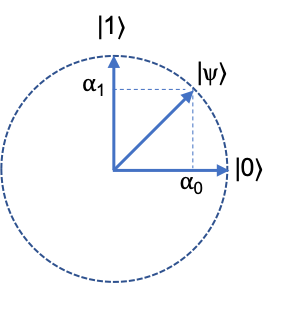
</div>

It is important to understand that this is an abstract *state space*, not physical space. For example, electron spin may be up or down, which are opposite directions in physical space, but these are orthogonal (perpendicular) vectors in state space.

The state can be $\ket{0}$ or $\ket{1}$, but it can also be a linear combination of these, which is known as a *superposition*:

```math
\ket{\psi}=\alpha_0\ket{0}+\alpha_1\ket{1}
```

The complex coefficients $\alpha_0$ and $\alpha_1$ are called *probability amplitudes*.

For now, just think of $\ket{\psi}$ as the symbol for a vector labelled $\psi$. A vector of this form is called a *ket* and $\ket{\psi}$ is pronounced "ket sigh". It is part of the Dirac *bra-ket* notation which will be explained later.

When we measure the state of a qubit, its quantum state jumps randomly to one of the two basis states, $\ket{0}$ or $\ket{1}$, with a probability $p$ given by the square of the absolute value of the corresponding probability amplitude:

```math
\begin{align*}
p(0) &= \lvert\alpha_0\rvert^2\\[1ex]
p(1) &= \lvert\alpha_1\rvert^2
\end{align*}
```

This is known as the *Born Rule*.

We get the corresponding classical bit (0 or 1) as the measurement result. 

The total probability of the measurement outcomes must equal one, so:

```math
p(0) + p(1) = \lvert\alpha_0\rvert^2 + \lvert\alpha_1\rvert^2 = 1
```

Consequently, the state vector is a unit vector as shown in the diagram.

If the measurement result is 0, then the post-measurement state will be $\ket{0}$ and $p(0)$ will become 1. If the measurement result is 1, then the post-measurement state will be $\ket{1}$ and $p(1)$ will become 1. Hence, measuring the qubit again will produce the same result. However, subsequent operations on the qubit may place it back in a superposition. 

Superposition is often misleadingly described in the popular science media as if a system were in two physical states at the same time, such as a particle being in two places at once or an electron spin being simultaneously both up and down. A qubit actually has a single definite quantum state that is represented by a vector in state space. The state evolves through the application of *unitary* operators which are deterministic and reversible. The randomness only arises when we try to measure the state. Between measurements, the state evolves in a *unitary* fashion.

**Note:** For now, just think of *unitary* as meaning that it preserves the total probability of unity. There is more to it than that, but we will return to it later.

Measurement of a qubit only gives us a single bit of information, whereas the underlying complex amplitudes of the state can have a potentially infinite number of possible values. There is no way, even in principle, that we can determine the quantum state by measurement. We can estimate the classical probabilities if we repeat an experiment many times from the same initial conditions, but this doesn't give us the complex probability amplitudes and their phases. 

We will see later that the limit of "knowability" of a quantum state gets even more interesting when we try to measure the value of two complementary properties, such as spin-up and spin-left of an electron. Measuring property A then B doesn't give the same result as measuring B then A.

Quantum measurement is fundamentally unpredictable. It is not just a lack of knowledge. In contrast, the randomness we encounter in the classical world just reflects lack of knowledge. For example, the laws of classical physics could, in principle, predict the outcome of a coin toss if we knew the exact initial conditions and interactions of the coin.

### Quantum Probability, Phase and Coherence

A probability amplitude $\alpha$ is a complex number, which may be written as:

```math
\alpha = |\alpha| e^{i\phi}
```

where $|\alpha|^2$ gives the probability and $\phi$ is an associated *phase*.

The relative phase between two quantum states allows them to *interfere* with one another. If they are in phase, *constructive interference* occurs and the probability is increased. If they are in anti-phase, *destructive interference* occurs and the probability is decreased.

Phase is essential to describe observed quantum phenomena such as superposition, interference and entanglement. Quantum *coherence* is the ability of quantum states to maintain a fixed and stable phase relationship with one another.

Coherent quantum states are very fragile. Quantum particles easily become entangled with the environment and the phase information leaks away. This makes the quantum system behave in a way that appears classical, since the interference terms disappear. The macroscopic classical world we see around us is made of quantum particles, but the "quantumness" has been lost through this process of *decoherence*.

Interference is one of the key quantum phenomena that is exploited in quantum computing. We get quantum states to interfere so that correct solutions interfere constructively and their probability increases, while other outcomes interfere destructively and their probability decreases. A final measurement then has a high probability of giving a valid result from the computation. A quantum computer normally has to be kept at an extremely low temperature to preserve quantum coherence of the qubit states for long enough to perform a computation.

### Interference

In classical probability theory, if an outcome can occur in two mutually-exclusive ways, the probability of it happening is the sum of the probabilities for the two cases:

```math
p = p_0 + p_1
```

However, at the quantum level we need to allow for the outcome arising from a superposition of the two cases, by using *probability amplitudes* that are complex numbers. The probability is the square of the absolute value of the probability amplitude $\alpha$:

```math
p = \alpha^*\,\alpha = \lvert \alpha \rvert ^2,  \qquad \alpha \in \mathbb{C}
```

where $\alpha^*$ denotes the complex conjugate of $\alpha$.

If something can happen in two different ways, we add the probability amplitudes:

```math
\begin{align*}
   p &= \lvert \alpha_0 + \alpha_1 \rvert ^2\\
	&=  (\alpha_0 + \alpha_1)^*\  (\alpha_0 + \alpha_1) \\
	& = \lvert \alpha_0 \rvert^2 + \lvert \alpha_1 \rvert^2 + \alpha_0 \alpha_1^* + \alpha_0^* \alpha_1 \\
	& = \lvert \alpha_0 \rvert^2 + \lvert \alpha_1 \rvert^2 + \lvert\alpha_0\rvert\lvert\alpha_1\rvert (e^{i(\phi_0-\phi_1)} + e^{-i(\phi_0-\phi_1)}\\
	& = \lvert \alpha_0 \rvert^2 + \lvert \alpha_1 \rvert^2 + 2 \lvert \alpha_0\rvert \lvert \alpha_1 \rvert \cos{(\phi_0 - \phi_1)}]
\end{align*}
```

The final term represents quantum *interference*. This term can be positive (constructive interference) or negative (destructive interference), depending on the relative phase $(\phi_0 - \phi_1)$.

In the classical case, the two states of a bit (0 and 1) are mutually exclusive, so that the interference term disappears and the probability reduces to the classical one:

```math
p = \lvert \alpha_0 \rvert^2 + \lvert \alpha_1 \rvert^2 = p_0 + p_1
```

### Vectors and Matrices

The two qubit basis states $\ket{0}$ and $\ket{1}$ can be represented as column vectors as follows:

```math
\ket{0} =  \begin{bmatrix}1\\0\end{bmatrix}\quad\text{and}\quad\ket{1} = \begin{bmatrix}0\\1\end{bmatrix}
```

**Note:** This is not strictly an equality because the left-hand side is an abstract vector and the right-hand side is a coordinate vector. However, it is common practice to write it as an equality.

A superposition of the two basis states can then be written as:

```math
\alpha_0 \ket{0} + \alpha_1 \ket{1} = \begin{bmatrix}\alpha_0\\ \alpha_1\end{bmatrix}
```

A quantum computer evolves the quantum states of its qubits by applying a sequence of unitary operators in the form of quantum gates. These operators can be represented by matrices. For example, the quantum operator $X$ is described by the following matrix:

```math
X =\begin{bmatrix}0 & 1 \\ 1 & 0 \end{bmatrix}
```

When applied to a qubit state, the X operator simply swaps the amplitudes (and hence probabilities) of $\ket{0}$ and $\ket{1}$ :

```math
\begin{bmatrix}0 & 1 \\ 1 & 0 \end{bmatrix} \begin{bmatrix}\alpha_0 \\ \alpha_1 \end{bmatrix} = \begin{bmatrix}\alpha_1 \\ \alpha_0 \end{bmatrix}
```

When applied to the basis states $\ket{0}$ or $\ket{1}$, it reduces to the classical NOT operation:

```math
\begin{align*}
 X \ket{0} = \begin{bmatrix}0 & 1 \\ 1 & 0 \end{bmatrix} \begin{bmatrix}1 \\ 0 \end{bmatrix} = \begin{bmatrix}0 \\ 1 \end{bmatrix} = \ket{1}\\[1ex]
X \ket{1} = \begin{bmatrix}0 & 1 \\ 1 & 0 \end{bmatrix} \begin{bmatrix}0 \\ 1 \end{bmatrix} = \begin{bmatrix}1 \\ 0 \end{bmatrix}= \ket{0}
 \end{align*}
```

Of course, a real quantum computer doesn't use vectors and matrices; it lets real quantum particles do the work. However, matrices provide a way to perform numerical computations and simulations on a classical computer.

### Dirac Notation

#### Hilbert Space

It was mentioned earlier that the complex vector space used in quantum computing is called *Hilbert Space*. Linear algebra in Hilbert space is normally described using *Dirac Notation*, which is also known as *Bra-Ket* notation.

Hilbert Space is a type of complex vector space that comes with an *inner product* that allows us to define lengths, angles and orthogonality, which are essential for working with quantum states. Hilbert spaces also extend to infinite-dimensional spaces, although this is not necessary for quantum computing as we are working with  a finite number of qubits.

A qubit can be any system that is described by a 2-dimensional Hilbert space. As we shall see shortly, a system with $K$ qubits requires a $2^K$ dimensional Hilbert space.

It is important to understand that Hilbert space represents an abstract mathematical *state space* describing the quantum state of a system. It should not be confused with the physical space in which a property, such as the spin of an electron, is measured. 

#### Bras and Kets

The *Ket* symbol $\ket{\psi}$ was briefly introduced above as a notation for a vector. We will now look at this notation in more detail, since it is used extensively in quantum computing.

Dirac’s *Bra-Ket* notation is used in quantum mechanics to describe quantum states as vectors in *Hilbert space*. It provides a concise way to write vector equations and manipulate them algebraically without requiring a specific basis (i.e. coordinate system). The notation automatically enforces complex conjugation where appropriate.

Dirac notation introduces two symbols: $\bra{A}$ which is called a "bra" and $\ket{B}$ which is called a "ket", where $A$ and $B$ are just labels. The symbols are called *Bra* and *Ket* because their inner product $\braket{A|B}$ is written like a pair of brackets.

Rather than going into the formal mathematical definitions of *Bra* and *Ket* and their various products, we will keep the maths simple by considering their representations in terms of coordinate vectors and matrices. However, bear in mind that bra-ket notation really refers to coordinate-free vectors in Hilbert space.

As we saw earlier, the state of a qubit can be expressed as a linear sum of two basis kets $\ket{0}$ and $\ket{1}$:

```math
\ket{\psi}=\alpha_0\ket{0}+\alpha_1\ket{1}
```

This can be represented by a column vector:

```math
\alpha_0\ket{0}+\alpha_1\ket{1}=\begin{bmatrix}\alpha_0\\\alpha_1\end{bmatrix}
```

So far, we have only looked a single qubit that has two basis states, but in practice we require many qubits. A $K$-qubit system has $2^K$ basis states and can be represented by an $n=2^K$-element column vector:

```math
\ket{A} = \begin{bmatrix}a_1\\a_2\\...\\a_n\end{bmatrix}
```

**Note:** We will see below why a $K$-qubit system requires one $2^K$-element vector rather than $K$ vectors of two elements.

The corresponding Bra $\bra{A}$ is represented by a row vector, which is obtained by transposing the column vector and taking the complex conjugate of the elements: 

```math
\bra{A} = \ket{A}^\dagger =  \begin{bmatrix}a_1^*, & a_2^*, ...\, a_n^*\end{bmatrix}
```

The *dagger* symbol $\dagger$ denotes the *Hermitian Conjugate*. The *Hermitian Conjugate* is also called the *Conjugate Transpose* when we are using matrices.

There are three important products: the *inner product* $\braket{A|B}$, the *outer product* $\ket{A}\bra{B}$ and the *tensor product* $\ket{A}\otimes\ket{B}$.

#### Inner Product

The *inner product* $\braket{A|B} \in\mathbb{C}$ is:

```math
\begin{align*}
	\braket{A|B} &= \begin{bmatrix}a_1^*,\dots,a_n^*\end{bmatrix}  \begin{bmatrix}b_1\\ \dots\\b_n\end{bmatrix}\\
	\\
	&= a_1^* b_1 + a_2^* b_2 +...+ a_n^* b_n
\end{align*}
```

The inner product is similar to the dot (scalar) product of ordinary vectors, except that it involves a complex conjugate. This is enforced by the use of the *Bra* (conjugate transpose) in the notation.

The inner product has conjugate symmetry:

```math
\braket{\phi|\psi}=\braket{\psi|\phi}^*
```

**Note:** The notation $\braket{A|B}$ is a shortened version of $\bra{A}\ket{B}$, in which the two vertical bars have been run together.

Using the inner product, we can express the fact that $\ket{0}$ and $\ket{1}$ are orthonormal:

```math
\begin{align*}
\braket{0|1} &= \braket{1|0} =0 &&\text{(orthogonal)}\\[0.3ex]
\braket{0|0} &= \braket{1|1} =1 &&\text{(normal)}
\end{align*}
```

In the context of quantum computing, the inner product can be used to find the probability that measuring state $\ket{\psi}$ will result in basis state $\ket{x}$:

```math
p(x)=|\braket{x|\psi}|^2
```

#### Outer Product

The outer product creates an operator from two vectors:

```math
\ket{A}\bra{B} = \begin{bmatrix}a_1\\\dots\\a_m\end{bmatrix} \begin{bmatrix}b_1^*,\dots,b_n\end{bmatrix}
	=  \begin{bmatrix}a_1 b_1^*&\dots&a_1 b_n^*\\\dots\\a_mb_1^*&\dots&a_mb_n^*\end{bmatrix}
```

We can express a quantum operator, such as the NOT operator $X$, in terms of outer products:

```math
X=\ketbra{0}{1}+\ketbra{1}{0}=\begin{bmatrix}0&1\\1&0\end{bmatrix}
```

If we apply the $X$ operator to $\ket{1}$, we get:

```math
\begin{align*}
X\ket{1}&=(\ket{0}\bra{1}+\ket{1}\bra{0})\ \ket{1}\\[0.3ex]
&=\ket{0}\bra{1}\ket{1}+\ket{1}\bra{0}\ket{1}\\[0.3ex]
&=\ket{0}\ 1+\ket{1}\ 0\\[0.3ex]
&=\ket{0}
\end{align*}
```

Outer products are often used to create *projection operators* (see below) and *density matrices*.

#### Projection Operators

The outer product $\ketbra{\phi}{\phi}$ of a normalized vector $\ket{\phi}$ with its conjugate transpose is an operator known as a *projector*:

```math
P_{\phi}=\ket{\phi}\bra{\phi}
```

If the projector is applied to a vector $\ket{\psi}$, the result is:

```math
\begin{align*}
P_{\phi} \ket{\psi} &= (\ket{\phi}\bra{\phi})\ \ket{\psi}\\
&= \ket{\phi}\ \braket{\phi|\psi}\\
&=\braket{\phi|\psi}\ \ket{\phi}
\end{align*}
```

The regrouping of terms allowed by associativity results in an inner product $\braket{\phi|\psi}$. This can then be moved to the left as a coefficient multiplier of $\ket{\psi}$ as it is just a complex number. The effect of the projector $\ketbra{\phi}{\phi}$ is to project the vector $\ket{\psi}$ onto the basis vector $\ket{\phi}$.

This example illustrates how we can use bra-ket notation to perform algebra on abstract vectors, without requiring a specific basis.

Projectors are *idempotent*. In other words, applying a projector $P$ twice gives the same result as applying it once:

```math
\begin{align*}
P^2&=(\ket{\psi}\bra{\psi})(\ket{\psi}\bra{\psi})\\[0.3ex]
&= \ket{\psi}(\braket{\psi|\psi})\bra{\psi}\\[0.3ex]
&=\ket{\psi}\bra{\psi}\\[0.3ex]
&=P
\end{align*}
```

#### Tensor Product

The tensor product (denoted by $\otimes$) combines two Hilbert spaces with dimensions $M$ and $N$ into one Hilbert space with dimension $M\times N$. It can also be used to combine vectors and operators. It allows us to combine qubits into multi-qubit systems and to combine those into larger systems.

The tensor product can be written in several different ways. The tensor product symbol $\otimes$ is often omitted in Dirac notation as it is implied by the concatenation of kets:

```math
\ket{A}\otimes\ket{B} \equiv \ket{A}\ket{B} \equiv \ket{AB}
```

The tensor product of $n$ identical states is sometimes written as a *tensor power*. For example:

```math
\ket{0}^{\otimes n}=\ket{0}\otimes\dots\otimes\ket{0}
```

The simplest example is the tensor product of two qubits $\ket{A}$ and $\ket{B}$, which each have a vector space of dimension 2. The combined state is:

```math
\ket{\psi} = \ket{A}\otimes\ket{B}
```

The result $\ket{\psi}$ is a vector in a new vector space of dimension 4 that has four basis vectors: 

```math
\ket{00}, \ket{01}, \ket{10}, \ket{11}
```

If $\ket{A}$ and $\ket{B}$ are represented by column vectors, their joint state is:

```math
\ket{A}\otimes\ket{B} = \begin{bmatrix}a_1\\a_2\end{bmatrix} \otimes  \begin{bmatrix}b_1\\ b_2\end{bmatrix}
	= \begin{bmatrix}a_1 b_1\\a_1 b_2\\a_2 b_1\\a_2 b_2\end{bmatrix}
```

For example:

```math
\ket{1}\otimes\ket{0} = \begin{bmatrix}0\\1\end{bmatrix} \otimes  \begin{bmatrix}1\\ 0\end{bmatrix}
	= \begin{bmatrix}0\\0\\1\\0\end{bmatrix}
```

Although we can combine two quantum systems (i.e. Hilbert spaces) into one larger one, we cannot necessarily factor a large system into two smaller ones. For example, the following is an *entangled* state that is not separable into the tensor product of individual qubit states in the form $\ket{A}\otimes\ket{B}$.

```math
{\small\frac{1}{\sqrt{2}}} (\ket{01} + \ket{10} )
```

Consequently, we need to describe the whole system and not just its parts. A system with $K$ qubits requires a $2^K$ dimensional Hilbert space, rather than $K$ separate $2$-dimensional spaces.

The tensor product is associative, so we can combine arbitrarily many qubits into a multi-qubit state:

```math
\ket{\psi} = \ket{A_1}\otimes \ket{A_2}\otimes\dots\otimes\ket{A_n}
```

Associativity also allows us to combine two multi-qubit subsystems $A$ and $B$:

```math
\big(\ket{A_1}\otimes\ket{A_2}\big) \otimes \big(\ket{B_1}\otimes\ket{B_2}\big) = \ket{A_1}\otimes\ket{A_2}\otimes \ket{B_1}\otimes\ket{B_2}
```

The tensor product can also be used to combine operators. If $U$ and $V$ are operators and $\ket{A}$ and $\ket{B}$ are states:

```math
(U\otimes V)(\ket{A}\otimes \ket{B}) = (U\ket{A})\otimes(V\ket{B})
```

**Note:** Strictly, the tensor product is an operation on coordinate-independent vectors or operators. The corresponding operation on matrices is called the *Kronecker product*. However, it is common in quantum computing to refer to it as the tensor product. 

### Bloch Sphere

The Bloch Sphere is a three-dimensional graphical representation of the state of a single qubit. Unlike Hilbert space, it does not generalize to multi-qubit systems. However, it is a good way to visualise the effect of one-qubit gates, since these all correspond to rotations on the Bloch sphere. In fact, any unitary quantum circuit can be decomposed into just rotations of individual qubits on the Bloch sphere and interaction operations (CX gates) that can entangle two qubits.

<div style="text-align: center;">
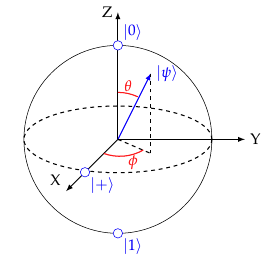
</div>

The Z-basis states $\ket{0}$ and $\ket{1}$ correspond to the North and South poles of the sphere as shown in the diagram. The state $\ket{\psi}$ of a qubit can be represented by a vector with polar angle $\theta$ and azimuthal (phase) angle $\phi$.

As discussed earlier, the state of a qubit can be described by two complex numbers, $\alpha_0$ and $\alpha_1$:

```math
\ket{\psi}=\alpha_0\ket{0}+\alpha_1\ket{1}
```

Four real numbers are required to represent two complex numbers, but it is possible for the Bloch sphere to describe the state with only two (real) angles because there is redundant information.

One degree of freedom is lost because the total probability must be one:

```math
\lvert\alpha_0\rvert^2 + \lvert\alpha_1\rvert^2 = 1
```

A second degree of freedom is lost because there are many kets that describe the same physical state, since a global phase term $e^{i\gamma}$ does not affect the result of a measurement:

```math
 \lvert e^{i\gamma}\ket{\psi}\rvert^2=\lvert\ket{\psi}\rvert^2
```

The state $\ket{\psi}$ of a qubit can then be mapped onto the Bloch sphere as follows:

```math
\ket{\psi} = \cos(\frac{\theta}{2})\ket{0} + e^{i\phi} \sin(\frac{\theta}{2})\ket{1}
```

where $0 \le\theta\le\pi$ and $0\le\phi\le2\pi$.

The probability of a measurement outcome of $\ket{0}$ or $\ket{1}$ depends only on the polar angle $\theta$ and not on the azimuthal (phase) angle $\phi$:

```math
\begin{align*}
p(\ket{0}) &= \lvert \cos({\small\frac{\theta}{2}}) \rvert^2 = \frac{1 + \cos\theta}{2}\\[0.4em]
p(\ket{1}) &= \lvert e^{i\phi}\sin({\small\frac{\theta}{2}}) \rvert^2 = \frac{1 - \cos\theta}{2}
\end{align*}
```

Evaluating these gives:

```math
 p(\ket{0}) = \begin{cases} 
      1 & \theta=0 \\
      0.5 & \theta=\frac{\pi}{2} \\
      0 & \theta=\pi 
   \end{cases}
```

```math
 p(\ket{1}) = \begin{cases} 
      0 & \theta=0 \\
      0.5 & \theta=\frac{\pi}{2} \\
      1 & \theta=\pi 
   \end{cases}
```

So, on the "equator" where $\theta=\frac{\pi}{2}$, there is an equal probability of measuring $\ket{0}$ or $\ket{1}$. This is called an *equal superposition*.

Qubit states that lie in the XZ plane of the Bloch sphere have real probability amplitudes. Rotations about the Z axis introduce phase terms of the form $e^{i\phi}$ which give rise to the need for complex probability amplitudes.

**Notes:**

- We are only considering *pure* states that can be described by a state vector with a norm of one. These are represented by points on the sphere. Points within the sphere correspond to *mixed states*. The unitary operators implemented by quantum gates are norm-preserving. Since the norm of a pure state vector is one, one-qubit gates perform rotations on the sphere.

- The basis states $\ket{0}$ and $\ket{1}$ are 180 degrees apart on the Bloch sphere, whereas they are 90 degrees apart in the complex vector space $\mathbb{C}^2$. When quantum gates are said to perform a rotation by some angle, this refers to the angle on the Bloch sphere.

- The Bloch sphere is well-suited for relating qubits to the behaviour of spin-½ systems, such as the spin of an electron. However, even qubits that are physically implemented by other 2-state phenomena, such as the direction of current in a superconducting loop, behave in the same way at the abstract level of qubits. It is equally possible to perform X, Y and Z rotations of them on the Bloch sphere, although these operations are no longer simply related to the physical system.

### Bases and Complementarity

In quantum mechanics, there are pairs of *complementary* properties, such as position and momentum, that cannot both be precisely known at the same time. This is the basis of the *Heisenberg Uncertainty Principle*. The more you know about one property, the less you can know about the other. An exact measurement of one of the properties makes the other one completely undetermined, such that a measurement of it gives a random result. Complementarity limits what we can know about a quantum system, even in principle.

In the case of qubits, complementarity exists between measurements made in the Z and X bases.

**Note:** "Bases" here is the plural of "basis". It is pronounced "bay-seez" to distinguish it from the plural of "base".

The X-basis vectors are denoted by $\ket{+}$ and $\ket{-}$ and are related to the computational (Z) basis vectors $\ket{0}$ and $\ket{1}$ as follows:

```math
\begin{align*}
	\ket{+} &= {\small\frac{1}{\sqrt{2}}}(\ket{0} + \ket{1}) =  {\small\frac{1}{\sqrt{2}}} \begin{bmatrix}1\\1\end{bmatrix}\\[1ex]
	\ket{-} &= {\small\frac{1}{\sqrt{2}}}(\ket{0} - \ket{1} =  {\small\frac{1}{\sqrt{2}}} \begin{bmatrix}1\\-1\end{bmatrix}
\end{align*}
```

and conversely:

```math
\begin{align*}
	\ket{0} &= {\small\frac{1}{\sqrt{2}}}(\ket{+} + \ket{-})\\[1ex]
	\ket{1} &= {\small\frac{1}{\sqrt{2}}}(\ket{+} - \ket{-})
\end{align*}
```

The scaling factor of $\frac{1}{\sqrt{2}}$ normalizes the vectors, so that the probabilities of the measurement outcomes still sum to one.

The following diagram shows how $\ket{+}$ and $\ket{-}$ are related to $\ket{0}$ and $\ket{1}$ in 2-dimensional Hilbert space.

<div style="text-align: center;">
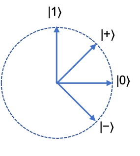
</div>

A basis state in the Z-basis corresponds to an equal superposition in the X-basis and vice versa. 

Consider the following sequence of operations:

- We start with a qubit in an unknown state and measure it in the Z basis. The state will collapse into one of the Z basis states: $\ket{0}$ or $\ket{1}$. For example, let us say it is $\ket{1}$.

- We measure the qubit again in the Z basis. The state will remain at $\ket{1}$ because it is already in a Z-basis state, so we will get the same result again, i.e: $\braket{1|1}=1$.

- But $\ket{1}$ is an equal superposition of $\ket{+}$ and $\ket{-}$. So, if we now measure the qubit in the X basis, the result will be completely random, with an equal probability that the state becomes $\ket{+}$ or $\ket{-}.$

  ```math
  p(+)=\braket{+|1}={\small\frac{1}{2}}\quad\text{and}\quad p(-)=\braket{-|1}={\small\frac{1}{2}}
  ```

- We measure again in the X basis. The state will remain unchanged because it is already in an X-basis state, so we will get the same result again.

- We measure the qubit in the Z basis. The state will collapse into the Z basis state $\ket{0}$ or $\ket{1}$, with equal probabilities. Note that the outcome of this Z-basis measurement is not correlated with the one from the earlier measurement in the Z-basis.

The operator that converts a qubit from the Z basis to the X basis, or vice versa, is the *Hadamard* operator $H$:

```math
H = \frac{1}{\sqrt{2}} \begin{bmatrix}1 & 1 \\ 1 & -1 \end{bmatrix}
```

So, for example:

```math
H\ket{1} = \frac{1}{\sqrt{2}} \begin{bmatrix}1 & 1 \\ 1 & -1 \end{bmatrix}\begin{bmatrix}0\\1\end{bmatrix}=\frac{1}{\sqrt{2}}\begin{bmatrix}1\\-1\end{bmatrix}=\ket{-}
```

The X basis is sometimes called the Hadamard basis. The Hadamard operator is frequently used in quantum algorithms, in the form of a Hadamard gate, to switch back and forth between the Z and X bases.

In addition, to the Z and X bases, there is also a Y basis. The Y basis vectors are denoted by $\ket{R}$ and $\ket{L}$, or sometimes by $\ket{i}$ and $\ket{-i}$. They are related to the computational (Z) basis vectors $\ket{0}$ and $\ket{1}$ as follows:

```math
\begin{align*}
	\ket{R} &= {\small\frac{1}{\sqrt{2}}}(\ket{0} + i\ket{1}) =  {\small\frac{1}{\sqrt{2}}} \begin{bmatrix}1\\i\end{bmatrix}\\[1ex]
	\ket{L} &= {\small\frac{1}{\sqrt{2}}}(\ket{0} - i\ket{1} =  {\small\frac{1}{\sqrt{2}}} \begin{bmatrix}1\\-i\end{bmatrix}
\end{align*}
```

### Rotations on the Bloch Sphere

The following diagram shows where the $\ket{0}, \ket{1}, \ket{+}, \ket{-}, \ket{R}$ and $\ket{L}$ states are located on the Bloch sphere in relation to the X, Y and Z axes:

<div style="text-align: center;">
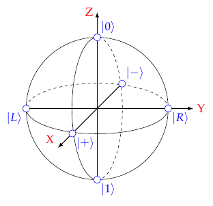
</div>

The X, Y and Z gates perform rotations of $\pi$ radians (180 degrees) about the corresponding axes of the Bloch Sphere. You may recognize them as the Pauli matrices if you have studied physics:

```math
X=\begin{bmatrix}0 & 1 \\ 1 & 0 \end{bmatrix},\quad Y=\begin{bmatrix}0 & -i \\ i & 0 \end{bmatrix},\quad Z=\begin{bmatrix}1 & 0 \\ 0 & -1 \end{bmatrix}
```

For example, viewed as rotations on the Bloch sphere:

```math
\begin{align*}
X \ket{0} &= \ket{1}\qquad &X \ket{1} &= \ket{0}\\[1ex]
Z \ket{+} &= \ket{-}\qquad &Z \ket{-} &= \ket{+}
 \end{align*}
 ```

The Hadamard gate (H), which was introduced above, rotates by $\pi$ radians about an axis midway between the X and Z axes. This is equivalent to a rotation by $\frac{\pi}{2}$ radians about the Y axis followed by $\pi$ about the X axis.

```math
H = {\small\frac{1}{\sqrt{2}}} \begin{bmatrix}1 & 1 \\ 1 & -1 \end{bmatrix}
```

This has the effect of switching between the Z and X bases.

```math
\begin{align*}
H \ket{0} &= \ket{+}\qquad & H \ket{+} &= \ket{0}\\[1ex]
H \ket{1} &= \ket{-}\qquad & H \ket{-} &= \ket{1}
 \end{align*}
 ```

There are also gates that rotate by other angles. The Phase gate $P(\phi)$ rotates by an angle $\phi$ about the Z axis.

```math
P(\phi)=\begin{bmatrix}1 & 0 \\ 0 & e^{i\phi} \end{bmatrix}
```

So, for example:

```math
\begin{align*}
P{(\small\frac{\pi}{2})}\ket{+}=\ket{R}
\end{align*}
```

Single-qubit gates are represented in quantum circuits as square boxes, as shown here:

<div style="text-align: center;">
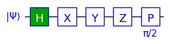
</div>

Hadamard gates are often drawn in a distinctive colour to draw attention to them, as they perform the special function of switching back and forth between the Z and X bases.

The horizontal line represents a qubit and the gates are applied from left to right, so this circuit means:

- Apply a Hadamard gate to the initial state $\ket{\psi}$, then an X-gate, then a Y-gate, then a Z-gate and finally a P-gate with a phase angle of $\frac{\pi}{2}$.

Written algebraically, this could be expressed as:

```math
P({\small\frac{\pi}{2}})ZYXH\ket{\psi}
```

The graphical circuit notation is generally easier to understand than the algebraic version, particularly for multi-qubit circuits.

We will discuss these gates in more detail in the chapter on quantum gates. The example above was just to provide a preliminary look at them in relation to the Bloch sphere and to introduce the idea of a quantum circuit.

### Unitary Operators

The previous section considered some single-qubit unitary operators that perform rotations on the Bloch sphere. We will now look at what a *unitary* operator is more generally.

A *unitary* operator $U$ is one whose inverse is its *Hermitian Conjugate* $U^\dagger$:

```math
U^\dagger U = U U^\dagger = I
```

Unitary operators are norm-preserving and invertible. The eigenvalues $\lambda$ of a unitary operator have a norm of one.


```math
U\ket{\psi} = \lambda \ket{\psi},\quad |\lambda|=1
```

The time evolution of a closed quantum system is *unitary*, according to the *Schrödinger equation*. If the state of a quantum system is $\ket{\psi}$, then the state $\ket{\psi'}$ at a later time corresponds to the application of a unitary operator $U$:

```math
\ket{\psi'} = U\ket{\psi}
```

The evolution does not depend on the state and is *linear*. Consequently, the result of applying a unitary operator $U$ to the sum (e.g. superposition) of two states is the sum of the results of applying the operator to the states individually:

```math
U (\ket{\psi} + \ket{\phi}) = U \ket{\psi} + U \ket{\phi}
```

The norm-preserving property of unitary operators implies that they preserve the total probability. The quantum state vector of a pure state has a norm of one, since the total probability of all measurement outcomes must be one. The operators applied to evolve the state must be unitary so as to preserve the norm.

The unitary operators in a gate-model quantum computer are called “quantum gates” by analogy with the logic gates of traditional computers. Unitary operators are reversible, since by definition their inverse is their Hermitian Conjugate. Quantum circuits built from quantum gates are just large unitary operators, provided that they do not contain any measurements. The evolution of the entire circuit is unitary. Consequently, quantum gates and quantum circuits are reversible. Measurement is not considered to be a gate because it is not reversible.

Unitary operators can be expressed as unitary matrices. A unitary matrix is one whose inverse is its conjugate transpose. It is the complex equivalent of a real orthonormal matrix. Unitary matrices are square, which results in quantum gates (and hence quantum circuits) having the same number of outputs as inputs. This is very different to ordinary digital logic gates where, for example, a NAND gate has two inputs and one output. The inputs of a NAND gate cannot be inferred from the output, so it is not reversible.

### Multi-Qubit States

Interesting things start to happen when we have more than one qubit.

#### Combining Qubits

As we saw in the section on Dirac notation, the states of two qubits in $\mathbb{C}^2$ can be combined into one state in $\mathbb{C}^4$ by taking their tensor product:

```math
\ket{A}\otimes\ket{B} = \begin{bmatrix}a_1\\a_2\end{bmatrix}
	\otimes  \begin{bmatrix}b_1\\ b_2\end{bmatrix}
	= \begin{bmatrix}a_1 b_1\\a_1 b_2\\a_2 b_1\\a_2 b_2\end{bmatrix}
```

The tensor product is associative, so we can combine arbitrarily many qubits into a multi-qubit state:

```math
\ket{\psi} = \ket{A_1}\otimes \ket{A_2}\otimes\dots\otimes\ket{A_n}
```

Associativity also allows us to combine two multi-qubit subsystems $A$ and $B$:

```math
\big(\ket{A_1}\otimes\ket{A_2}\big) \otimes \big(\ket{B_1}\otimes\ket{B_2}\big) = \ket{A_1}\otimes\ket{A_2}\otimes \ket{B_1}\otimes\ket{B_2}
```

The tensor product of individual pure qubit states gives the state of the N-qubit system. However, it is not necessarily possible to factor the state back into individual qubit states after multi-qubit operators (i.e. gates) have been applied. For example, the following is an *entangled* state that cannot be expressed as the tensor product of individual qubit states:

```math
\frac{1}{\sqrt{2}} (\ket{01} + \ket{10} )
```

In particular, this cannot be factored into a tensor product of the form $\ket{A}\otimes\ket{B}$. We say that the state is not *separable*.

A pair of entangled qubits do not each have their own individual state, but together have a joint state that describes the system of two qubits, even if they are at a great distance from one another.

#### Complexity

The state of a classical system with $N$ bits can, somewhat obviously, be represented by $N$ bits of storage. Any of the bits may be read (measured) or set individually without affecting the others.

However, the state of a quantum system with $N$ qubits cannot be represented by $N$ vectors in a 2-dimensional complex vector space, because the qubits may not be independent, as a result of quantum entanglement. Instead, it requires one vector in a $2^N$-dimensional vector space to represent an arbitrary $N$-qubit state. This needs $2^N$ complex numbers, so the storage required increases exponentially with the number of qubits.

A classical computer can represent 300 bits of information using only 38 bytes of memory, which is a trivial amount. In contrast, simulation of a quantum computer with 300 qubits requires a vector of $2^{300}$ (about $10^{90}$) complex values to represent the state, which is much more than the number of atoms in the observable universe (estimated to be around $10^{80}$ ). Simulating a quantum computer with more than a few tens of qubits is infeasible even on a supercomputer, for arbitrary quantum states. Of course, a real quantum computer with 300 qubits just requires 300 quantum particles that can act as qubits.

Unentangled states are separable and can therefore be simulated efficiently on a classical computer, since operations on individual qubits are just simple rotations. Without any entanglement, quantum computers would be no more powerful than classical computers.

**Note:** Modern quantum simulation techniques, such as the use of Matrix Product States, can allow simulations with hundreds of qubits in some cases, by compressing the quantum state and keeping track of entanglement, provided that the entanglement in the system is not too great. Although a useful improvement, it comes nowhere close to matching the exponential speed improvement that is potentially available from a real quantum computer.

Quantum states represent exponentially more information than classical states. However, we cannot access that information because measuring it will only give one of the classical states. The art of writing quantum algorithms is to utilize the vast state space, but then evolve the state towards one of the basis states, having some required property, which can be read out as the answer.

### No-Cloning Theorem

The *no-cloning* theorem of quantum mechanics says that, given an unknown quantum state, it is not possible to create an exact independent copy of it. For example, in quantum teleportation, it is not possible to send an unknown quantum state from A to B, unless the original state at A is lost in the process.

Cloning, if it were possible, would be an operation such as:

```math
\ket{\psi 0} \rightarrow \ket{\psi\psi} = \ket{\psi} \otimes \ket{\psi}
```
Note that the result can be expressed as the tensor product of two independent (but identical) states.

It is possible to create two identical quantum states by applying the same sequence of unitary operators to a $\ket{00\dots 0}$ state, but this is not the same as creating a copy of a given unknown state. Creating entanglement also does not count as cloning because the entangled qubits are not independent.

The related *no-deleting theorem* says that, given two identical quantum states, it is not possible to throw one away. This follows because the evolution of quantum state is reversible, so if deletion were possible then, in reverse, cloning would be possible.

Deletion would be the operation:

```math
\ket{\psi \psi} \rightarrow \ket{\psi 0}
```

The no-cloning theorem implies that it is not possible to connect the output of one quantum gate to the input of two other gates, which is a normal occurrence with classical logical gates (i.e. *fan-out*).

---
<div style="page-break-after: always;"></div>

## 3: Quantum Circuits

### Introduction

A *quantum circuit* is a network of quantum gates applied to a fixed set of qubits. It can be described by a quantum circuit diagram or using a textual representation. Quantum circuit diagrams are more standardised and they are also good for developing an intuitive understanding.

The following is a simple example of a quantum circuit, involving a Hadamard gate H and two CX (aka controlled-NOT) gates. Don't worry about what the circuit does for the moment; we are just considering the graphical notation:

<div style="text-align: center;">
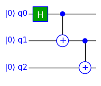
</div>

A quantum circuit diagram has a set of horizontal lines representing the qubits. The qubits are usually assumed to be initialized to $\ket{0}$, although this example shows the initial state for clarity. The qubits are numbered $0,1,2,\dots$ and typically labelled $q_0,q_1,q_2,\dots$, with qubit $q_0$ being the one at the top. The initial state is on the left and the final state is on the right.

In a tensor product of qubits, the qubit on the left is the *most-significant* qubit and the one on the right is the *least-significant* qubit. In the following 3-qubit state, $\ket{A}$ is the most-significant qubit and $\ket{C}$ is the least-significant:

```math
\ket{A}\otimes\ket{B}\otimes\ket{C}
```

There are two different conventions for numbering the qubits, which often causes confusion. This guide uses the *big-endian* convention, in which the *most-significant* qubit is qubit 0. In the circuit above, the initial state is the tensor product of the three qubits in the following order:

```math
\ket{q_0}\otimes\ket{q_1}\otimes\ket{q_2} = \ket{000}
```

The difference between *big-endian* and *little-endian* systems is discussed in a later section.

A quantum circuit has a fixed number of qubits, as required by unitarity and the no-cloning theorem. No qubits can be added to the circuit or deleted. Any extra qubits (known as *ancilla* qubits) that the computation needs must be included and initialized as part of the initial state. The flow of information is from left to right, with no loops allowed.

The diagram represents a sequence of unitary operators, in the form of quantum gates, applied to a set of qubits, with the information flow running from left to right. The gates are typically not physical entities, but just operators applied to a fixed set of qubits *in situ*.

### Composing Circuits

A sequence of operations can be composed by matrix multiplication, whereas operations on different qubits are combined by tensor multiplication.

The following example shows the series composition of two one-qubit gates:

<div style="text-align: center;">
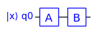
</div>

```math
\ket{\psi}=BA\ket{x}
```

where  $\ket{\psi}$ is the output state on the right-hand side.

Note that the operations in the diagram are applied left to right, whereas the order in the equation is from right to left. The order of the gates cannot be interchanged unless the associated operators commute.

Single qubit operators may be applied to the tensor product of qubit states by taking the tensor product of the operators:

<div style="text-align: center;">
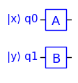
</div>

```math
\begin{align*}
\ket{\psi}&=A \ket{x} \otimes B \ket{y}\\[0.3em]
&\equiv (A\otimes B) (\ket{x}\otimes\ket{y})\\[0.3em]
&\equiv (A \otimes B) \ket{xy}
\end{align*}
```

This makes use of the following important identity, where $A$ and $B$ are operators  (i.e. gates):

```math
(A\otimes B)(\ket{x}\otimes \ket{y}) = (A\ket{x})\otimes(B\ket{y})
```

If gate B is absent in the above example, we must replace it with a dummy identity gate 'I', so that we can still form the tensor product to expand A to operate on the full quantum state:

<div style="text-align: center;">
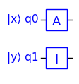
</div>

```math
\begin{align*}
\ket{\psi}&= A \ket{x}\otimes I \ket{y}\\[0.3em]
&\equiv (A\otimes I) (\ket{x}\otimes\ket{y})\\[0.3em]
&\equiv (A \otimes I) \ket{xy}
\end{align*}
```

where the identity gate $I$ is:

```math
I = \ketbra{0}{0}+\ketbra{1}{1}=\begin{bmatrix}1 & 0 \\ 0 & 1 \end{bmatrix}
```

Taking the tensor product with $I$ converts the one-qubit $A$ gate into a 2-qubit gate that operates on one of the qubits. The identity gate is not normally drawn in the circuit diagram as it is a 'do-nothing' operation that doesn't need a physical implementation in hardware.

The following example combines the above approaches:

<div style="text-align: center;">
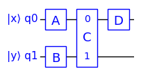
</div>

This corresponds to the following operations:

```math
\ket{\psi} = (D \otimes I) C (A \otimes B) \ket{xy}
```

First, A and B are applied to the two qubit inputs $\ket{x}$ and $\ket{y}$. Then a two-qubit gate C is applied. Finally, D is applied to the first qubit.

The A and B gates in this example may be applied in either order, or they can both be performed in parallel:

```math
(A\otimes I)(I\otimes B) = A\otimes B = (I\otimes B)(A\otimes I)
```

However, both A and B must be complete before C is applied. The circuit should be thought of as a *partially ordered* Directed Acyclic Graph (DAG), rather than as a strict time-sequence having time on the horizontal axis.

### Endianness

The qubit on the left side of a tensor product is referred to as the *most-significant* qubit. Hence, in the quantum state $\ket{0}\otimes\ket{1}\otimes\ket{1}$, the most-significant qubit is $\ket{0}$ and the least-significant qubit is $\ket{1}$. This state can also be written as $\ket{011}$.

There are two different conventions for numbering the qubits. In the *big-endian* convention, qubit 0 refers to the most-significant qubit whereas, in the *little-endian* convention, qubit 0 refers to the least-significant qubit. For example, a 3-qubit state is $\ket{q_0}\otimes\ket{q_1}\otimes\ket{q_2}$ for big-endian and $\ket{q_2}\otimes\ket{q_1}\otimes\ket{q_0}$ for little-endian.

The majority textbooks and academic papers use the big-endian convention. Development tools and software libraries for quantum computing vary in "endianness". For example, Google's Circ and Xanadu's PennyLane both use the big-endian convention, whereas IBM's Qiskit uses little-endian. This can lead to confusion for beginners when comparing examples from different sources or when trying to run textbook examples on little-endian systems.

This guide uses the big-endian convention. 

Consider the following simple circuit, consisting of a single CX gate with the control on qubit 0:

<div style="text-align: center;">
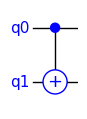
</div>

If we interpret it as a big-endian circuit, qubit 0 is the most-significant and the state is $\ket{q_0}\otimes\ket{q_1}$, with the tensor-multiplication order going down the diagram. The CX gate is then defined as:

```math
CX = \ket{0}\bra{0} \otimes I + \ket{1}\bra{1} \otimes X 
= \begin{bmatrix}1&0&0&0 \\ 0&1&0&0 \\0&0&0&1 \\0&0&1&0 \end{bmatrix}
```

If, on the other hand, we interpret the diagram as a little-endian circuit, qubit 0 is the least-significant and the state is $\ket{q_1}\otimes\ket{q_0}$, with the tensor-multiplication order going up the diagram. The CX gate is then defined as:

```math
CX = I \otimes \ket{0}\bra{0} + X \otimes \ket{1}\bra{1}
= \begin{bmatrix}1&0&0&0 \\ 0&0&0&1 \\0&0&1&0 \\0&1&0&0 \end{bmatrix}
```

The first definition is for a big-endian CX gate, whereas the second definition is for a little-endian CX gate. The tensor-product order of qubits to which the gate is applied is reversed, leading to reversal of the terms in the Dirac notation definition of the gate.

### Permutation of Qubits

Consider modifying the previous example so that there are 5 qubits and the $\ket{x}$ input is qubit 4 instead of qubit 0. The dotted lines on qubits 2 and 3 of gate 'C' indicate that the gate does not use these qubits.

<div style="text-align: center;">
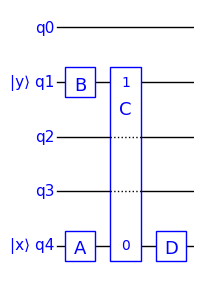
</div>

This gives rise to two problems. Firstly, we can't apply the 4x4 matrix of gate 'C' to non-adjacent qubits. Secondly, the order of the qubits does not match the order required by gate 'C' (indicated by the 0 and 1 labels in the gate symbol).

One solution is to use [SWAP](#swap-gate) gates to swap pairs of qubits to make the required qubits adjacent and in the correct order, then apply gate 'C' and finally reverse all the swaps to put the qubits back in the original order. The swap gates are denoted by a symbol with two crosses.

<div style="text-align: center;">
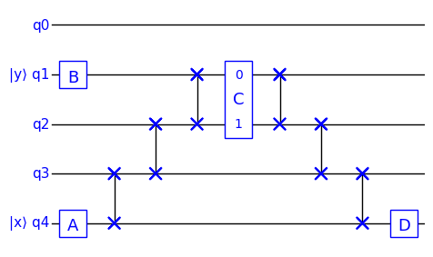
</div>

The swap gates, like the other gates, require adjacent inputs, so we cannot swap qubits 1 and 4 directly, but instead need to use a chain of swaps of adjacent qubits. Consequently, a large number of swaps may be needed to permute the qubits, especially when there are many qubits.

**Note:** We don't necessarily need to swap the qubit positions back after applying the 'C' gate, provided that we keep track of the permutation.

Non-consecutive qubits are a problem in real quantum computers because the qubits are typically physically arranged in a one or two dimensional array. Operations that involve interactions between qubits (e.g. CX), usually require them to be physically adjacent. Consequently, the physical topology of the array of gates is important in minimizing the number of swaps needed.

Quantum computer programming languages and quantum circuit diagrams work at a higher level of abstraction, where multi-qubit gates can be applied to arbitrary qubits, without the user needing to worry about such issues. Software then compiles these into sequences of lower-level operations for the quantum hardware, taking into account the qubit topology and primitive operations available.

Fortunately, in a quantum-computer simulator, we can sometimes implement swaps more efficiently by permuting the qubit indices, as explained in the next section. Then a later section considers approaches to simulating a quantum computer, including the use of tensors to provide a much more efficient solution.

### Addressing Qubits

It is important to understand that even a simple one-qubit gate can affect *all* the elements of the state vector. To see why this is, consider two qubits:

```math
\begin{align*}
\ket{A}&=a_0\ket{0} + a_1\ket{1}\\
\ket{B}&=b_0\ket{0} + b_1\ket{1}
\end{align*}
```

A 2-qubit state is formed by the tensor product of these two qubits:

```math
\begin{align*}
\ket{AB} &= \ket{A} \otimes\ket{B}\\
&= (a_0\ket{0} + a_1\ket{1})\otimes (b_0\ket{0} + b_1\ket{1})\\
&=a_0b_0\ket{00} + a_0b_1\ket{01} + a_1b_0\ket{10} + a_1b_1\ket{11}
\end{align*}
```

This can be written as a table:

```math
\begin{align*}
\ket{00}\quad & a_0b_0\\
\ket{01}\quad & a_0b_1\\
\ket{10}\quad & a_1b_0\\
\ket{11}\quad & a_1b_1
\end{align*}
```

The ket labels 00, 01, 10 and 11 can be thought of as binary numbers that index elements of the state vector. Qubits 0 and 1 corresponds to the first and second bits of this number respectively. The values of the elements, such as $a_0b_1$ all contain '$a$' and '$b$' terms. Consequently, modifying either of the qubits affects all of the elements of the state vector. 

This explains why we had to take the tensor product of gates with dummy identity gates to make a $2^N\times 2^N$ matrix that could be applied to the $2^N$ element state vector.

Individual state elements do not correspond to qubits, so we cannot apply gates to a subset of the elements. However, it is possible to permute the order of qubits by permuting the elements of the state vector. This is equivalent to permuting the columns of the binary index values in the table above and then sorting the table by index. However, a one-qubit gate can still affect the complex amplitudes of all the state elements, so we still need to expand the qubit matrix to match the size of the state vector.

As we will see in a later section on simulation, the use of tensors instead of vectors and matrices leads to a much simpler and more efficient approach, where qubits can be addressed directly and there is no need to expand matrices before applying them to the state.

---
<div style="page-break-after: always;"></div>

## 4: Quantum Gates

### Introduction

Quantum gates implement unitary operators as components in a quantum circuit. Measurement operations are also circuit components, but they are not unitary and consequently are not classified as gates.

The simplest quantum gates operate on a single qubit. However, if this were the only kind of gate, the state would remain separable. i.e. it could be factored into individual qubits and the same computation could be done efficiently on a classical computer. It is essential to have at least one type of multi-qubit gate that allows entanglement to be created.

There are many kinds of quantum gates, but any quantum circuit can be built (or closely approximated) using a small subset known as a universal gate set. There are several such sets, with as few as three gates being sufficient. The minimum is a couple of one-qubit rotation gates that can reach or approximate any point on the Bloch sphere and a two-qubit entangling gate, such as CX, to allow entanglement to be created. Any unitary can be decomposed into a circuit constructed from one and two qubit unitaries.

In practice, real quantum computers implement a small subset that is physically realizable given the technology available. Working at this level would make algorithm development very difficult and the algorithms would be specific to a given gate set. Consequently, quantum development tools usually have a wide range of gates (around 30) that provide useful abstractions. A compiler then takes the quantum circuit, optimizes it and compiles it into a sequence of operations for a particular quantum computer, taking into account the topology and primitive operations of the machine.

The following sections describe some of the most important gates, including the X, H, P and CX gates. It is possible to build any quantum circuit from just these gates. Quantum gate libraries normally contain additional specialised gates for convenience.

### X, Y and Z Gates

The quantum X gate is described by the following circuit symbol, Dirac notation and unitary matrix:

<div style="text-align: center;">
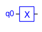
</div>

```math
X = \ketbra{0}{1}+\ketbra{1}{0}=\begin{bmatrix}0 & 1 \\ 1 & 0 \end{bmatrix}
```

When applied to a qubit state, the X gate simply swaps the amplitudes (and hence probabilities) of $\ket{0}$ and $\ket{1}$ :

```math
\begin{bmatrix}0 & 1 \\ 1 & 0 \end{bmatrix} \begin{bmatrix}\alpha_0 \\ \alpha_1 \end{bmatrix} = \begin{bmatrix}\alpha_1 \\ \alpha_0 \end{bmatrix}
```

When applied to the basis states $\ket{0}$ or $\ket{1}$, it reduces to the classical NOT operation, so the X gate is sometimes referred to as a NOT-gate.

```math
\begin{align*}
 X \ket{0} = \ket{1}\\[1ex]
 X \ket{1} = \ket{0}
 \end{align*}
```

In terms of the Bloch sphere, it is a rotation by $\pi$ radians about the X axis.

Similarly, there are Y and Z gates that rotate by $\pi$ on the Bloch sphere about the Y and Z axes, respectively:

```math
Y = \begin{bmatrix}0 & -i \\ i & 0 \end{bmatrix}
```

```math
Z =\begin{bmatrix}1&0 \\ 0&-1 \end{bmatrix}
```

The X, Y and Z matrices correspond to the Pauli $\sigma_x$, $\sigma_y$ and $\sigma_z$ matrices in physics, so these gates are sometimes called the Pauli-X, Pauli-Y and Pauli-Z gates.

### Hadamard (H) Gate

The Hadamard gate (H) is described by the following circuit symbol, Dirac notation and unitary matrix:

<div style="text-align: center;">
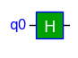
</div>

```math
\begin{align*}
H &= {\small\frac{1}{\sqrt{2}}}(\ketbra{0}{0} +\ketbra{0}{1} + \ketbra{1}{0} - \ketbra{1}{1}) \\
&={\small\frac{1}{\sqrt{2}}} \begin{bmatrix}1 & 1 \\ 1 & -1 \end{bmatrix} \end{align*}
```

**Note:** This gate is often drawn in colour to draw attention to it, because it performs a special role in quantum circuits, by switching back and forth between the Z and X bases.

The Hadamard gate is important because it transforms between the Z and X bases. One consequence of this is that a basis state is converted into a superposition with equal probabilities of state $\ket{0}$ and $\ket{1}$:

```math
\begin{align*}
H \ket{0} = {\small\frac{1}{\sqrt{2}}} \ket{0} + {\small\frac{1}{\sqrt{2}}}\ket{1} &= \ket{+}\\[1ex]
H \ket{1} = {\small\frac{1}{\sqrt{2}}} \ket{0} - {\small\frac{1}{\sqrt{2}}} \ket{1} &= \ket{-}
 \end{align*}
 ```
 
See the section on the [Hadamard Transform](#hadamard-transform) for the generalization of this to N-qubit states.

On the Bloch sphere, this corresponds to a rotation by $\frac{\pi}{2}$ radians about the Y axis followed by $\pi$ about the X axis. Equivalently, it is a rotation by $\pi$ radians about the axis shown by the red arrow:

<div style="text-align: center;">
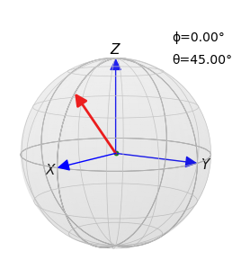
</div>

This effectively interchanges the X and Z axes and flips the sign of the Y axis.

The Hadamard gate transforms the state of a single qubit between the Z and X basis, or vice versa:
 
```math
\begin{align*}
H \ket{0} &= \ket{+}\qquad & H \ket{+} &= \ket{0}\\[1ex]
H \ket{1} &= \ket{-}\qquad & H \ket{-} &= \ket{1}
 \end{align*}
```
 
The Hadamard gate is its own inverse, so applying it a second time undoes the effect of the first application:

```math
H H = \frac{1}{2} \begin{bmatrix}1 & 1 \\ 1 & -1 \end{bmatrix} \begin{bmatrix}1 & 1 \\ 1 & -1 \end{bmatrix} = \begin{bmatrix}1 & 0 \\ 0 & 1 \end{bmatrix} = I
```

If we sandwich a Z-basis operator between the two H gates, the operation is carried out in the X basis, or vice versa. For example:

```math
\begin{align*}
HZH &\equiv X\\[1ex]
HXH &\equiv Z
\end{align*}
```

### Hadamard Transform

The Hadamard transform is not a gate, but it follows on naturally from discussion of the Hadamard gate.

One reason that the Hadamard gate is important is that it takes a basis state and converts it to a superposition with equal probabilities of state $\ket{0}$ and $\ket{1}$.

```math
\begin{align*}
H \ket{0} = {\small\frac{1}{\sqrt{2}}} \ket{0} + {\small\frac{1}{\sqrt{2}}}\ket{1} &= \ket{+}\\[1ex]
H \ket{1} = {\small\frac{1}{\sqrt{2}}} \ket{0} - {\small\frac{1}{\sqrt{2}}} \ket{1} &= \ket{-}
 \end{align*}
 ```

Many quantum algorithms work by first putting the system into a superposition of all possible solution states using Hadamard gates. They then apply quantum operators to increase the relative amplitude of the solution by interference. Finally, the state is measured causing it to assume the (classical) solution state with a high probability.

If Hadamard gates are applied to each of the qubits of an N-qubit all-zeros state $\ket{00\dots 0}$, the effect is to place the whole state into an equal superposition of all $2^N$ basis states. For example, for $N=3$:

<div style="text-align: center;">
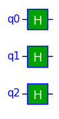
</div>

```math
\ket{\psi} = {\small\frac{1}{\sqrt{8}}} (\ket{000} + \ket{001} + \ket{010} + \ket{011} + \ket{100} + \ket{101} + \ket{110} + \ket{111})
```

This operation is known a *Hadamard Transform*. A Hadamard gate is just a one-qubit Hadamard transform. The Hadamard transform performs a local change of basis on each qubit individually, whereas the Quantum Fourier Transform (QFT) is a transformation of the whole state vector.
 
### Phase (P) Gate

The phase gate rotates the phase of a qubit around the Z axis in the Bloch sphere by an angle $\phi$.

<div style="text-align: center;">
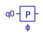
</div>

```math
\begin{align*}
P(\phi) &= \ketbra{0}{0} + e^{i\phi}\ketbra{1}{1} \\[0.5em]
&= \begin{bmatrix}1 & 0 \\ 0 & e^{i\phi} \end{bmatrix}
\end{align*}
```

When the phase gate is applied to a qubit $\alpha_0\ket{0} + \alpha_1\ket{1}$, the result is:

```math
\begin{bmatrix}1 & 0 \\ 0 & e^{i\phi} \end{bmatrix}\begin{bmatrix}\alpha_0 \\ \alpha_1 \end{bmatrix}=\begin{bmatrix}\alpha_0 \\ \alpha_1 e^{i\phi}\end{bmatrix}
```

Note that all the phase is applied to the $\ket{1}$ state. It is not necessary to apply separate phases to the two basis states as only the relative phase matters. The global phase does not affect the measurement outcome.

The following are special cases of the phase gate that are given their own names as they are frequently used:

```math
\begin{align*}
Z &= P(\pi)\\[0.3em]
S &= P(\frac{\pi}{2})= \sqrt{Z}\\[0.3em]
T &= P(\frac{\pi}{4})= \sqrt{S}
\end{align*}
```

The term *Phase gate* is sometimes used to refer specifically to the S gate, which is a special case of the P gate.

### Controlled-X (CX) Gate

The Controlled-X (CX or CNOT) gate is a quantum gate that operates on two qubits. Consequently, it is represented by a 4x4 unitary matrix:

<div style="text-align: center;">

</div>

```math
\begin{align*}
CX &= \ket{0}\bra{0} \otimes I + \ket{1}\bra{1} \otimes X\\[0.5em]
&= \ket{00}\bra{00} + \ket{01}\bra{01} + \ket{10}\bra{11} + \ket{11}\bra{10}\\[0.5em]
&= \begin{bmatrix}1&0&0&0 \\ 0&1&0&0 \\0&0&0&1 \\0&0&1&0 \end{bmatrix}
\end{align*}
```

Note that this definition assumes the big-endian qubit convention.

If the inputs are in the basis states $\ket{0}$ or $\ket{1}$, the CX gate behaves like the classical exclusive-OR (XOR) gate, with one of the inputs propagated as an output to make it reversible. It applies the X operation to the second qubit if the first qubit is $\ket{1}$.

If the control input is in a superposition $\alpha\ket{0}$ + $\beta\ket{1}$, the output is a superposition of the outputs for $\ket{0}$ and $\ket{1}$, because unitary operators are linear.

The CX gate is important because it allows two qubits to be [entangled](#entanglement).

For example, if the input to the gate is $\ket{\psi 0}$ where:
```math
\ket{\psi}=\alpha\ket{0}+\beta\ket{1}
```
then the effect of the gate is:

```math
\ket{\psi0}\rightarrow \alpha\ket{00} + \beta\ket{11}
```

Although, the two resulting qubits are the same, the gate is performing entanglement, not cloning. The output state cannot be factored into the tensor product of two independent qubit states (except in the trivial case that $\alpha=0$ or $\beta=0$).

Cloning (which is not allowed by the [No-Cloning Theorem](#no-cloning-theorem)) would be the operation:

```math
\ket{\psi 0} \rightarrow \ket{\psi\psi} = \ket{\psi} \otimes \ket{\psi}
```

**Note:** The symbol for controlled gates can be a little misleading. The solid dot  of the control is not just a connection to the qubit line. This would be invalid because of the *no-cloning theorem*. Instead, you should think of the CX gates as a  2-qubit gate, with two inputs and two outputs. The next section shows that under some circumstances the effect of a controlled gate may actually be on its control qubit and not on the target qubit.

### Understanding Controls

We often think of the control of a controlled gate as an enabling input, such that a $\ket{1}$ on the control qubit enables the controlled operation on the target qubit and a $\ket{0}$ on the control causes the gate to have no effect. However, this is a misleading way to think about controlled gates. It is valid when the control is in the computational basis state, $\ket{0}$ or $\ket{1}$. However, when the control is in a superposition state, the output of the gate is a superposition of its outputs for each of the basis states, but this may no longer behave like a simple control action.

For example, consider the following circuit with a controlled-X (CX) gate sandwiched between Hadamard gates. This "Hadamard Sandwich" changes the basis from Z to X before the CX gate and then back again afterwards.

<div style="text-align: center;">
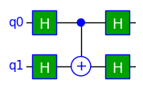
</div>

This is exactly equivalent to the following circuit, in which the roles of the control and target qubits are interchanged:

<div style="text-align: center;">
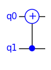
</div>

The "Hadamard sandwich" effectively changes the basis from Z to X. This has the effect of reversing the roles of the control and target qubits. So, the concept of a particular qubit of a gate being the control is dependent on the basis. This effect plays a key role in the phenomenon of *Phase kickback*, which is the subject of one the example algorithms, which we will look at later.

For some controlled gates, such as CZ, it is actually arbitrary which qubit we regard as the control because of symmetry. These are often represented by a symmetrical symbol, such as the CZ in the following circuit.

<div style="text-align: center;">
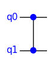
</div>

### Controlled-U Gate

We can make a controlled version of any one-qubit gate $U$ as follows.

<div style="text-align: center;">
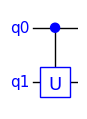
</div>

```math
\textrm{cu}(U) = \ket{0}\bra{0} \otimes I + \ket{1}\bra{1} \otimes U
```

This can be written as a *block matrix* (i.e. one made of sub-matrices):

```math
\textrm{cu}(U) = \begin{bmatrix}I_2&0_2\\0_2&U_2 \end{bmatrix}
```

The suffices indicate the size of the sub-matrix. The suffix is 2 in the simple case that U is a one-qubit gate (2x2 matrix). However, this generalizes to K-qubit gates as follows:

```math
\textrm{cu}(U) = \begin{bmatrix}I_{\small M}&0_{\small M}\\0_{\small M}&U_{\small M} \end{bmatrix}\quad\textrm{where}\quad M=2^K
```

Note that the above definition assumes the big-endian qubit convention.

In this way, we can build controlled versions of any gate. Some fairly common ones are CCX, CP and CZ. The CCX gate (also known as the Toffoli gate) is an X gate with two controls.

### SWAP Gate

The SWAP gate swaps the state of two qubits. As the gate operates on two qubits, it is represented by a 4x4 unitary matrix:

<div style="text-align: center;">
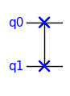
</div>

```math
\begin{align*}
SWAP &= \ketbra{00}{00} + \ketbra{01}{10} + \ketbra{10}{01} + \ketbra{11}{11}\\[0.5em]
&= \begin{bmatrix}1&0&0&0 \\ 0&0&1&0 \\ 0&1&0&0 \\ 0&0&0&1 \end{bmatrix}
\end{align*}
```

This definition is the same for both big-endian and little-endian conventions because the swap operation is symmetrical with respect to the two qubits. Consequently, the symbol makes no distinction between the two qubits.

SWAP operations are important on a real quantum computer because two-qubit gates (like CX) need the qubits to be physically-adjacent so that they can interact. The SWAP operation allows the qubits to be moved around.

SWAP itself is equivalent to the application of three CX gates as follows:

<div style="text-align: center;">
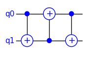
</div>

A sequence of swaps of adjacent qubits may be needed to realize a swap of two qubits that are several qubits apart. The topology of the physical qubit array is obviously important in minimizing the number of swap operations required.

---
<div style="page-break-after: always;"></div>

## 5: Entanglement

### Creating Entanglement

Entanglement was introduced in the earlier section on [Multi-Qubit States](#multi-qubit-states). Together with superposition and interference, it is one of the three main quantum phenomena exploited by quantum computers.

The following example shows how entanglement can be created using just a Hadamard (H) gate and a CX gate, from the initial state $\ket{00}$:

<div style="text-align: center;">
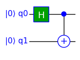
</div>

The Hadamard gate creates an equal superposition of $\ket{0}$ and $\ket{1}$:

```math
H \ket{0} = \frac{1}{\sqrt{2}}(\ket{0} + \ket{1})
```

The CX gate applies an X operation to the second input if the first input is $\ket{1}$.:

```math
CX = \ket{0}\bra{0} \otimes I + \ket{1}\bra{1} \otimes X
```

The first input of the CX gate is in a superposition, so the output is also in a superposition:

```math
\begin{align*}
\ket{\psi}&=CX\,(H\otimes I)\ket{00}\\
&={\scriptsize\frac{1}{\sqrt{2}}}(\ket{0}\ket{0} + \ket{1} (X \ket{0}))\\
 &= {\scriptsize\frac{1}{\sqrt{2}}} (\ket{00} + \ket{11} )
\end{align*}
```

This is an entangled state that cannot be factored as the tensor product of two individual qubit states. That is, it can't be written in the form $\ket{A}\otimes\ket{B}$.

Although this two-gate circuit is very simple, it is an important building block of quantum circuits, because entanglement is essential in order to perform useful quantum computations.

### Bell States

The entangled state created above is one of the four maximally-entangled states of two qubits, known as the *Bell states*. They are named after the physicist John Stewart Bell. The different Bell states are created by using different initial states, as follows:

```math
\begin{align*}
\ket{00} &\rightarrow {\scriptsize\frac{1}{\sqrt{2}}} (\ket{00} + \ket{11} )\\
\ket{01} &\rightarrow {\scriptsize\frac{1}{\sqrt{2}}} (\ket{01} + \ket{10} )\\
\ket{10} &\rightarrow {\scriptsize\frac{1}{\sqrt{2}}} (\ket{00} - \ket{11} )\\
\ket{11} &\rightarrow {\scriptsize\frac{1}{\sqrt{2}}} (\ket{01} - \ket{10} )
\end{align*}
```

### Bell Measurement

Given two qubits that are in a Bell state, a *Bell measurement* can be used to determine which of the four Bell states the qubits are in.

The following circuit shows a Bell state being created (to the left of the barrier) and then measured with a Bell measurement (to the right of the barrier):

<div style="text-align: center;">
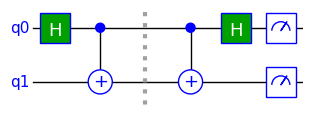
</div>

The two successive CX gates cancel as they both apply an X (NOT) conditional on the same qubit. The two H gates then cancel because the Hadamard operator is Hermitian, i.e. its own Hermitian Conjugate. Normally, of course, the Bell measurement would be performed on an arbitrary entangled state and not one we had just created.

The two meter symbols denote Z-basis measurements, as described in the section on [Measurement](#measurement).

Bell measurement is used, for example, in the [Quantum Teleportation](#quantum-teleportation) protocol.

### Monogamy of Entanglement

The principle of the *Monogamy of Entanglement* says that if two qubits are maximally entangled with one another, they cannot have any entanglement with a third qubit. This principle is important in quantum cryptography.

However, this does not mean that multi-qubit entanglement is impossible, just that there are some restrictions on what is allowed. For example, three qubits can be fully entangled, but without any entanglement between the two qubits of any pair.

The following example shows a 3-qubit entangled state, known as a *GHZ state* after Greenberger, Horne and Zeilinger.

<div style="text-align: center;">

</div>

The resulting entangled state is:

```math
\ket{\psi}={\scriptsize\frac{1}{\sqrt{2}}} (\ket{000} + \ket{111} )
```

If we measure qubit q0, we will either get $\ket{0}$ or $\ket{1}$. The remaining two qubits are then in the state $\ket{00}$ or $\ket{11}$ respectively, but it is just a classical correlation. Qubits q1 and q2 are not in a superposition of $\ket{00}$ and $\ket{11}$, so they are not entangled. It is just a lack of knowledge about the result of measuring q0 that leaves two outcomes for q1 and q2.

Any number of qubits can be entangled this way by cascading more CX gates.

---
<div style="page-break-after: always;"></div>

## 6: Measurement

### Introduction

It is not possible to inspect the quantum state of a real quantum computer. The only way to get a result is to perform a measurement that *collapses* the quantum state by projecting it onto one of the basis states. Each possible measurement outcome has an associated probability and the state after measurement is a random sample from this probability distribution. Ideally, the state will have been evolved in a way that gives a high probability of getting the required result.

Measurement of a qubit in the computational (i.e. Z) basis is usually shown by a meter symbol like this:

<div style="text-align: center;">
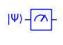
</div>

Some systems allow both qubits and classical bits in a quantum circuit, in which case the measurement symbol has an additional classical bit output, which is usually denoted by a double line:

<div style="text-align: center;">
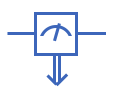
</div>

The simplest scenario is that the quantum circuit represents pure unitary evolution of state. Measurements can then be added to the output to obtain a classical result from the final quantum state. A pure unitary circuit is convenient for circuit analysis and for state simulations that just output probabilities.

Quantum circuits sometimes contain mid-circuit measurements, for a variety of reasons, as discussed below. The Principle of Deferred Measurement can often be used to move these to the end of the circuit, but sometimes this is not possible, for example when they are used for *Quantum Error Correction* (QEC).

### Measurement Operators

Measurement of the state of a quantum system is associated with a *measurement operator* $M$, for the measurement basis. The act of measurement changes the state to an *eigenvector* $\ket{\psi}$ of the measurement operator that is one of the basis states. The measured value is the corresponding *eigenvalue* $\lambda$:

```math
M \ket{\psi} = \lambda \ket{\psi}
```

Equations of this form are known as *eigenvalue equations*.

The operator must be *Hermitian* (self-adjoint). A Hermitian matrix is equal to its own conjugate transpose. The diagonal elements are real because they are their own conjugates. Hermitian matrices have the property that their eigenvalues are real and their eigenvectors are orthogonal. This ensures that the basis states are orthogonal and the measurement result is real.

The measurement operators for the X, Y and Z bases are the well-known Pauli $\sigma_x$, $\sigma_y$ and $\sigma_z$ matrices, which are also called the X, Y and Z matrices:

```math
X=\begin{bmatrix}0 & 1 \\ 1 & 0 \end{bmatrix},\quad Y=\begin{bmatrix}0 & -i \\ i & 0 \end{bmatrix},\quad Z=\begin{bmatrix}1 & 0 \\ 0 & -1 \end{bmatrix}
```

These are related by:

```math
X^2=Y^2=Z^2=-iXYZ=\begin{bmatrix}1&0\\0&1\end{bmatrix} = I
```

**Note:** It is important to understand that the measurement operator is *not* applied to the state in the same way as a quantum gate. Instead, it defines an *observable* that we wish to measure. When you perform a measurement, the system state changes to one of the *eigenvectors* of the Hermitian matrix and the outcome is the corresponding *eigenvalue*. Confusion can arise because the X, Y and Z matrices are also used as quantum gates, where they perform rotations about the X, Y and Z axes of the Bloch sphere.

In quantum computing, we normally work in the Z basis, which is called the *Computational basis*, so the observable is the Hermitian operator $Z$ :

```math
Z = \begin{bmatrix}1 & 0 \\ 0 & -1 \end{bmatrix}
```

This has eigenvalues $\lambda=+1$ and $-1$, with corresponding eigenvectors $\begin{bmatrix}1\\0\end{bmatrix}$ and $\begin{bmatrix}0\\1\end{bmatrix}$.

We usually denote the eigenvalues by $0$ and $1$, when we want to treat the result as classical bits and denote the corresponding eigenvectors by $\ket{0}$ and $\ket{1}$:

```math
\ket{0} = \begin{bmatrix}1\\0\end{bmatrix}, \qquad \ket{1} = \begin{bmatrix}0\\1\end{bmatrix}
```

This association between kets and column vectors was introduced in an earlier section.

### Projective Measurement

The Hermitian operator $M$ defines *what* we want to measure (an observable). Projectors are used to explain *how* the measurement results follow from this.

A Hermitian operator $M$ can be expressed as:

```math
M = \sum_i{\lambda_i P_i}
```

where $\lambda_i$ are the eigenvalues of $M$ and $P_i$ are projectors onto the basis vectors.

This is known as *spectral decomposition* of a matrix and is the connection between the Hermitian operator and a set of orthogonal projectors that project the state onto basis vectors.

Using the Z matrix and its eigenvectors and eigenvalues, the projectors are:

```math
P_{+1}=\ket{0}\bra{0} = \begin{bmatrix}1&0\\0&0\end{bmatrix}
```
```math
P_{-1}=\ket{1}\bra{1} = \begin{bmatrix}0&0\\0&1\end{bmatrix}
```

**Note:** We can confirm that this is a correct spectral decomposition of Z as follows:

```math
\begin{align*}
\sum_i{\lambda_i P_i} &= (+1)\ket{0}\bra{0}+(-1)\ket{1}\bra{1}\\&=(+1)\begin{bmatrix}1&0\\0&0\end{bmatrix} + (-1)\begin{bmatrix}0&0\\0&1\end{bmatrix}\\[1ex] &= \begin{bmatrix}1 & 0 \\ 0 & -1 \end{bmatrix}=Z
\end{align*}
```

Consider measurement of a qubit which has the state:

```math
\ket{\psi} = \alpha_0 \ket{0} + \alpha_1 \ket{1}
```

Then:

```math
p(+1)=\bra{\psi}P_{+1}\ket{\psi} = |\alpha_0|^2
```
```math
p(-1)=\bra{\psi}P_{-1}\ket{\psi} = |\alpha_1|^2
```

This is the *Born Rule* which was introduced earlier. If we name the measurement results $0$ and $1$:

```math
\begin{align*}
p(0) &= \lvert\alpha_0\rvert^2\\[1ex]
p(1) &= \lvert\alpha_1\rvert^2
\end{align*}
```

**Note:** The lower-case symbol $p$ is used for probability, whereas upper-case $P$ is used for Projector.

Measurement of the state of a qubit results in the state changing (collapsing) to one of the basis states with a probability given by the squared magnitude of the corresponding amplitude.

After a measurement, the system is in an eigenstate of the measurement operator. So, if we measure it again, in the same basis, we will get the same result with probability $p=1$. This follows because the projectors are *idempotent*:

```math
P_i^2=P_i
```

### Measuring Multiple Qubits

When there are multiple qubits, they may be measured one-at-a-time, in any order, or all together. It gives the same result because the state is projected onto the same set of outcomes.

Mathematically, measuring qubits one-at-a-time corresponds to expanding the $2\times 2$ Hermitian matrix by forming the tensor product with identity matrices $I$ for the unmeasured qubits. For example, to measure the first of three qubits, the Hermitian matrix is:

```math
M=Z\otimes I\otimes I
```

To measure all the qubits at once, the Hermitian matrix would be:

```math
M=Z\otimes Z\otimes Z
```

If the qubits are entangled, measuring one qubit may affect the probabilities of other unmeasured qubits, but this does not affect the final outcome.

The qubits that have already been measured have definite values that can't be changed by measuring other qubits. This leads to the *Principle of Implicit Measurement*. This states that any qubits which have not been measured at the end of the computation may be assumed to be measured.

### Measurement in Different Bases

The measurement operators for the X, Y and Z bases are the well-known Pauli X, Y and Z matrices, as discussed previously.

Quantum computer hardware normally only supports measurement in the Z basis. Measurement in this basis is denoted by a meter symbol in a quantum circuit:

<div style="text-align: center;">

</div>

However, a Z-basis measurement can be used to make measurements in other bases, by first transforming the state between bases and then performing a Z-basis measurement.

For example, a X-basis measurement can be made by applying a Hadamard (H) gate before the Z-basis measurement.

<div style="text-align: center;">
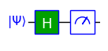
</div>

Similarly, to make a Y-basis measurement, we first apply an $S^\dagger$ gate and then a Hadamard gate before the Z-basis measurement.

<div style="text-align: center;">
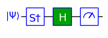
</div>

The $S$ gate is a special case of the phase gate (P), which applies a phase rotation of $\frac{\pi}{2}$. The $S^\dagger$ (S-dagger) gate is its Hermitian conjugate, which applies a phase rotation of $-\frac{\pi}{2}$ radians:

```math
S^\dagger = P(\small\frac{-\pi}{2})
```

### Principle of Deferred Measurement

The *principle of deferred measurement* says that a quantum circuit can always be replaced by an equivalent one which has all the measurements at the end, without affecting the measurement probabilities.

Once all measurements are at the end, the circuit becomes a single unitary operator that is followed by final measurements of its outputs. This simplifies analysis and optimization of the circuit by allowing only pure states to be considered.

It can also make the circuit much faster to simulate if we just want measurement probabilities. On a real quantum computer, it is necessary to perform many runs in order to estimate the probabilities, but with a state simulator we can compute the probabilities directly, provided that the circuit contains no measurements.

#### Method 1

If mid-circuit measurements are used to control (i.e. enable) operations later in the circuit, then the classically-controlled operations can be replaced by ones with quantum controls.

For example, consider the following circuit:

<div style="text-align: center;">
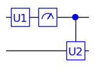
</div>

**Note:** The above diagram should have been drawn with double lines to indicate classical bits. The output of the measurement is a classical bit and U2 has a classical control.

This circuit can be replaced by the following, where U2 now has a quantum control:

<div style="text-align: center;">
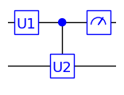
</div>

#### Method 2

Another way to move a mid-circuit measurement to the end is to entangle the qubit with an ancilla qubit. The ancilla can then be measured at the end of the circuit.

Consider the following example, where we want to move the mid-circuit measurement to the end:

<div style="text-align: center;">
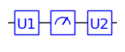
</div>

The ancilla bit is initialized to $\ket{0}$, entangled and finally measured at the end, giving the same result that we would have got from the original mid-circuit measurement:

<div style="text-align: center;">
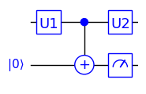
</div>

If mid-circuit measurements are used to control (i.e. enable) operations later in the circuit, then the classically-controlled operations can be replaced by ones with quantum controls.

### Mid-Circuit Measurement

One reason that mid-circuit measurements may be made is that the measurement result is used to control a subsequent quantum operation. As discussed above, it is possible to move such measurements to the end of the circuit by the principle of deferred measurement. However, this may be at the expense of an ancilla qubit, which can be a problem given that qubits are a precious resource in today's systems.

With a real quantum computer, there are other reasons why it may be desirable to perform mid-circuit measurements. For example, noise is a significant problem, so there is an advantage in measuring a qubit as early as possible before it loses coherence. Mid-circuit measurements are also used by Quantum Error Correction (QEC) techniques.

Another possible reason for a mid-circuit measurement is that it allows the qubit to be reused if it is reset to $\ket{0}$ after measurement. This goes against the ideal of reversible evolution of state, but it can be a pragmatic solution to gain a qubit when qubits are in short supply.

Mid-circuit measurements are usually much slower than quantum gates. As a result, they may increase the likelihood of unwanted decoherence of the other qubits.

### Measurement in Simulations

With a real quantum computer, it is fundamentally impossible to observe the quantum state, so we are forced to perform a measurement that gives us a single classical result. Using a quantum state simulator, on the other hand, often makes it possible to omit the measurements altogether, because the probabilities tell us all we need to know. In fact, the probabilities let us see the "big picture" of all possible outcomes, whereas a real quantum computer collapses the state and just gives a single measurement outcome.

A simulator can also let us look at the complex quantum state, phases and measurement probabilities and watch them evolve. Simulation of quantum computations is not just a way to develop and test quantum algorithms when you don't have a real quantum computer available. It is a valuable tool for learning about quantum computing and for understanding, developing and debugging quantum algorithms. Being able to see the algorithm in operation provides much more insight and can help us to develop our intuition.

If it is required to simulate measurements (for example to see some typical measurement counts), it is possible to simulate them by just re-sampling the probability distribution, without the need to re-run the simulation. This assumes that there are no mid-circuit measurements. If mid-circuit measurements are present, they can often be moved to the end of the circuit, by the [Principle of Deferred Measurement](#principle-of-deferred-measurement).

### Measurement as Decoherence

The traditional (Copenhagen interpretation) view of quantum measurement treats it as a discontinuous irreversible jump that causes the quantum state to suddenly collapse into a classical one. However, it seems very unsatisfactory that the state normally evolves in a deterministic unitary manner, but follows a completely different non-deterministic rule when we observe it. It is not even clear what constitutes a measurement.

A more modern view, from the perspective of quantum information theory, is that measurement is the interaction of a quantum system with the environment through entanglement and information exchange. This causes phase information to leak out into the environment, so that the quantum coherence is lost. This process of *decoherence* makes the original system behave classically as it can no longer exhibit quantum effects such as superposition and interference. The evolution of the system being measured is no longer unitary, although the system as a whole, including the environment, is still unitary in principle. However, the phase information is now lost in the trillions of particles in the environment, so it is impossible in practice to recover the information and restore the coherence. Decoherence is the reason that that our everyday macroscopic world does not exhibit quantum behaviour, even though it is made of quantum particles.

The interaction with the environment can be via a measuring device, which in turn interacts with the environment, or it can be direct, in which case we can think of the environment as "measuring" the system. The system rapidly becomes entangled with trillions of particles in the measuring device and the entanglement rapidly spreads into the environment, so that there is a big multi-qubit entanglement which has a consistent view of the measurement outcome. We see one particular result because we are entangled with the environment.

---
<div style="page-break-after: always;"></div>

## 7: Quantum Algorithms

This section describes some quantum algorithms, including Shor's algorithm and Grover's algorithm. The examples have been adapted from the Jupyter Notebook examples that are included with the author's TinyQsim simulator. However, the executable code has been omitted here to keep this Guide less specific to particular development tools.

If you would like to see full working versions of these examples, see the Examples section in the TinyQsim documentation (https://jbrumf.github.io/tinyqsim).

**Note:**  TinyQSim should not be confused with the Tiny-Q project that has subsequently appeared in the PyPI software repository with the name TinyQSim. The two are not related.

---

### 7.1: Interference

This example looks at the phenomenon of quantum interference, which plays a key role in most quantum algorithms.

#### Introduction

Two quantum states can be made to *interfere* with each other. If they are in phase, their amplitudes will reinforce one another. If they are in anti-phase, they will cancel one another. Even a single qubit can interfere with itself, because it has two basis states $\ket{0}$ and $\ket{1}$. (If you are familiar with the well-known "Double-slit" experiment, this is like the way that a photon or electron can be in a superposition of going through both slits and interfering with itself.)

<div style="text-align: center;">
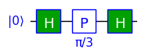
</div>

The circuit uses a phase (P) gate and two Hadamard (H) gates. Although very simple, this pattern is an important building block for quantum circuits.

The first Hadamard gate places the qubit in an equal superposition of $\ket{0}$ and $\ket{1}$. The phase gate then introduces a phase difference of $\frac{\pi}{3}$ radians (i.e. 60 degrees) between these two components. The final Hadamard gate undoes the effect of the first Hadamard, recombining the components, causing them to interfere with one another, increasing or decreasing their relative amplitudes.

If we run the algorithm on a simulator, the effect of the interference is evident in the measurement probabilities:
```
    p(0) = 0.75
    p(1) = 0.25
```
With a real quantum computer it is necessary to add a measurement operation to the end of the circuit. The circuit can be run a few hundred times to get measurement counts, from which the probabilities can be estimated.

Sandwiching the phase gate between two Hadamard gates has converted a non-measurable phase difference into an observable probability difference.

#### Effect of Phase Angle

The following plot was obtained by running the circuit on a quantum circuit simulator for various values of the phase angle $\phi$. It shows how the probabilities of measuring '0' and '1' vary as a function of $\phi$.

<div style="text-align: center;">
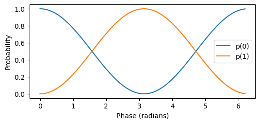
</div>

#### Analysis

We will label points in the circuit A, B, C, D, so that we can refer to the state at these points as $\ket{\psi_A},\ket{\psi_B}$, etc:

<div style="text-align: center;">
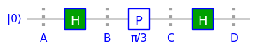
</div>

The initial state $\ket{\psi_A}$ is:

```math
\ket{\psi_A}=\ket{0}
```

The first Hadamard gate transforms this into the superposition state:

```math
\ket{\psi_B}=\frac{1}{\sqrt{2}}(\ket{0} + \ket{1})
```

The phase gate is defined as:

```math
P(\phi)=\ket{0}\bra{0}+e^{i\phi}\ket{1}\bra{1}
```

When applied to the superposition state, it gives:

```math
\ket{\psi_C}=\frac{1}{\sqrt{2}}(\ket{0} + e^{i\phi}\ket{1})
```

Finally, the second Hadamard gate results in the state:

```math
\ket{\psi_D}={\small\frac{1}{2}}\left[(\ket{0}+\ket{1}) + e^{i\phi}(\ket{0}-\ket{1})\right]
```

which can be rewritten as:

```math
\ket{\psi_D}=\frac{1}{2}\left[(1 + \cos{\phi}+ i\sin{\phi})\ket{0} + (1 - \cos{\phi} - i\sin{\phi})\ket{1} \right]
```

For $\phi=\frac{\pi}{3}$, we can substitute $\cos{\phi}=\frac{\sqrt{3}}{2}$ and $\sin{\phi}=\frac{1}{2}$

which gives:

```math
\ket{\psi}=\frac{1}{4}\left[(3 + i\sqrt{3})\ket{0}+(1-i\sqrt{3})\ket{1}\right]
```

The probabilities of measuring $\ket{0}$ and $\ket{1}$ are:

```math
p(\ket{0})=\frac{1}{4}(3 + \sqrt{3}i)\ \frac{1}{4}[(3 - \sqrt{3}i) = \frac{3}{4}
```

```math
p(\ket{1})=\frac{1}{4}(1 - \sqrt{3}i)\ \frac{1}{4}[(1 + \sqrt{3}i) = \frac{1}{4}
```

These agree with the values of 0.75 and 0.25 given earlier.

#### Bloch-Sphere Description

Another way to understand the behaviour of the circuit is to plot the state vector on the Bloch sphere and follow it step-by-step as we perform each gate operation in turn. The Bloch sphere is only suitable for representing single-qubit systems, but the graphical visualization may help in building some intuition.

The state vector is described by two angles on the Bloch sphere. The phase angle $\phi$ is measured clockwise about the +Z axis. The polar angle $\theta$ is measured relative to the +Z axis. So, $\theta=\frac{\pi}{2}$ corresponds to points on the "equator" of the sphere, where the measurement probabilities of 0 and 1 are equal.

The circuit starts in an initial state of $\ket{0}$ which is in the +Z direction, as shown below by the red vector:

<div style="text-align: center;">
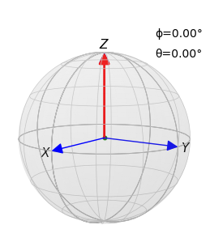
</div>

In this state, there is a 100% probability of getting state $\ket{0}$ if we make a measurement.

The first gate is a Hadamard (H) gate. Hadamard gates perform a 180 degree rotation about an axis mid-way between the X and Z axes (sometimes called the 'X+Z' axis). This operation can be viewed as a basis change that swaps the role of the X and Z axes. It has the effect of transforming the Z-basis state $\ket{0}$ into the superposition state $\ket{+}=\frac{1}{\sqrt{2}}(\ket{0}+\ket{1})$, which is a basis state of the X basis.

Consequently, after the first Hadamard gate, the state vector is in the +X direction:

<div style="text-align: center;">
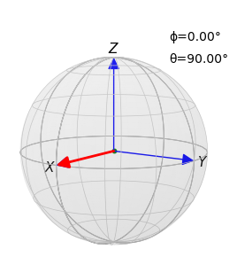
</div>

There are now equal probabilities of measuring 0 or 1.

```
  p(0) = 0.5
  p(1) = 0.5
```

Next, the phase (P) gate in our example circuit rotates the state vector 60 degrees clockwise about the +Z axis:

<div style="text-align: center;">
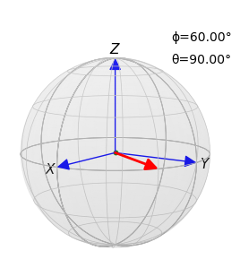
</div>

The measurement probabilities of $\ket{0}$ and $\ket{1}$ are still both 50%, as the state vector is still on the equator:

The final Hadamard gate undoes the original Hadamard transformation, leaving the state vector at an angle of 60 degrees to the original $\ket{0}$ state.

<div style="text-align: center;">

</div>

The two basis states now have different measurement probabilities. There is now a 75% probability of measuring a '0' and 25% probability of measuring a '1', which agrees with the values given earlier.

```
  p(0) = 0.75
  p(1) = 0.25
```

One way to think about the circuit is that the Hadamard-sandwich $HPH$ is a basis change that transforms the phase (P) gate so that it rotates about X instead of Z. A phase change then becomes a measurable amplitude change. Alternatively, from an interference perspective, the first Hadamard places the state in a superposition. The phase gate then introduces a phase difference between the $\ket{0}$ and $\ket{1}$ states. The second Hadamard then causes the two states to interfere with one another, leading to an observable amplitude difference.

Many quantum algorithms work by placing a set of $N$ qubits in a joint superposition of the $2^N$ states. The phases are then selectively modified so that the states interfere, amplifying valid solutions using constructive interference. A final Hadamard or Fourier transform then puts the state back in a form where we can see the phase difference as amplitude differences when we measure the output state. This will become clearer when we look at Quantum Phase Estimation and Shor's Algorithm in subsequent examples.

---

### 7.2: Phase Kickback

This example explores the phenomenon of Phase Kickback. This is an effect in which controlled gates can have an effect on their control qubits. It is an important building block in many quantum algorithms such as the Quantum Phase Estimation (QPE) and Shor's Algorithm.

#### Introduction

Any unitary operator can be expressed in terms of the phases $\phi_j$ of its eigenvectors $\ket{u_j}$, as follows:

```math
U=\sum_j{e^{i\phi_j}\,\ket{u_j}\bra{u_j}}
```

where $\lambda_j = e^{i\phi_j}$ are the corresponding eigenvalues.

The eigenvalue always has a magnitude of one because the operator is unitary, so it is just a phase term.

If we apply the unitary to one of its eigenvectors $\ket{u_k}$, the result will be the corresponding eigenvalue $e^{i\phi_k}$ multiplied by the eigenvector:

```math
\begin{align*}
U \ket{u_k} &= ({e^{i\phi_k}\,\ket{u_k}\bra{\psi_k}})\ \ket{u_k}\\
&= e^{i\phi_k}\ket{u_k}
\end{align*}
```

Consider a unitary operator $U$ which has an eigenvector $\ket{u_k}$ with corresponding eigenvalue $e^{i\phi}$.

```math
U\ket{u_k} = e^{i\phi}\ket{u_k}
```

We apply $U$ to its eigenstate as a controlled-U with the control in superposition:

<div style="text-align: center;">
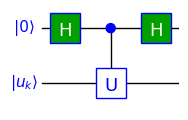
</div>

The output is:

```math
{\small\frac{1}{\sqrt{2}}}(\ket{0}\ket{u_k} + \ket{1}U\ket{u_k}
```

```math
= {\small\frac{1}{\sqrt{2}}}(\ket{0}\ket{u_k} + e^{i\phi}\ket{1}\ket{u_k}
```

This is not an entangled state, because it can be written as the tensor product of qubit states:

```math
({\small\frac{1}{\sqrt{2}}}(\ket{0} + e^{i\phi}\ket{1})) \otimes\ket{u_k}
```

The phase now appears on the control qubit.

Being able to do the factorization relies on the state $\ket{\psi}$ being an eigenstate of $U$. If this were not the case, the qubits would be entangled and it would not be meaningful to talk about their individual phases.

This effect is called "Phase Kickback". The phase resulting from a controlled gate is "kicked back" onto the control qubit and the target qubit is left unaffected. There were two things necessary to make this example work. The control input had to be in an equal superposition state and the target input had to be in an eigenvector of the controlled operation.

#### Example

For a concrete example, we will use the following circuit:

<div style="text-align: center;">
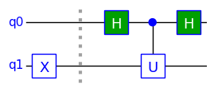
</div>

The unitary matrix $U$ has an eigenvector of $\ket{1}$ with corresponding eigenvalue $e^{\large i\frac{\pi}{3}}$.

```math
U=\begin{bmatrix}1&0\\0&e^{i\phi}\end{bmatrix},\quad\text{where }\phi=\frac{\pi}{3}
```

The $X$ gate initializes qubit q1 to $\ket{1}$, which is an eigenvector of $U$.

The output state is:

```math
\displaystyle \ket{\psi} = (0.75+0.43301j)\ \ket{01} + (0.25-0.43301j)\ \ket{11}$
```

This is not an entangled state, because it can be written as the tensor product of qubit states:

```math
\ket{\psi}=\left[(0.75+0.43301j)\ket{0}+(0.25-0.43301j)\ket{1}\right] \otimes\ket{1}
```

All the phase has been kicked-back to qubit q0. Qubit q1 is still in its original state $\ket{1}$ and so has not been affected.

Phase kickback will work for any unitary, because a unitary simply applies a phase $\theta_k$ when its input is the corresonding eigenvector $\ket{\phi_k}$.

Although we have only considered a one-qubit unitary with two eigenvectors, it works for an N-qubit unitary with $2^N$ eigenvectors. By initializing the input of the unitary to one of its eigenvectors, we can read out the phase associated with the corresponding eigenvalue. This plays an important role in algorithms such as Quantum Phase Estimation (QPE) and Shor's Algorithm.

#### Role of Controls

Phase Kickback may seem very strange, because we often think of the control of a controlled gate as an enabling input, such that a $\ket{1}$ on the control qubit enables the controlled operation on the target qubit and a $\ket{0}$ on the control causes the gate to have no effect. However, this is only valid when the control is in the computational basis state, $\ket{0}$ or $\ket{1}$. In the phase kickback circuit, the controls are in an X-basis state (i.e. a superposition) and the only effect of the controlled gates is on their controls. See the earlier section on *Understanding Controls* for a discussion of this.

---

### 7.3: Quantum Fourier Transform

The Quantum Fourier Transform (QFT) is an important building block of many quantum algorithms, including Quantum Phase Estimation and Shor's algorithm. These are the subject of subsequent examples. Here, we look at how it is implemented using quantum gates and some of its properties.

#### Introduction

The Fourier transform is widely used in science and engineering to transform data between two different domains. For example, in signal processing a waveform in the time domain may be transformed into a spectrum in the frequency domain or vice versa. It is often useful to transform data to a different domain where operations may be performed more easily. Then the result can be transformed back to the original domain.

In quantum computing, we use the Quantum Fourier Transform (QFT) to transform quantum states between the Computational Basis and the Fourier Basis. The QFT is equivalent to the application of an ordinary inverse Discrete Fourier Transform (DFT) to the quantum state vector (see below). The *inverse* arises simply because the QFT is normally defined with a different sign convention.

An $n$-qubit QFT maps an input state $\ket{x}$ onto a sum of basis states $\ket{k}$ in the Fourier basis:

```math
QFT: \ket{x}\mapsto{\small\frac{1}{\sqrt{N}}}\sum_{k=0}^{N-1}e^{\large\frac{2\pi i\ xk}{N}}\ket{k},\\
\quad\text{where }N=2^n
```

**Note:** A ket such as $\ket{0011}$ is sometimes written as $\ket{3}$, using a decimal label instead of a binary one. This is often convenient when we are using qubits to encode numerical values. It is usually clear from context which is meant. Similarly, the above equation sums an expression containing $\ket{k}$ over integer values of $k$.

#### QFT Implementation

The QFT can be implemented using quantum gates, as shown here for a 4-qubit state:

<div style="text-align: center;">
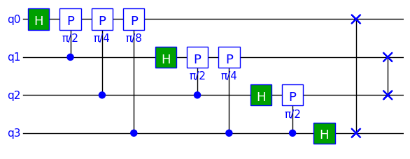
</div>

This pattern continues as we add more qubits. The simplest case is for a one-qubit QFT, when the circuit reduces a single Hadamard gate. The SWAP gates on the outputs reverse the order of the qubits, in much the same way that a bit-reversal is used in the DFT.

#### Inverse QFT

The inverse QFT is the inverse of the QFT circuit given above. By definition, a unitary operator is one whose inverse is its Hermitian Conjugate. To reverse the circuit, we simply reverse the sequence of gates and replace each gate by its conjugate transpose:

```math
(U_1 U_2\dots U_{n-1})^\dagger = U^\dagger_{n-1}\dots U^\dagger_2 U^\dagger_1
```

In the QFT circuit above, the Hadamard and swap gates are Hermitian (i.e. equal to their own conjugates transposes). The conjugate transpose of the phase gate is given by:

```math
P^\dagger(\phi) = P(-\phi)
```

Consequently, the 4-qubit inverse QFT is implemented by the following circuit:

<div style="text-align: center;">
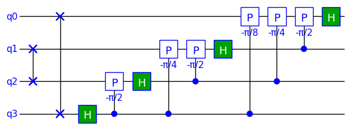
</div>

#### Phases

Returning to the QFT definition:

```math
QFT: \ket{x}\mapsto{\small\frac{1}{\sqrt{N}}}\sum_{k=0}^{N-1}e^{\large\frac{2\pi i\ xk}{N}}\ket{k},\\
\quad\text{where }N=2^n
```

If the input $\ket{x}$ is a basis state, then the output is an equal-magnitude superposition with linearly increasing phase. The rate at which the phase increases going along the state vector is proportional to $k$, which the index along the state vector, and to $k$, which is the input.

Let us look at the result of applying the 4-qubit QFT to some simple states. This should help to build some intuition about what the QFT does. The magnitude and phase plots shown below were produced by running the QFT circuit on a quantum circuit simulator with various input states.

#### QFT(|0000>)

The simplest case is when the input state is $\ket{0000}$, as plotted here:

<div style="text-align: center;">
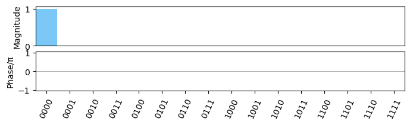
</div>

In this case, the QFT produces an equal superposition state with all zero phases:

<div style="text-align: center;">
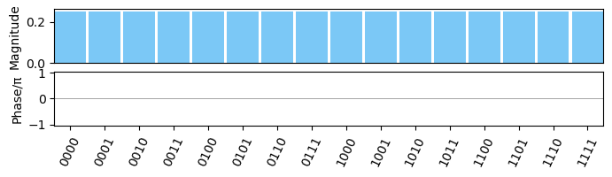
</div>

From the definition of the QFT given earlier:

```math
\begin{align*}
QFT_4(\ket{0}) &= {\small\frac{1}{\sqrt{16}}}\sum_{k=0}^{15} e^0\ket{k}\\
&={\small\frac{1}{4}}(\ket{0}+\ket{1}+\ket{2}+\ket{3}+\dots+\ket{15})
\end{align*}
```

Referring to the QFT circuit above, when the input is $\ket{0000}$ all of the control qubits for the phase gates are $\ket{0}$, so the circuit could be reduced to four Hadamard gates and is equivalent to a Hadamard Transform.

#### QFT(|0010>)

Let us repeat the simulation with an input state of $\ket{0010}$. Note that $0010$ is the binary for $2$ and corresponds to the position of the input basis state along the state vector. We can also write this state as $\ket{2}$.

<div style="text-align: center;">
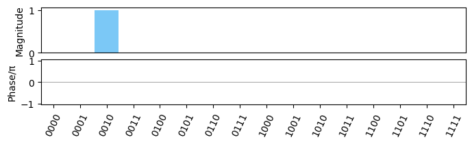
</div>

The output is a superposition with equal magnitudes, as before, but with linearly increasing phase. The phase $\phi$ wrap-arounds at $\pi$ because the phase is plotted in the range $-\pi\lt\phi\le\pi$.

<div style="text-align: center;">
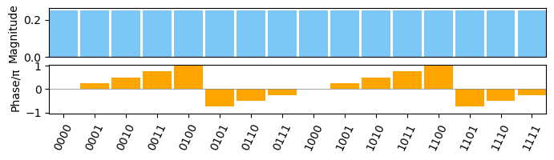
</div>

```math
\begin{align*}
QFT_4(\ket{2}) &= {\small\frac{1}{\sqrt{16}}}\sum_{k=0}^{15} e^{\large\frac{2\pi i\ 2k}{16}}\ket{k}\\
&={\small\frac{1}{4}}(\ket{0}+e^{i\pi\frac{1}{4}}\ket{1}+e^{i\pi\frac{2}{4}}\ket{2}+e^{i\pi\frac{3}{4}}\ket{3}+\dots+e^{i\pi\frac{15}{4}}\ket{15})
\end{align*}
```

The phase is increasing at $\frac{\pi}{4}$ per element in the transformed state vector.

If you are familiar with the ordinary Fourier transform or DFT, you will probably recognise this as an example of the *Fourier Shifting Theorem*. This says that a translation (shift) in one domain corresponds to a linearly increasing phase in the other domain.

If we took the inverse QFT of the above phase ramp, we would get back to the input state $\ket{2}$ (or a close approximation). In the *Quantum Phase Estimation* (QPE) example, which follows later, we do precisely that, to estimate an unknown phase. 

#### Interference

Up to now, we have just looked at applying the QFT to a basis state. However, since unitary operators such as the QFT are linear, the QFT of a superposition of basis states is just the superposition of the QFTs of the individual basis states.

The QFT of a basis state is an equal-magnitude superposition of all basis states with associated phases. If we measure it, the result will be random because all states are equally likely. However, if we take the QFT of the superposition of two or more basis states, the results can *interfere* with one another, resulting in measurable amplitude variations.

For example, consider the superposition:

```math
\ket{\psi}=\frac{1}{\sqrt{2}}(\ket{0001}+\ket{1111})
```

We expect the result to be real as the input state has even symmetry, since $\ 15 \equiv -1 \pmod{16}$.

```math
\ket{\psi} = 0.70711\ \ket{0001} + 0.70711\ \ket{1111}
```

<div style="text-align: center;">
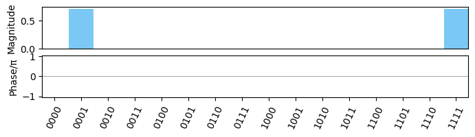
</div>

If we take the QFT of this superposition, the resulting amplitudes follow a cosine curve as shown below. This time we will plot the real and imaginary parts, instead of magnitude and phase, to show the negative part of the cosine curve.

<div style="text-align: center;">
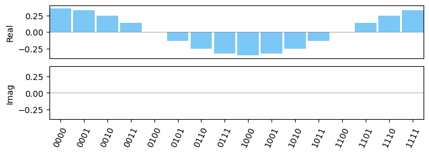
</div>

The following plot shows the magnitude and phase. The magnitude is the absolute value of the complex amplitude, so there is a phase term of $e^{i\pi}=-1$ to account for the sign change. The phases for $\ket{0100}$ and $\ket{1100}$ are meaningless because the magnitude is zero.

<div style="text-align: center;">
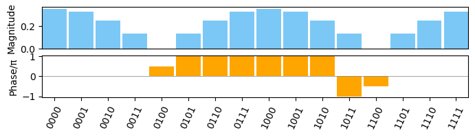
</div>

The result can be quantified as follows:

```math
\ket{\psi}=\frac{1}{\sqrt{2}}(\ket{1}+\ket{15})
```

```math
\begin{align*}QFT(\ket{\psi})&={\small\frac{1}{\sqrt{2}}}(\frac{1}{4}\sum_{k=0}^{15} e^{{2\pi ik}\frac{1}{16}} + \frac{1}{4}\sum_{k=0}^{15} e^{{2\pi ik}\frac{15}{16}})\\
&={\small\frac{1}{4\sqrt{2}}}\sum_{k=0}^{15}(e^{{2\pi ik}\frac{1}{16}}+e^{-{2\pi ik}\frac{1}{16}})
\end{align*}
```

Using the identity $\cos{\phi}=\frac{e^{i\phi}+e^{-i\phi}}{2}$, this simplifies to:

```math
QFT(\ket{\psi})={\small\frac{1}{2\sqrt{2}}}\sum_{k=0}^{15}\cos(\frac{2\pi k}{16})
```

#### Computational Complexity

The time complexity of the traditional DFT algorithm is $\mathcal{O}(N^2)$. However, it is usually implemented by the Fast Fourier Transform (FFT) algorithm which is $\mathcal{O}(N\log{N})$. The QFT does even better than this.

From the quantum circuit of the QFT shown earlier, it is apparent that the number of gates needed for an n-qubit QFT is:

```math
(1+2+3+\dots+n) +\left\lfloor\frac{n}{2}\right\rfloor=\frac{n(n+1)}{2} + \left\lfloor\frac{n}{2}\right\rfloor
```

The $ \left\lfloor\frac{n}{2}\right\rfloor$ term is for the swap gates.

If we assume that the gates all have the same execution time, the time complexity is:

```math
\mathcal{O}(n^2) = \mathcal{O}(\log^2 N),\quad\text{where }N=2^n
```

This is exponentially faster than even the FFT. However, it assumes that we can efficiently implement a CP gate where the 2 qubits are non-adjacent. In practice, a quantum computer can normally only perform such operations on physically-adjacent qubits. This may lead to some overhead in performing 'swap' operations to move the qubits around.

#### Relation to DFT

The QFT has the same effect as applying the normal inverse Discrete Fourier Transform (DFT) to the quantum state vector. It is equivalent to the *inverse* DFT, rather than forward DFT, simply because a different sign convention is used. 

The inverse DFT, with $\frac{1}{\sqrt{N}}$ normalization, can be defined as:

```math
X_n = \frac{1}{\sqrt{N}} \sum_{m=0}^{N-1} x_m\omega_N^{mn},\quad n=0,1,2,\dots,N-1
```

where $\omega_N = e^\frac{2\pi i}{N}$

The result is in bit-reversed order, so we need to finally apply a bit-reversal operation.

The DFT can be expressed as a matrix as follows, where the $\omega^0$ terms have been written as $1$.

```math
U_N=\frac{1}{\sqrt{N}}\begin{bmatrix}1&1&1&\dots&1\\
1&\omega&\omega^2&\dots&\omega^{N-1}\\
1&\omega^2&\omega^4&\dots&\omega^{2(N-1)}\\
\vdots&\vdots&\vdots&\dots&\vdots\\
1&\omega^{N-1}&\omega^{2(N-1)}&\dots&\omega^{(N-1)(N-1)}\\
\end{bmatrix}
```

The QFT is equivalent to the application of this unitary matrix to the quantum state. The columns of the matrix are the DFTs of the N orthogonal quantum basis vectors $[1,0,0,\dots], [0,1,0,\dots],[0,0,1,\dots], $ etc. Because of linearity, we can apply it to a general quantum state that is a superposition of the basis states.

---

### 7.4: Quantum Phase Estimation

Quantum Phase Estimation (QPE) is an important part of many quantum algorithms, such as Shor's factorization algorithm. The aim of QPE is to find the phase associated with an eigenvector of a unitary operator. This example looks at how it works.

This example builds on the previous ones on Phase Kickback and the Quantum Fourier Transform (QFT), so it is recommended to study those first. 

#### Phase Kickback

Here is a quick recap of the main points from the Phase Kickback example.

Any unitary operator can be expressed in terms of the phases $\phi_j$ of its eigenvectors:

```math
U=\sum_j{e^{i\phi_j}\,\ket{\psi_j}\bra{\psi_j}}
```

where $\lambda_j = e^{i\phi_j}$ are the corresponding eigenvalues.

The eigenvalue always has a magnitude of one because the operator is unitary.

If we apply the unitary to one of its eigenvectors $\ket{\psi_k}$, the result will be the corresponding eigenvalue $e^{i\phi_k}$ multiplied by the eigenstate:

```math
\begin{align*}
U \ket{\psi_k} &= ({e^{i\phi_k}\,\ket{\psi_k}\bra{\psi_k}})\ \ket{\psi_k}\\
&= e^{i\phi_k}\ket{\psi_k}
\end{align*}
```

If we apply a controlled unitary to one of its eigenvectors, with the control in an equal superposition state, the phase is "kicked back" to the control qubit and the target qubit is left unchanged.

#### Fractional Phase

The principal value of the phase $\phi$ can be expressed as a fraction $\theta$ of $2\pi$.

```math
\theta=\frac{\phi}{2\pi},\quad\text{where }\theta\in[0,1)
```

This can be approximated as an $m$-bit binary fraction:

```math
\theta\approx\sum_{k=1}^m{\theta_k} 2^{-k},\quad\text{where }\theta_k\in\{0,1\}
```

which can be written using '.' for the *binary point*, analogous to a decimal point:

```math
\theta\approx 0.\theta_1\theta_2\dots\theta_m
```

Encoding the phase this way allows us to represent it using a qubit register, with the qubits corresponding to the bits of the binary fraction. The aim is to evolve the phase so that, when measured, it will give the bits of the binary fraction. For example, with a 3-qubit register, a measurement outcome of $\ket{011}$ would correspond to the phase $\theta=.011$ in binary, if we place a binary point before it.

#### Example Unitary Operator

To demonstrate QPE, we will define a 2$\times$2 matrix which has eigenvalue phases of 0, p1, p2, p3 for eigenstates $\ket{00}, \ket{01}, \ket{10}, \ket{11}$, respectively. The phases are expressed as multiples of $2\pi$.

```math
\begin{bmatrix}
1&0&0&0\\0&e^{i \phi_1}&0&0\\0&0&e^{i \phi_2}&0\\0&0&0&e^{i \phi_3}
\end{bmatrix}
```

where $\phi_k= 2\pi p_k,\quad p_k\in [0,1)$

Note that the suffix $k$ specifies which eigenvalue we are considering. This should not be confused with the suffixes on $\theta$ which are bit indices.

#### The QPE Circuit

The following diagram shows the general form of the QPE circuit.

<div style="text-align: center;">
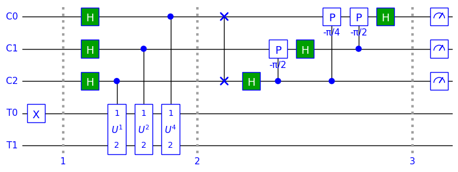
</div>

When run, it gives the measurement result: [0 1 1].

This example has two quantum registers: a Control register C with 3 qubits and Target register T with 2 qubits.

The circuit has four stages, which are separated by barrier symbols in the diagram:

- Initialisation
- Phase kickback
- Inverse QFT
- Measurement

We will consider each of these stages in turn:

**Initialization**

The T register is initialized to the eigenvector of interest $\ket{u}$, which has eigenvalue $\lambda=e^{2\pi i\theta}$, where $\theta\in [0,1)$ is the phase we want to find.
 
The eigenvector $\ket{u}$ and eigenvalue $\lambda$ are related by the eigenvalue equation:

```math
\begin{align*}
U \ket{u} = \lambda\ket{u}=e^{2\pi i\theta}\ket{u}
\end{align*}
```

A Hadamard transform is applied to the control register, which places it in a superposition state:

```math
\begin{align*}
\ket{\psi_1}=(H^{\otimes m}\ket{0}^{\otimes m})\otimes\ket{u}\\
={\small\frac{1}{\sqrt{M}}}\sum_{k=0}^{M-1}\ket{k} \otimes\ket{u}
\end{align*}
```

where $M=2^m$

**Phase Kickback**

You will probably recognize that the Hadamard gates and the controlled unitaries form three instances of the Phase Kickback circuit discussed in a previous example. The final Hadamard gates of the Phase Kickback circuits have been replaced by a single inverse Quantum Fourier Transform (QFT$^\dagger$), but we will come back to that shortly.

The action of applying a unitary operator $U$ to one of its eigenvectors $\ket{u}$ is to multiply the target eigenvector by its eigenvalue. If the unitary is a controlled-unitary, the phase is *kicked-back* from the target to the control and the target is left unchanged:

```math
\begin{align*}
\ket{\psi_2}&={\small\frac{1}{\sqrt{M}}}\sum_{k=0}^{M-1}\lambda\ket{k} \otimes\ket{u}\\
&={\small\frac{1}{\sqrt{M}}}\sum_{k=0}^{M-1}e^{2\pi i k\ \theta}\ket{k} \otimes\ket{u}
\end{align*}
```

**Inverse QFT**

The Quantum Fourier Transform (QFT) is defined by:

```math
QFT: \ket{x}\mapsto{\small\frac{1}{\sqrt{M}}}\sum_{k=0}^{M-1}e^{2\pi i k\frac{x}{M}}\ket{k}
```

This is identical to the control register part of $\ket{\psi_2}$ if we equate $\theta$ with $\frac{x}{M}$ :

```math
\theta = \frac{x}{M}
```

So, taking the inverse QFT of the control register should result in a single basis state $\ket{x}$, provided that $\theta$ can be expressed as fraction with an integer numerator and denominator $M$. Otherwise the probability distribution will peak close to this value and $\frac{x}{M}$ is the nearest approximation to $\theta$ expressed as a binary fraction with $m$ bits. In this case, $\frac{x}{M}$ is an estimate $\hat{\theta}$:

```math
\hat{\theta}=\frac{x}{M}
```

However, the phase we want to find might be a value that is not expressible as a fraction with an integer numerator and a denominator which is a power of 2, for example $\frac{5}{26}$. In the next notebook, we will look at how Shor's factorization algorithm solves this problem using *partial fraction convergents*.

**Measurement Result**

The example circuit above was configured with the target register initialized to the eigenvector $\ket{10}$, which corresponds to the eigenvalue with phase $3/2^3=3/8$. The measurement result was $011_2$ in binary. If we precede this by a binary point, it is the phase as the binary fraction $\theta=.011_2=\frac{3}{8}$, which is correct. These phases are expressed as fractions of $2\pi$.

Since we are using a state simulator, instead of a real quantum computer, we will omit the measurement stage from the subsequent examples. Simulation allows us to look at the phases and probabilities, which will give us a much better insight into how the algorithm works.

#### Examples

The following examples consider a QPE circuit with 5 control qubits and 2 target qubits. The unitary matrix is then created with phases corresponding to $\frac{1}{32},\frac{4}{32}\text{ and }\frac{5.5}{32}$, for eigenvectors $\ket{1},\ket{2}\text{ and }\ket{3}$ respectively.

**Example 1**

For the first example, we will set the eigenvector to $\ket{01}$, which corresponds to the eigenvalue with fractional phase $\theta=\frac{1}{32}$.

<div style="text-align: center;">
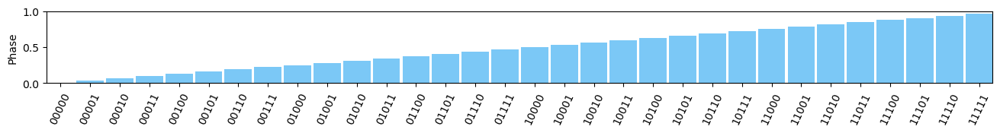
</div>

<div style="text-align: center;">
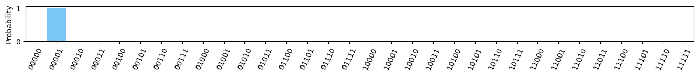
</div>

The above plots show the phase of the Control register just before the inverse QFT (IQFT) and the measurement probabilities after the IQFT. The plots were generated by the state simulator. This should look familiar if you have studied the preceding QFT example notebook.

Looking at this in reverse, an output which corresponds to a single basis state $\ket{k}$, would result in a linear phase ramp with $k$ cycles of $2\pi$. In this case $k=1$.

The probability distribution shows that measuring the control register would give the result 00001. If we precede this by a binary point, it is the phase as the binary fraction $\theta=.00001_2 = \frac{1}{32}$, which is correct. 

**Example 2**

For this example, we will set the eigenvector to $\ket{10}$, which corresponds to the eigenvalue with fractional phase $\theta=\frac{5}{32}$.

<div style="text-align: center;">
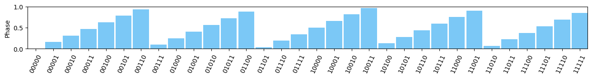
</div>

<div style="text-align: center;">
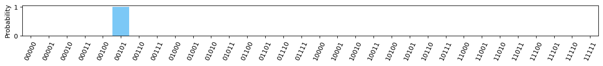
</div>

The result of measurement would be $00101$. If we precede this with a binary point we get $\theta=.00101_2 = \frac{5}{32}$, as expected.

The phase has 5 cycles in a state vector of length 32, so the result is $\frac{5}{32}$.

**Example 3**

The previous examples have deliberately used fractional phases that are integer multiples of $\large\frac{1}{2^5}$ as the control register has 5 qubits. The following example sets the eigenvector to $\ket{11}$ which has an eigenvalue phase of $\theta=\frac{11}{64} = \frac{5.5}{32}$.

<div style="text-align: center;">
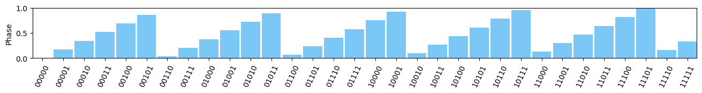
</div>

<div style="text-align: center;">
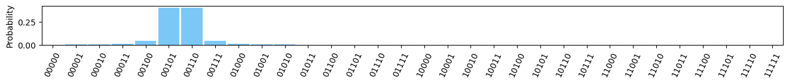
</div>

There are now 5.5 phase cycles, which doesn't correspond to a single basis state. The probabilities are divided between results 5 and 6, but there is some leakage into adjacent values.

**Note:** If you are familiar with Fourier Transforms in signal processing, you may recognize this as *spectral leakage*.

In this case, we could just repeat the QPE with 6 control qubits and we would get the result $\theta=001011_2=\frac{11}{64}$.

However, the phase we want to find might not be expressible as a fraction with an integer numerator and a denominator that is a power of 2, such as $\frac{5}{26}$. In the next example we look at how Shor's factorization algorithm solves this problem using *partial fraction convergents*.

---

### 7.5: Shor's Algorithm

This example looks at Shor's Algorithm for integer factorisation.  It makes use of the Quantum Fourier Transform (QFT) and Quantum Phase Estimation (QPE) algorithms that were explored in previous examples, so it would be useful to become familiar with those examples first.

#### Introduction

Factoring large composite numbers is an interesting mathematical problem in its own right, but it has particular practical implications for the widely-used RSA encryption system. RSA relies for its security on the fact that it is easy to multiply two large prime numbers but very difficult to find the factors if you are just given their product.

In 1994, Peter Shor published a quantum algorithm, now known as Shor's algorithm, that can theoretically factor large composite numbers exponentially faster than a classical computer. To have any practical advantage over classical factoring methods, Shor's algorithm would need to be run on a quantum computer with thousands of logical (error free) qubits, which is still some way in the future.

Shor's algorithm is a hybrid algorithm that combines both classical and quantum computation. The top-level routine is classical and calls a quantum order-finding subroutine that runs on a quantum computer.

#### The Top-Level Algorithm

The algorithm is based on number theory and makes use of modular arithmetic as well as Euclid's algorithm for efficiently finding the Greatest Common Divisor (GCD) of two integers.

The aim is to factor a composite number $N$ into its factors $p_1$ and $p_2$:

```math
N=p_1\ p_2
```

We will assume that these factors are odd primes. If $N$ is even, then $2$ is trivially a factor. If the values are not prime, we can recursively call the factorization routine, using a classical primality test to decide when to stop recursing.

We start by choosing a random integer $a$ such that $1<a<N$.

If $\gcd(a,N)\ne 1$ then the GCD is a factor and we can stop.

Otherwise, we find the *multiplicative order* of $a$ modulo $N$. This is defined as the smallest positive integer $r$ such that:

```math
a^r\equiv 1\pmod{N}
```

where $a$ is an integer coprime to $N$:

```math
\gcd(a, N)=1
```

Finding the order is the part of the algorithm that can make use of a quantum processor to give an exponential speed improvement.

If $r$ is odd we restart the algorithm with a new random value of $a$. If $r$ is even, then $\frac{r}{2}$ is an integer and we have found a square root of $1$ modulo $N$:

```math
(a^{r/2})^2 \equiv 1\pmod{N}
```

By the difference of squares:

```math
(a^{r/2})^2 - 1^2 \equiv 0\pmod{N}
```

```math
(a^{r/2}-1)(a^{r/2}+1)\equiv 0\pmod{N}
```

Hence:

```math
N\ |\ (a^{r/2}-1)(a^{r/2}+1)
```

If $N\nmid (a^{r/2}\pm 1)$ then the following must be factors of $N$ and we have a solution:

```math
\gcd(a^{r/2}+1, N)\quad\text{ and }\quad\gcd(a^{r/2}-1, N)
```

**Note:** Modular exponentiation and Euclid's algorithm can be used to calculate expressions of this form efficiently.

We require that neither of the terms $(a^{r/2}+1)$ and $(a^{r/2}-1)$ is zero. The latter can't be zero because it would imply that $r/2$ was the order of $a$ modulo $N$; but it is smaller than $r$ which is defined as the smallest positive integer $r$ such that $a^r\equiv 1\pmod{N}$, which would lead to a contradiction. To guard against the first one being zero, we restart the algorithm with a new random $a$ if:

```math
a^{r/2}\equiv -1\pmod{N}
```

It can be seen from the above that the algorithm is probabilistic in nature and may fail at several points if certain conditions are not met. In these cases, the algorithm is restarted with a new random value of $a$. The condition that $r$ must be even has a probability of about 50%. The conditional probability that $a^{r/2}\not\equiv -1\pmod{N}$, given that $r$ is even, is at least 50%. From this simplistic analysis, the probability of success for a particular initial guess is $\approx$25%, which implies that about 4 tries are needed on average.

When the order-finding is run on a quantum processor, the speed is exponentially greater than factoring on a classical computer. Even if a few runs are needed because of the restarts, the overall speedup is still exponentially better.

#### Simple Numerical Example

To demonstrate how the algorithm works, we will factor $N=21$.

Let us assume $a=2$ as the random starting value, chosen so that $1<a<N$.

First, calculate $\gcd(2,21)=1$

As the GCD is 1, it follows that 2 and 21 are coprime, so there isn't a trivial factor and we can proceed with the "difference of squares" approach.

Next, we need to find the order $r$, which is the smallest positive integer such that $2^r\equiv 1\pmod{21}$. To do this classically (non-quantum), we could try successive integers for 'r':

```math
\begin{align*}
2^0&\equiv 1&\pmod{21}&\quad\text{(start of cycle)}\\
2^1&\equiv 2&\pmod{21}\\
2^2&\equiv 4&\pmod{21}\\
2^3&\equiv 8&\pmod{21}\\
2^4&\equiv 16&\pmod{21}\\
2^5&\equiv 11&\pmod{21}\\
2^6&\equiv 1&\pmod{21}\\
\end{align*}
```

Hence the order $r=6$. The pattern repeats with a cycle length of 6, with the first cycle starting at $r=0$.

Since $r$ is even, we can proceed as follows, using the difference of squares:

```math
2^6-1\equiv 0 \pmod{21}
```

```math
(2^\frac{6}{2}+1)(2^\frac{6}{2}-1)\equiv 0\pmod{21}
```

```math
9\times 7 \equiv 0\pmod{21}
```

$21$ doesn't divide $7$ or $9$, so the GCDs of $7$ and $9$ with $21$ must divide $21$.

The required factors of 21 are therefore:

```math
\gcd(9,21)=3\quad\text{ and }\quad\gcd(7,21)=7
```

#### Quantum Order Finding

Shor's algorithm achieves its performance gain on a quantum computer by using a quantum implementation of order-finding. This actually has both quantum and classical parts:

- A quantum circuit that performs Quantum Phase Estimation (QPE)
- A classical algorithm that extracts the order $r$ from the phase

Quantum Phase Estimation was discussed in an earlier section.

We need to find the multiplicative order of $a$ modulo $N$, which is defined as the smallest integer such that:

```math
a^r\equiv 1\pmod N
```

where $a$ is coprime to $N$.

Quantum order finding works by defining a unitary $U$ such that:

```math
U: \ket{x}\mapsto \ket{ax\bmod N}
```

The QPE returns an approximation to an eigenvalue of $U$, when the input of the target register is the corresponding eigenvector.

If $U_{a,N}\ket{x} = \ket{ax \bmod N}$, then it satisfies $U^r_{a,N}=I$ when $r$ is the order.

Hence, its eigenvalues will be $e^{2\pi\frac{k}{r}}$ for $k=0,\dots,r-1$.

Applying $U$ to the eigenstate $k$ times multiplies the phase $\theta$ by $k$:

```math
U^k\ket{u_e}=e^{2\pi ik\theta}\ket{u_e}
```

```math
U^k: \ket{x}\mapsto \ket{a^k x\bmod N}
```

where $\ket{u_e}$ is the eigenvector of $U$ for which we want to find the eigenvalue.

Using Quantum Phase Estimation (QPE) with $m$ qubits for the QPE control register, we will measure some value $x$, such that $\frac{x}{2^m}$ is an approximation to $\frac{k}{r}$:

```math
\frac{x}{2^m}\approx\frac{k}{r}
```

We need to deduce the order $r$ by finding the exact rational $\frac{k}{r}$ from the approximation $\frac{x}{2^m}$. We will come back to this shortly.

#### Quantum Phase Estimation

The following diagram shows the general form of the Quantum Phase Estimation circuit for the trivial case of factoring 15. The number of qubits used for the 'C' register has been reduced from 9 to 4 to make the diagram easier to understand.

The circuit is the same as the one in QPE example except that it is using the modular exponentiation unitary and measurements are performed on the output of the control register.

<div style="text-align: center;">
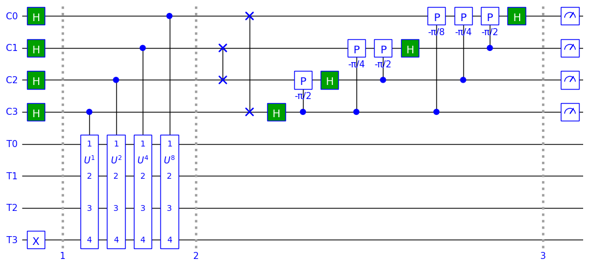
</div>

The qubits are split into two registers, C and T. Register C is the control register, with $m$ qubits, and register T is the target register, with $t$ qubits, that is initialized with the eigenvector. 

The operation of this circuit was discussed in detail in the notebook on Quantum Phase Estimation (QPE), so it will not be repeated here.

For Shor's algorithm, register T requires enough qubits to hold the binary representation of the number $N$ that is to be factored:

```math
t=\lceil\log_2 N\rceil
```

Register C normally requires more qubits than register T to give the required phase resolution. The following value is commonly used:

```math
m = \lceil 2\log_2 N\rceil + 1
```

**Note:** This value can be derived using Legendre's theorem on continued fractions. It guarantees that the correct partial-fraction convergent will appear in the list of convergents (see above). However, the convergents are *reduced fractions*, so the required order may be a multiple of the convergent denominator.

The circuit diagram above is just to illustrate the generate form of the QPE circuit, so a smaller value of $m$ has been used to make the diagram easier to understand.

The target register is initialized to the eigenvector $\ket{u_e}=\ket{0\dots 01}$ of the unitary $U$. Then applying QPE gives an approximation $\frac{x}{2^m}$ to the phase, as discussed above.

#### Computing the Order

Using Quantum Phase Estimation (QPE), measurement of the $m$-qubit control register will give some value $x$, such that $\frac{x}{2^m}$ is an approximation to the true phase $\theta=\frac{k}{r}$:

```math
\frac{x}{2^m}\approx\frac{k}{r}
```

where $k=0,1,\dots,r-1$

The next step is to deduce the multiplicative order $r$ by finding the exact rational $\frac{k}{r}$ from the approximation $\frac{x}{2^m}$. This can be done by computing the sequence of *continued-fraction convergents*, which are a sequence of progressively better approximations to a fraction.

We just need to check the denominator $q$ of each convergent, until we find the first one that satisfies:

```math
a^q\equiv 1\pmod{N}
```

For example, for $a=40, N=119, m=15$, the QPE might return $x=27989$. Then the continued-fraction convergents would be:

```math
\small\frac{1}{1}, \frac{5}{6}, \frac{6}{7}, \frac{35}{41}, \frac{41}{48}
```

Checking each of the denominators $q$ as a candidate $r$, the first to succeed is $r=48$:

```math
a^r = 40^{48} \equiv 1 \pmod{119}
```

Hence, we have found that the order $r$ is $48$.

The approximation error in the value returned by QPE is:

```math
\left|\frac{x}{2^m}-\frac{k}{r}\right|
```

Legendre's theorem on continued fractions states that if a rational number $\frac{p}{q}$ is a sufficiently good approximation of a real number $\alpha$, such that:

```math
\left|\alpha-\frac{p}{q}\right| < \frac{1}{2q^2}
```

then $\frac{p}{q}$ must be one of the convergents of the continued fraction of $\alpha$.

Rather than test each convergent denominator to see whether it is the order 'r' of $a$ mod $N$, it can be faster to only test ones that satisfy the approximation error condition:

```math
\left|\frac{x}{2^m}-\frac{k}{r}\right| < \frac{1}{2r^2}
```

The procedure may still sometimes fail to find the order because the convergents are *reduced fractions* in their lowest terms. The actual order may therefore be a multiple of the convergent denominator. The simplest solution is to restart the algorithm with a new random value $a$, as is done for other failure conditions.

**Note:** Another solution to the reduced fraction problem is to try small multiples of the candidate order. Alternatively, the quantum circuit may be run  two or more times and the Least Common Multiple (LCM) of the resulting denominators used as the candidate $r$ value.

#### Example

Putting everything together, let us look at how the algorithm might factor the integer $119$:

```math
N=119
```

The first step is to select a random number $a$ in the range $1\lt a\lt $N, and check whether it is coprime with $N$. For example:

```math
a=40
```
```math
\gcd(40,119)=1
```

As the GCD is 1, it follows that 40 and 119 are coprime, so there isn't a trivial factor and we can proceed with the quantum order-finding approach.

The target register needs 7 qubits for the 7-bit number $N=119$.

The control register needs $m$ qubits, where:

```math
m = \lceil 2\log_2 N\rceil + 1 = 15
```

The QPE requires a unitary $U$, such that:

$$
U: \ket{x}\mapsto \ket{ax\bmod N}
$$

The QPE is run on the quantum processor and quantum measurement of the control register returns the binary value $110110101010101_2$, which is $x=27989$.

This gives an approximation to the phase of: $\hat{\theta}=\frac{27989}{32768}$.

To find the order $r$, we need to find the exact rational $\frac{k}{r}$ from this approximation by using continued-fraction convergents. In this case, the convergents are:

```math
\small\frac{1}{1}, \frac{5}{6}, \frac{6}{7}, \frac{35}{41}, \frac{41}{48}
```

Checking each of the denominators 'q' as a candidate 'r', the first to succeed is $r=48$:

```math
a^r = 40^{48} \equiv 1 \pmod{119}
```

Hence, we have found that the order $r$ is $48$.

This is even, so we can factor $N$ using the difference-of-squares approach:

```math
(40^{24})^2 - 1^2 \equiv 0\pmod{119}
```

```math
(40^{24}+1)(40^{24}-1)\equiv 0\pmod{119}
```

The required factors of 21 are therefore:

```math
\gcd((40^{24}+1),119)=17
```
and
```math
\gcd((40^{24}-1),119)=7
```

Hence $119$ can be factor as $17\times 7$.

---

### 7.6: Grover's Algorithm

This example demonstrates how Grover's Search Algorithm may be used to solve search problems that involve finding the input to a black-box function that produces a particular output. 

#### Introduction

There is an important class of problems in computing where you can quickly check a candidate solution, but it is very hard to find the solution other than by trying all the different possibilities. In general, for a list of $N$ items it would take order $\mathcal{O}(N)$ steps to go through the possibilities. Grover's algorithm can in principle solve problems of this kind in $\mathcal{O}(\sqrt{N})$ steps on a quantum computer.

We can abstract problems of this kind as a one-way black-box function known as an "oracle". We can ask the oracle whether something is a solution and it will give the reply 'yes' or 'no'.

We will explore how the algorithm works with the aid of a simple example. The oracle will hide a secret K-bit binary number. Our goal is to find the secret number by asking the oracle whether specific "guesses" are correct. On a classical computer it would take $\frac{N}{2}$ attempts on average and $N$ in the worst case. With a quantum computer we can solve it in order $\mathcal{O}(\sqrt{N})$ attempts with very high probability. The advantage of the quantum algorithm gets progressively better as the size of the search space increases.

In a more realistic application, an oracle might check whether something satisfies a constraint, rather than just hiding a pre-existing answer.

To be of practical use, the algorithm would require a real quantum computer with thousands of logical (error-free) qubits. On today's Noisy Intermediate-Scale Quantum (NISQ) devices, it doesn't yet give any advantage. However, Grover's algorithm illustrates a more general approach to quantum algorithm design that involves starting with a superposition of all possibilities and then iteratively using amplitude amplification to increase the probability of the solution state.

#### How the Algorithm Works

Grover's algorithm starts by placing the quantum state into an equal superposition $\ket{s}$ of the $N=2^K$ basis states. The solution we are searching for corresponds to the basis state $\ket{\omega}$. We will assume for simplicity that the problem has a single solution. However, the method can be generalized to cases where there are multiple solutions.

The superposition of the remaining $N-1$ basis states forms the vector $\ket{\omega_\perp}$, which is orthogonal to $\ket{\omega}$. The two vectors $\ket{\omega_\perp}$ and $\ket{\omega}$ span an (unknown) two-dimensional plane in the N-dimensional complex vector space, as shown here:

<div style="text-align: center;">
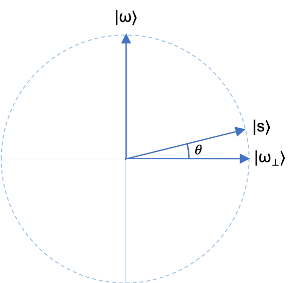
</div>

The initial superposition state is:

```math
\ket{s} = {\small\frac{1}{\sqrt{N}}}\sum_{i=0}^N{\ket{x_i}} = \ket{+\dots +}
```

This can be written as the sum of two orthogonal vectors:

```math
\ket{s} = \sqrt{\frac{1}{N}}\ \ket{\omega} + \sqrt{\frac{N-1}{N}}\ \ket{\omega_\perp}
```

Consequently, the angle $\theta$ between $\ket{s}$ and $\ket{\omega_\perp}$ given by:

```math
\theta=\arcsin\left(\frac{1}{\sqrt{N}}\right)
```

For $N\gg 1$ this can be approximated as:

```math
\theta\approx\frac{1}{\sqrt{N}}
```

Grover's algorithm starts by initializing the state to the superposition $\ket{s}$ and then performs a sequence of iterations that rotate the state vector until it is close to the solution state $\ket{\omega}$. This results in a high probability of getting the correct solution when the state is measured.

The first two iterations are illustrated by the following diagram:

<div style="text-align: center;">
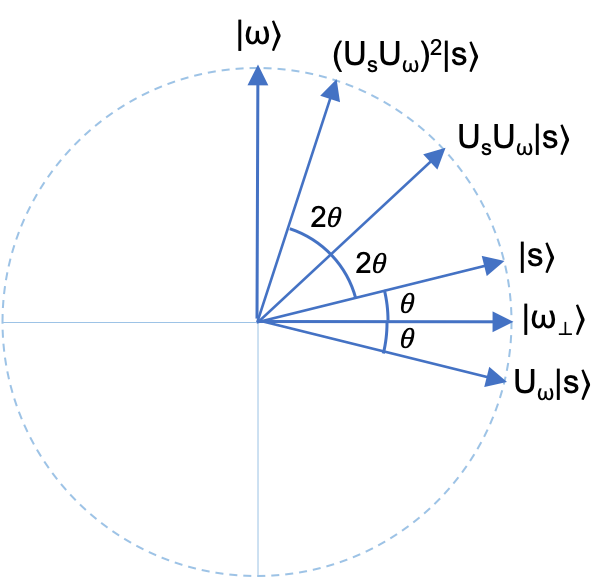
</div>

Each iteration consists of the application of unitary operators $U_\omega$ and $U_s$, where $U_\omega$ is the oracle and $U_s$ is called the Diffusion operator.

- The state is initialized to the equal superposition $\ket{s}=\ket{+\dots +}$
- The operator $U_\omega$ then flips the state about $\ket{\omega_\perp}$ resulting in $U_\omega\ket{s}$
- The operator $U_s$ then flips the state about $\ket{s}$ resulting in $U_sU_\omega\ket{s}$

All the vectors are in the plane spanned by $\ket{\omega}$ and $\ket{s}$. The effect of two flips in a plane, about axes separated by $\theta$, is rotation by $2\theta$ (see diagram).

Successive iterations of $U_sU_\omega$ are applied until the state is as close as possible to the solution state $\ket{\omega}$, which occurs when the total angle is close to $\frac{\pi}{2}$. A measurement of the state then has a high probability of yielding the solution state $\ket{\omega}$.

So the overall algorithm is as follows:

- Calculate the number of iterations $\nu$ that are needed.
- Initialize the state to the equal superposition $\ket{s}$
- Repeat $\nu$ times:
  - Apply the oracle $U_\omega$
  - Apply the diffusion operator $U_s$
- Measure the state, yielding the result $\omega$ with high probability.

#### Number of Iterations

The total angle $\phi$ starts at $\theta$ and increases by $2\theta$ with each iteration. After $\nu$ iterations, the total angle $\phi$ is:

```math
\phi=(2\nu+1)\ \theta\approx\frac{1}{\sqrt{N}}(2\nu+1)
```

We want this to be as close to $\frac{\pi}{2}$ as possible. Consequently, the required number of iterations, which must be an integer, is:

```math
\nu = \left\lfloor\frac{\pi}{4}\sqrt{N}\right\rfloor
```

This explains why the algorithmic complexity, in terms of the number of iterations, is $\mathcal{O}(\sqrt{N})$.

The probability $P(\nu, K)$ of measuring the correct result after $\nu$ iterations is:

```math
\begin{align*}
P(\nu, K) &= \sin^2(\phi)\\
&\approx\sin^2\left[(2\nu + 1)\frac{1}{\sqrt{2^K}}\right]
\end{align*}
```

When $N$ is large, which will normally be the case for problems where the algorithm is needed, the probability of getting the correct result is very close to one.

#### Reflections

An operator $U_x$ which reflects about the hyperplane orthogonal to $\ket{x}$ can be defined as:

```math
U_x = \mathbb{I} - 2\ket{x}\bra{x}
```

To see why this is the case, we can apply it to a vector $\ket{\psi}$:

```math
\begin{align*}
U\ket{\psi} &= (\mathbb{I}-2\ket{x}\bra{x})\ \ket{\psi}\\[0.4em]
&= \ket{\psi}-2\ket{x}\braket{x|\psi}\\[0.4em]
&= \begin{cases}
      -\ket{\psi}, & \text{if $\psi=x$}\\
      +\ket{\psi}, & \text{if $\psi \ne x$}
\end{cases}
\end{align*}
```

It flips the component of the vector $\ket{\psi}$ that is along $\ket{x}$, while leaving the other components which are orthogonal to $\ket{x}$ unchanged. This is equivalent to reflecting $\ket{\psi}$ about the hyperplane orthogonal to $\ket{x}$.

#### MCZ Gate

In order to perform the flip operations for the example, we will make use of Multi-Controlled-Z (MCZ) gates. When an MCZ appears in an algebraic expression as an operator, it will be denoted by $M_{cz}$ so that it isn't confused with the composition of three separate operators.

$M_{cz}$ is equivalent to the $U_x$ operator described above, for the specific case of $\ket{x}=\ket{1\dots 1}$.

```math
M_{cz}=\mathbb{I}-2\ket{1\dots 1}\bra{1\dots 1}
```

In other words, it flips the sign of the $\ket{1\dots 1}$ state and leaves all the others unchanged.

```math
M_{cz}\ket{x} = \begin{cases}
      -\ket{x}, & \text{if $\ket{x}=\ket{1\dots 1}$}\\
      +\ket{x}, & \text{if $\ket{x}\ne\ket{1\dots 1}$}
\end{cases}
```

It is easy to make it work for vectors other than $\ket{1\dots 1}$, by applying a suitable transformation. Consequently, we can use it to implement both the oracle and the diffusion operator.

#### The Oracle

The $2^K$ possible values are represented as the basis states of a K-qubit quantum state. If we query the oracle with the correct solution state, it will indicate its "yes" answer by flipping the sign of the state, otherwise it will leave the sign unchanged. If we query it with a quantum superposition of all possible states, it will just flip the state corresponding to the correct solution.

The oracle $U_\omega$ reflects across the hyperplane orthogonal to $\ket{\omega}$:

```math
U_\omega = \mathbb{I} - 2\ket{\omega}\bra{\omega}
```

It flips the component of the state vector along $\ket{\omega}$ while leaving the other components orthogonal to $\ket{\omega}$ unchanged.

An MCZ gate on its own could serve as the oracle for an all-ones key $11\dots 1$. For an arbitrary key, we just need to invert the qubits that have a $0$ bit in the key by adding some 'X' (NOT) gates.

The following circuit shows the oracle for a 4-bit secret ket '0101', implemented using an MCZ gate:

<div style="text-align: center;">
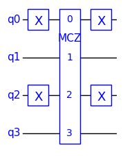
</div>

If the input is a superposition of all basis states, only the basis state $\ket{0101}$ will have its sign flipped.

#### The Diffusion Operator

The diffusion operator $U_s$ flips the state vector about the $\ket{s}$ vector which is the equal superposition state $\ket{+\dots +}$.

```math
U_s = 2\ket{s}\bra{s} - \mathbb{I}
```

An MCZ gate flips the sign of the $\ket{1\dots 1}$ component:

```math
M_{cz}=\mathbb{I}-2\ket{1\dots 1}\bra{1\dots 1}
```

In order to make it flip the state about the $\ket{s}$ vector, we can make the following transformation:

```math
U_s= - (H^{\otimes K}X^{\otimes K}\ M_{cz}\ X^{\otimes K}H^{\otimes K})
```

The $X$ gates make $M_{cz}$ flip $\ket{0\dots 0}$ instead of $\ket{1\dots 1}$. Then the $H$ gates make it flip $\ket{+\dots +}$ instead of $\ket{1\dots 1}$.

The negative sign results from the reversed order of terms. It can be ignored because it represents a global phase of $\pi$, which has no measurable effect.

The following circuit shows a 4-qubit diffusion operator implemented using an MCZ gate:

<div style="text-align: center;">
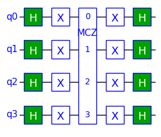
</div>

#### Example with 4-bit Key

As a trivial example, let us consider the simple case of a 4-bit secret key '0101'.

Since, $N=2^4=16$, the number of iterations required is 3, from the formula given earlier:

```math
\nu = \left\lfloor\frac{\pi}{4}\sqrt{N}\right\rfloor=3
```

The first step of the algorithm is to create an equal superposition state using a Hadamard transform. If we were to make a measurement now, the probability of getting the correct solution would be $\frac{1}{16}=6.25\%$.

<div style="text-align: center;">
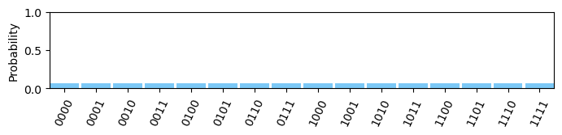
</div>

Next, we apply the oracle. This flips the component of the state vector corresponding to the unknown key:

<div style="text-align: center;">
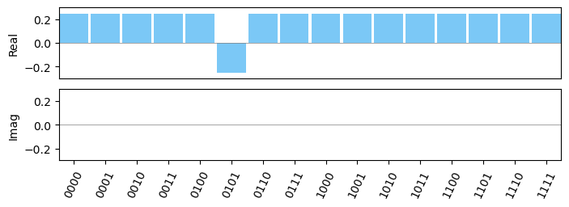
</div>

If we were to make a measurement at this stage, all outcomes would still be equally likely as the probabilities are given by the square of the absolute value of the amplitude.

Next, we apply the diffusion operator.

<div style="text-align: center;">
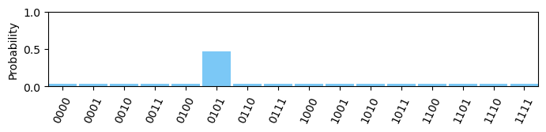
</div>

This amplifies the probability of the solution state significantly. If we made a measurement now, there would be 47% probability of getting the correct solution.

We need to perform two more iterations that each apply the oracle followed by the diffusion operator. After the second iteration, the probability of a measurement giving the correct result has been further increased to 90.8%. 

<div style="text-align: center;">
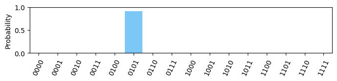
</div>

After the third iteration, it has reached 96.1%.

<div style="text-align: center;">
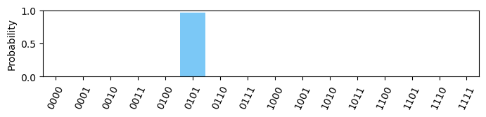
</div>

We can now perform a quantum measurement, which will give the correct result with a probability of 96%. If we were to perform another iteration, the probability would start going down again.

The probability of getting an incorrect result is $1 - 0.96 = 0.04$. If this happens, we just need to run the process again. The oracle function is by its nature one that makes it easy to check the result. The probability of both measurements being wrong is $0.04^2 = 0.0016$.

The complete quantum circuit for this example is as follows. This shows the initial Hadamard transform, followed by 3 Grover iterations and finally the measurement.

<div style="text-align: center;">
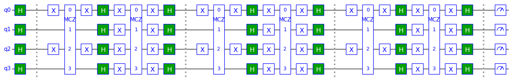
</div>

This example has demonstrated Grover's algorithm as well as the more general concept of Amplitude Amplification.

---

### 7.7: Quantum Teleportation

Quantum teleportation is a protocol for sending quantum information (i.e. qubits) from one place to another.

Imagine that Alice has a data qubit that she wishes to send to Bob. The [No-Cloning Theorem](#no-cloning-theorem) of quantum mechanics says that it is impossible to create an independent and identical copy of an unknown quantum state. This implies that if Alice sends a qubit to Bob, then she no longer has access to the qubit herself.

The protocol requires Alice and Bob to each have one of an entangled pair of qubits. Alice makes a joint [Bell Measurement](#bell-measurement) of the data qubit with her entangled qubit. This results in two classical bits of information corresponding to the four possible measurement outcomes. If Alice sends these two classical bits to Bob, he can use them with his entangled qubit to recreate the qubit that Alice sent. The Bell measurement that Alice performs destroys the quantum state of her data qubit, so the no-cloning theorem is not violated.

The following quantum circuit shows Alice's part of the protocol:

<div style="text-align: center;">
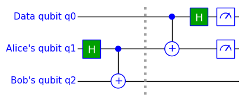
</div>

The part to the left of the barrier shows the creation of an entangled pair of qubits. Alice has one qubit and Bob has the other. Alice could create the entangled pair and send one to Bob or a third-party could create the pair and send one to each of them. This does not violate the no-cloning theorem because the two qubits are not independent.

If Alice were to simply measure her qubit, she would get a random result of 0 or 1. If Bob then measured his qubit, he would get the same result. However, this alone cannot be used to send information as Alice has no control over the result of her measurement.

Instead, Alice performs a joint [Bell Measurement](#bell-measurement) of the data qubit with her entangled qubit. This results in two bits of classical information that say which of the four possible Bell states the qubits are in. Alice then sends these two bits of information to Bob over a normal (classical) communication channel.

Bob applies one of the following quantum operations to his entangled qubit, depending on the two classical bits he receives from Alice:

```math
\begin{align*}
0,0 &\rightarrow \textrm{none}\\
0,1 &\rightarrow X\\
1,0 &\rightarrow Z\\
1,1 &\rightarrow X \textrm{ then } Z
\end{align*}
```

Bob's part of the protocol can be drawn as a circuit as follows. Classical bits are normally drawn as a double lines in quantum circuits, but here they are just shown as single lines. The X and Z gates have classical controls, which simply means that Bob applies an X or Z operation, depending on the classical bits he received.

<div style="text-align: center;">
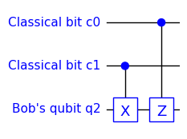
</div>

This results in Bob having the data qubit that Alice sent. Note that although entanglement is used, the information cannot be sent faster than the speed of light because Bob cannot decode his qubit until he receives the two bits over a classical channel.

If Bob were to just guess what the two classical bits would be, he would have a 25% chance of correctly decoding the qubit but, if sent a sequence of qubits, he would not know which ones were correct.

---
<div style="page-break-after: always;"></div>

## 8: Simulating a Quantum Computer

It is useful to have a simulator that allows us to develop and test quantum algorithms on a conventional computer. A simulator is also a good tool for learning about quantum computers and experimenting with new ideas.

Earlier, we saw that quantum states could be represented by vectors and quantum gates by matrices. This suggests that we can simulate a quantum circuit by starting with an initial state vector and applying the matrix for each gate in the circuit in turn, until we are left with a final state. Unfortunately, this approach does not scale well as the number of qubits is increased.

Before looking at ways of tackling this problem with tensors, we will first look at what is wrong with this simple matrix-based approach.

### Simulation using Matrices

A quantum state can be represented as a vector and the gates, which are applied to it, as matrices.

A K-qubit gate requires a $2^K\times 2^K = 2^{2K}$ matrix of complex values, typically of 16 bytes each. However, even the $2\times 2$ matrix of a one-qubit gate (e.g. Hadamard) must be expanded to an N-qubit matrix with $2^N\times 2^N$ elements (by tensor multiplication with identity matrices) so that it can be applied to the entire N-qubit quantum state. This is because even a simple one-qubit gate can affect all the elements of the state vector (see the earlier section on [Addressing Qubits](#addressing-qubits)).

For 15 qubits, the matrix would be $2^{15}\times 2^{15}\times 16$ bytes $= 16$ GB, growing by a factor of 4 for each extra qubit. This is a problem not only of memory but also of execution speed. There is an enormous overhead in using such a large matrix when the actual gate to be applied only needs a 2x2 matrix.

The time complexity is of the order $\mathcal{O}(M.2^{2N})=\mathcal{O}(M.4^N)$ for M gates applied one at a time to the state vector. This is just for the matrix multiplications. It does not take into account expanding the gates or permuting the qubits.

There are various ways of optimizing this approach, for example by multiplying several smaller matrices together before expanding them to operate on the entire quantum state. However, at least one matrix has to operate on the full quantum state, assuming that the circuit cannot be factored into independent circuits. So the memory usage is unchanged. Even a speed improvement by a factor of 4 only makes up for one extra qubit and does little to fight against the exponential growth in complexity as the number of qubits increases.

In conclusion, the 'brute force' approach of using matrices and vectors for simulation is only useful for very simple circuits involving up to about 15 qubits and is not normally used in practice. The following sections look at how we can improve on this using tensors.

### Tensors

A tensor is a mathematical object that generalizes scalars, vectors, and matrices to higher-dimensions. A scalar is an order-0 tensor, a vector is an order-1 tensor and a matrix is an order-2 tensor. Tensors allow this to be extended to an arbitrary order. The order of a tensor is sometimes called its *rank*, but rank also has another meaning, so we will use the term *order*. For implementation purposes, we can consider tensors as multi-dimensional arrays with one dimension per tensor index.

Consider the simple example of multiplying a matrix M by a vector V. This may be written in index notation as:

```math
U_i = \sum_{j} M_{ij}V_j
```

The summation sign is often omitted by using Einstein summation notation, which makes summation implicit over indices that appear twice within a term. This allows the above example to be written more concisely as:

```math
U_i = M_{ij}V_j
```

Viewed from a tensor perspective, the summation over a repeated index is called a *tensor contraction*. The example above describes the tensor contraction of an order-2 tensor $M_{ij}$ with an order-1 tensor $V_j$, resulting in an order-1 tensor $U_i$. The order of a tensor is the number of indices it has. 

This algebraic summation notation works well for simple examples but rapidly becomes cumbersome for large networks of tensors. Fortunately, there is a tensor diagram notation, which was originally proposed by Roger Penrose in 1971, that allows the equations to be expressed as simple diagrams. Despite their simplicity, the diagrams give a rigorous description.

The tensor contraction above becomes:

<div style="text-align: center;">
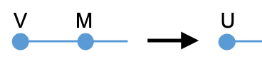
</div>

The 'legs' of a tensor correspond to the indices, so an order-N tensor has N legs. A line linking two tensors corresponds to summation over a repeated index. The links may be labelled with the tensor subscript but this is usually not necessary. Sometimes, differently shaped or coloured symbols may be used to distinguish between different types of tensor or tensors used for different purposes.

This notation allows complex tensor networks to be drawn in a way that is much easier to understand than a set of equations.

### Simulation using Tensors

A quantum circuit can be treated as a tensor network in which the quantum gates and state are represented by tensors.

For example, a 4-qubit quantum state may be represented as an order-4 tensor $T_{abcd}$ where the subscripts correspond to qubits. Similarly, the matrix definition of a 2-qubit gate can be expressed as an order-4 tensor $G_{ijkl}$. If we now want to apply the gate to qubits $b$ and $c$ of the state, it is simply necessary to perform the following tensor contraction.

```math
G_{efbc}\,T_{abcd}\,\rightarrow T^{'}_{aefd}
```

<div style="text-align: center;">
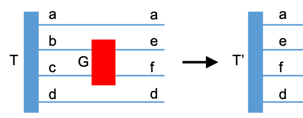
</div>

Using this approach, the order-N state tensor has $2^N$ elements of 16 bytes each, which is the same as for the matrix approach. The saving comes because, for example, a 4x4 gate matrix can be expressed as an order-4 tensor and applied to the relevant qubits by using the appropriate tensor indices for the tensor contraction. There is no longer any need to expand the gate definition to operate on the entire state. It is also trivial to apply the gate to non-adjacent qubits or qubits in a different order. We simply specify these by using the appropriate indices.

If the circuit is built from one and two qubit gates, a constant average gate size can be assumed, so the variation with gate size can be ignored. The time complexity for $M$ gates is then $\mathcal{O}(M.2^N)$. This is better than the complexity for the matrix approach, which was $\mathcal{O}(M.2^{2N})$, by a factor of $2^N$, which is an exponential improvement. Halving the exponent from $2N$ to $N$ approximately doubles the number of qubits $N$ that can be simulated, from around 15 to around 30.

This is a big improvement over the matrix method, but it is possible to do even better, as shown in the next section.

From an implementation perspective, linear-algebra libraries (e.g. Python's numpy) typically use *strided arrays* that allow very efficient tensor operations, such as permuting tensor indices or 'reshaping' a matrix into a tensor, without copying the data. This makes it possible to perform efficient tensor contractions.

### Matrix Product States (MPS)

The state of an N-qubit system can be expressed as a $2^N$ element vector or as an equivalent order-N tensor. However, this can be a very inefficient way of representing the state because the size of the data structure is independent of the actual state. For example, an initial 30-qubit state of $\ket{000\dots 0}$ occupies 16GB, but the 30 qubits are independent as there is no entanglement and could be represented by 60 complex numbers in just $60 * 16 = 960$ bytes. 

This suggests that it may be possible to compress the representation of the state in a way that grows in size as necessary, as more and more entanglement is introduced. One way to do this is to split the state tensor into a number of lower-order tensors, known as a Matrix Product State (MPS) or Tensor Train (TT).

As an example, consider a state tensor $\large T^{s_1s_2s_3s_4}$ of order $N=4$, corresponding to 4 qubits:

<div style="text-align: center;">
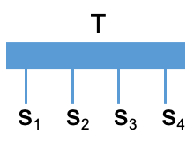
</div>

A Matrix Product State (MPS) or Tensor Train (TT) is a factorization of the tensor into a number of tensors $A$ of lower order, as shown here:

```math
\large{ T^{s_1s_2s_3s_4} = A^{s_1}_{b_1} A^{s_2}_{b_1b_2} A^{s_3}_{b_2b_3} A^{s_4}_{b_3}}
```

<div style="text-align: center;">
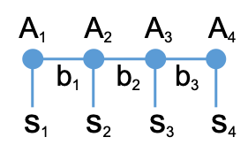
</div>

As the equation implies, these four tensors would give back the original order-4 tensor if they were contracted, so no information has been lost.

**Note:** The use of subscripts and superscripts is simply for clarity. It does not imply covariant and contravariant indices.

The tensors in the train each have order 3, except for the ones at the ends, which have order 2. A dummy index can be added to the tensors at each end, so that they are all order-3 and can be treated in the same way. The horizontal lines are called *bonds* and represent summation over the bond indices $b$. The $s$ indices are the *physical indices* of the original tensor $T$ and are of dimension $d$, where $d=2$ in the case of qubits, corresponding to the $\ket{0}$ and $\ket{1}$ components.

The MPS factorization can be performed using Singular Value Decomposition (SVD). This is a linear algebra technique that factorizes a matrix $M$ as follows:

```math
M = U D V^\dagger
```

where $U$ and $V$ are unitary matrices and $D$ is a diagonal matrix. The diagonal elements of $D$ are the singular values. An SVD can be applied to a tensor by first reshaping the tensor into a matrix and finally reshaping the resulting matrices back into tensors.

It is possible to convert an existing state vector into an MPS by applying an SVD to the state and reshaping the resulting $U$ term to give the first MPS tensor $A_1$. The remaining $DV^\dagger$ term becomes the starting point for the next SVD iteration, resulting in the second MPS tensor $A_2$ and so on. However, starting with a vector would limit the number of qubits, so it is better to just create the initial state MPS directly. This is trivial if the qubits in the state are not entangled, which is normally the case for the initial state.

The dimension of the bonds starts out at 1 for a non-entangled initial state such as $\ket{00\dots0}$. The resulting storage requirement is only $Nd$ elements, which is same as just having $N$ independent order-1 tensors for the qubits. The bond dimensions grow as multi-qubit gate tensors are applied which introduce entanglement between qubits. If the degree of entanglement is low, the dimension of the bonds can remain low. The bond dimension grows from each end of the train and in the worst case reaches a maximum of $2^\frac{N}{2}$ at the centre of the train.

The bond dimension may start off small but will grow as the application of gate tensors introduces entanglement. This can be countered by limiting the bond dimension to a maximum value $\chi$. After each SVD, only the $\chi$ largest non-zero singular values are kept and the others are set to zero. The matrix rows and columns corresponding to singular values of zero can then be removed, leaving fewer elements to store and process. This results is a small approximation error but significantly reduces the  amount of data to be stored and processed. Provided that the degree of entanglement is not too high, an MPS can achieve a significant degree of compression of the quantum state, with a corresponding reduction in memory usage and processing time.

A Matrix Product Operator (MPO) is similar to an MPS, except that the tensors are of order-4 instead of order-3. It provides a way to factor a tensor operator into a train of lower-order tensors in much the same way that an MPS factors a state. The following diagram shows an MPO (in red) being applied to an MPS. The MPS and MPO sites can then be contracted together resulting in an updated MPS.

<div style="text-align: center;">
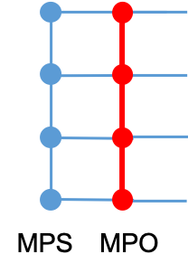
</div>

### Simulation using MPS

The initial state of an N-qubit quantum computation is typically $\ket{00\dots 0}$, which can be created as a trivial MPS directly without having to first construct an order-N tensor of size $2^N$.

A quantum circuit is a form of tensor network. The state is represented by an MPS and the individual gates are represented by tensors. Whereas the matrix representation of a 2-qubit gate (e.g. CX) is a 4x4 matrix (i.e. an order-2 tensor with index dimension 4), the tensor representation is an order-4 tensor with index dimension 2, corresponding to the number of basis states of a qubit.

The following diagram shows how a one-qubit gate (the red square) can be contracted into the MPS, replacing one of the original MPS tensor nodes.

<div style="text-align: center;">
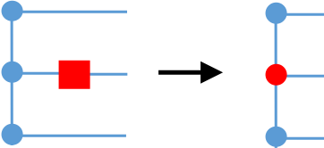
</div>

```math
G_{mj}A_{ijk}\rightarrow A^{'}_{imk}
```
where $G_{mj}$ is the one-qubit gate tensor and $A_{ijk}$ is the MPS site into which it is to be contracted.

In the case of a one-qubit gate, no approximation is involved and the bond dimensions in the chain remain unchanged.

The situation is a little more complicated for a 2-qubit gate, as shown below. The 2-qubit gate tensor (shown in red) is contracted with the MPS and replaces two of the tensors in the chain with an order-4 tensor, as shown in the middle part of the diagram. The SVD procedure described earlier is then used the split this new tensor into two order-3 tensors to restore the MPS.

<div style="text-align: center;">
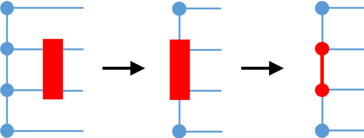
</div>

```math
G_{cdab}A_{iaj}B_{jbk} \rightarrow C_{icdk} \xrightarrow{\small\text{SVD}} A^{'}_{icm}B^{'}_{mdk}
```

where $G_{cdab}$ is the 2-qubit gate tensor and A & B are two consecutive MPS sites into which the gate is to be merged.

The tensor $C_{icdk}$ is the contracted state in the MPS that replaces consecutive qubit sites $A$ and $B$. This is then split by SVD into the new MPS sites $A'$ and $B'$. The bond shown in red now has a greater bond dimension, which reflects the entanglement introduced between the two qubits.

This procedure can be repeated to merge all the gates in the quantum circuit into the MPS, resulting in an MPS that describes the final state. The bond dimension can be limited, as described above, to keep the MPS size under control by approximating the state if it starts to grow too large.

How well this method works depends on the quantum circuit and the initial state. The bond dimension necessary to achieve good compression depends on the correlations introduced between qubits by entanglement. Superposition, on its own, does not lead to increased entanglement; the entire initial state may be placed in a superposition without any entanglement being present.

The application of a 2-qubit gate is more complicated if it is applied to non-adjacent qubits, because the intermediate qubit tensors need to be updated to increase the bond dimensions. One solution is to use a sequence of swaps, as discussed earlier, to make the qubits adjacent. The gate tensor is then applied and then the sequence of swaps is undone. This results in the  dimension of the bonds linking the intermediate tensors being increased as appropriate. The sequence of swaps can be implemented as a single Matrix Product Operator (MPO). Alternatively, the 2-qubit gate could be turned into an MPO that operates on the two qubits required, with identity tensors for the MPO nodes in between, avoiding the need for swaps altogether.

Whether Matrix Products States are a good solution for simulation depends very much on the amount of entanglement generated by the quantum circuit. If the entanglement is low, an MPS can potentially allow simulations involving hundreds of qubits.

### ZX Calculus

ZX calculus is a graphical language for reasoning about quantum computation. It is relatively new, but is included here as an interesting new development.

We have seen that a quantum circuit can be viewed as a tensor network. In fact, it is a restricted kind of tensor network in which the wires connecting tensors must use a fixed set of qubit lines. The circuit is a directed graph with time flowing from left to right, so wires cannot go backwards. The tensors representing gates must be unitary and have the same number of inputs as outputs.

Some simplification of a quantum circuit is possible using algebraic properties of gates as rewrite rules to replace one sequence of gates with another. For example, $HXH\rightarrow Z$. However, there are around 30 different types of quantum gate, leading to an enormous number of possible rewrite rules.

ZX Calculus [JvdW20] breaks quantum gates down into more primitive tensors, of which there are just two kinds, X-spiders and Z-spiders. These are denoted by red and green dots respectively, with 'legs' corresponding to the tensor indices. A spider with N 'legs' represents an order-N tensor. It has an associated phase which by default is zero.

A third type of tensor is usually included to represent the Hadamard operation. Although this could be constructed from X and Z spiders, it is useful to have a separate symbol because it is a conceptually significant operation that switches between the Z and X bases, which can be used to convert X spiders to Z spiders or vice versa. It is denoted by a yellow square or sometimes simply by using a blue wire instead of a normal black wire.

A ZX tensor network is an undirected multigraph which is a much more general than a normal quantum circuit. The tensor indices are not necessarily inputs or outputs, so there is no requirement for the tensors to have the same number of inputs as outputs and the wires may go in any direction. There are no longer any qubit lines, except possibly at the input and output of the circuit. Any quantum gate or quantum circuit may be reduced to a tensor network consisting of just red and green spiders.

Because there are only red and green spiders, the rewrite rules are very simple and there are only a few of them. Tools exist to apply these rules to simplify the tensor network. The rewrite transformations may be used to execute (i.e. simulate) a quantum circuit symbolically by reducing it to a final state, given an initial state. Alternatively, the simplification may reduce the circuit and then the simplified form may be turned back into a normal quantum circuit for execution on a real quantum computer. However, extracting the circuit is computationally hard.

This section was just to give a flavour of the ZX-calculus for interest, without going into too much detail. For further information and examples see [JvdW20].

---
<div style="page-break-after: always;"></div>

## 9: Conclusions

This has been a look at some concepts of quantum computing, mostly from the perspective of information processing rather than physical implementation. There are many more topics that could have been included, but it is hoped that this has been a useful start.

If you wish to explore further, the [Bibliography](#bibliography) contains some suggestions. Richard Feynman's paper [Fey82] is of historical interest, because it is where the idea of quantum computing was originally proposed. Leonard Susskind's book [Sus15] is a good basic introduction to quantum mechanics that is easy to understand. David Mermin's Book [Mer07] concentrates on the computer science aspects and looks at some quantum algorithms. Nielsen and Chaung's book [NC10] is an excellent textbook if you want to dive deeper into some of the topics. Finally, John van de Wetering's paper [JvdW20] may be of interest if you wish to explore the relatively new area of ZX calculus.

---

## Bibliography

[Fey82]: R. Feynman, Simulating Physics with Computers, *International Journal of Theoretical Physics*, Vol 21, Nos 6/7, 1982.

[JvdW20]: J van de Wetering. Zx-calculus for the working quantum computer scientist, arXiv:2012.13966v1 [quant-ph], Dec 2020.

[Mer07]: D.Mermin, *Quantum Computer Science*, Cambridge Univerity Press, 2007.

[NC10]: M.A. Nielsen and I.L.Chuang, *Quantum Computation and Quantum Information*, 10th anniversary edition, Cambridge University Press, 2010.

[Sus15]: L. Susskind, A. Friedman, Quantum Mechanics - The Theoretical Minimum, Penguin Books, 2015.
