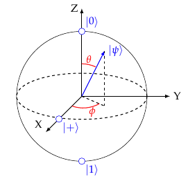

# A Short Guide to Quantum Computing

*Jon Brumfitt
(This revision: 23 April 2025)*

### Preface

This is a short introduction to quantum computation, focusing on quantum states, gates, circuits and quantum information, rather than hardware implementation technologies such as superconducting qubits and quantum dots. The final section looks at ways of simulating quantum computations on an ordinary computer.

Quantum mechanics and quantum computing are, by their very nature, rather mathematical. I have tried to keep the maths as simple as possible and have avoided the rigorous derivations you might find in a text book. However, some knowledge of complex numbers, vectors and matrices is assumed.

After a career mostly spent developing scientific software for space astrophysics missions, I retired and was looking for something interesting to do with all the spare time I had suddenly acquired. Many years earlier at university, I had been fascinated by quantum mechanics, so the emerging field of quantum computing caught my imagination and I was keen to learn more about it.

I ordered a book on quantum computing, but had only read a few pages before I started using Python to simulate some of the things I had read about. This quickly grew into a small simulator that I called "TinyQsim" (https://github.com/jbrumf/tinyqsim). This has no relation to the TinyQsim package in the PyPI repository.

If you read a book or watch a lecture on something, you may feel you understand it, but it is not until you try to actually use the knowledge that you really begin to understand it properly and appreciate all the subtle points that the book or lecturer glossed over or didn't mention. Writing the simulator has given me a much better understanding than I would have got by just using an off-the-shelf quantum simulator. I have often found that writing about something, preparing a lecture on it or simulating it in software are good ways to improve your understanding of it.

This guide started out as as a few informal notes on quantum computing to accompany TinyQsim, but has grown into the current document, which is now separate from the simulator. I have enjoyed writing it and there are many more topics I would like to have covered, so I may continue to add to it from time to time.

I would encourage you to get a simulator and experiment with the things in this guide yourself. You may be better of with a more comprehensive quantum simulator, such as IBM's Qiskit, which has a big user community and lots of documentation and examples. However, if my short guide has got you interested, then it has served its purpose.

Jon Brumfitt
April 2025

---

### Contents

- [Quantum Computing Basics](#quantum-computing-basics)
    - [Preface](#preface)
    - [Contents](#contents)
  - [1: Introduction](#1-introduction)
  - [2: Preliminaries](#2-preliminaries)
    - [Qubits](#qubits)
    - [Quantum Probability and Interference](#quantum-probability-and-interference)
    - [Dirac Bra-Ket Notation](#dirac-bra-ket-notation)
      - [Inner Product](#inner-product)
      - [Outer Product](#outer-product)
      - [Tensor Product](#tensor-product)
      - [Projectors](#projectors)
    - [Qubit States](#qubit-states)
    - [Complementarity](#complementarity)
    - [Bloch Sphere](#bloch-sphere)
    - [Multi-Qubit States](#multi-qubit-states)
    - [Unitary Operators](#unitary-operators)
    - [No-Cloning Theorem](#no-cloning-theorem)
  - [3: Quantum Circuits](#3-quantum-circuits)
    - [Endianness](#endianness)
    - [Operations on Multiple Qubits](#operations-on-multiple-qubits)
    - [Composing Circuits](#composing-circuits)
    - [Permutation of Qubits](#permutation-of-qubits)
    - [Addressing Qubits](#addressing-qubits)
  - [4: Quantum Gates](#4-quantum-gates)
    - [Introduction](#introduction)
    - [X Gate (aka NOT gate)](#x-gate-aka-not-gate)
    - [Hadamard (H) Gate](#hadamard-h-gate)
    - [Hadamard Transform](#hadamard-transform)
    - [Phase (P) Gate](#phase-p-gate)
    - [Controlled-X (CX) Gate](#controlled-x-cx-gate)
    - [Controlled-U (CU) Gate](#controlled-u-cu-gate)
    - [SWAP Gate](#swap-gate)
  - [5: Entanglement](#5-entanglement)
    - [Creating Entanglement](#creating-entanglement)
    - [Bell States](#bell-states)
    - [Bell Measurement](#bell-measurement)
    - [Monogamy of Entanglement](#monogamy-of-entanglement)
  - [6: Measurement](#6-measurement)
    - [Introduction](#introduction)
    - [Simulated Measurements](#simulated-measurements)
    - [Measurement Operators](#measurement-operators)
    - [Measurement in Different Bases](#measurement-in-different-bases)
    - [Measurement as Entanglement](#measurement-as-entanglement)
    - [Principle of Implicit Measurement](#principle-of-implicit-measurement)
    - [Principle of Deferred Measurement](#principle-of-deferred-measurement)
    - [Mid-Circuit Measurement](#mid-circuit-measurement)
  - [7: Examples](#7-examples)
    - [Quantum Teleportation](#quantum-teleportation)
    - [Exploring the Teleportation Example](#exploring-the-teleportation-example)
    - [Quantum Fourier Transform](#quantum-fourier-transform)
    - [Quantum Phase Estimation](#quantum-phase-estimation)
  - [8: Simulating a Quantum Computer](#8-simulating-a-quantum-computer)
    - [Simulation using Matrices](#simulation-using-matrices)
    - [Tensors](#tensors)
    - [Simulation using Tensors](#simulation-using-tensors)
    - [Matrix Product States (MPS)](#matrix-product-states-mps)
    - [Simulation using MPS](#simulation-using-mps)
    - [ZX Calculus](#zx-calculus)
  - [9: Conclusions](#9-conclusions)
  - [Bibliography](#bibliography)

---

## 1: Introduction

Quantum computing uses the special properties of quantum systems, such as superposition and entanglement, to perform computations. In principle, this makes it possible to solve certain problems that would be totally intractable on a conventional (classical) computer.

Classical computers represent information in the form of *bits* that can have either the value 0 or 1. Quantum computers, on the other hand, use *qubits* that can be in a *superposition* of both 0 and 1. When one or more qubits are in a superposition, the states can be made to *interfere* with one another, either cancelling or reinforcing each other. Qubits can be *entangled* with one another so that information is encoded in the relationships between qubits and the qubits no longer have independent states of their own. These mechanisms give quantum computing enormous power, which we are still in the early stages of learning how to exploit.

The idea of Quantum Computers was proposed by physicist Richard Feynman in 1982 when he published a paper called "Simulating Physics with Computers" [Fey82]. He pointed out that many physical systems that we would like to simulate are quantum mechanical, so it would make sense to simulate them using a computer that works at the quantum level. Indeed, nowadays, the simulation of chemicals, drugs and materials at the quantum level is seen to be an important prospective application area.

There are two main types of quantum computer: the gate-model quantum computer and the adiabatic quantum computer. This document only considers the gate-model. The gate model uses *quantum gates*, analogous to the logic gates of classical computers. These implement quantum operators that can manipulate a quantum state to evolve it towards a solution. A *quantum circuit* defines a sequence of gates that can perform an algorithm.

In 1994, Peter Shor published a quantum algorithm, known as Shor's algorithm, that can theoretically factor large integers exponentially faster than a classical computer. This led to a lot of interest as it would allow a quantum computer to break widely-used encryption codes such as RSA. However, quantum technology also provides new solutions to cryptography, such as Quantum Key Distribution (QKD), that are secure against quantum computers.

Quantum computers work on a completely different principle to classical computers, so the quantum algorithm to solve a problem is entirely different to a classical one. A lot of work is needed to find quantum algorithms that can exploit the power of a quantum computer. As yet, only a few exist.

Current quantum computers are referred to as Noisy Intermediate-Scale Quantum (NISQ) devices. They are susceptible to *decoherence* of the fragile quantum state, caused by noise and interaction of the qubits with their environment, leading to high error rates. Devices are cooled down to near absolute zero to reduce the thermal noise and shielded against other forms of radiation. Qubits can be made more robust by quantum error correction, implemented using many physical qubits to make one logical qubit. Consequently, the number of useful qubits can be much less that the physical number. The key challenge in the years ahead is to scale quantum computers up to the tens or hundreds of thousands of logical qubits needed to tackle real-world problems, while keeping noise and errors under control.

An added benefit of developing the technology for quantum computers is that we are learning new ways to manipulate nature at the quantum level. This is certain to have applications in other areas such as quantum sensing and quantum metrology.

## 2: Preliminaries

### Qubits

The unit of information for classical computers is the *bit*, which has two possible states that we label 0 and 1. The unit of information for quantum computers is the *qubit*, which has two basis states that are denoted by $\ket{0}$ and $\ket{1}$. However, unlike a classical bit, a qubit can be in a *superposition* of its two basis states.

The qubit is an abstraction of a two-level quantum system, such as the spin of an electron or the polarisation of a photon. Another example is the energy level of an atom that can be in either the ground state or a specific excited energy state. Yet another kind is a superconducting qubit with two distinct current states. By working at the abstract level of a qubit, we can describe quantum computation in a way that makes it independent of the physical realisation.

The *ket* symbol $\ket{\psi}$ is part of the Dirac *Bra-Ket* notation and represents a complex vector with label $\psi$. The $\ket{0}$ and $\ket{1}$ basis states can be thought of as corresponding to the classical bit states 0 and 1. This basis is known as the *computational basis* or Z-basis.

The two qubit basis states $\ket{0}$ and $\ket{1}$ can be represented as column vectors as follows:

```math
\ket{0} =  \begin{bmatrix}1\\0\end{bmatrix}\quad\text{and}\quad\ket{1} =  \begin{bmatrix}0\\1\end{bmatrix}
```

When it is measured in a particular basis, a qubit will always be found in one of the two basis states. However, when it is not being measured, it can also be in a linear superposition of the two basis states:

```math
\ket{\psi} = \alpha_0 \ket{0} + \alpha_1 \ket{1} = \begin{bmatrix}\alpha_0\\ \alpha_1\end{bmatrix},\qquad \alpha_0,\alpha_1 \in \mathbb{C}
```

where $\alpha_0$ and $\alpha_1$ are called *probability amplitudes*.

When the state of the qubit is measured, it will become one of the two basis states with a probability $p$ given by the square of the absolute value of the corresponding probability amplitude.

```math
\begin{align*}
p(0) &= \lvert\alpha_0\rvert^2 = \alpha_0^*\,\alpha_0\\[1ex]
p(1) &= \lvert\alpha_1\rvert^2 = \alpha_1^*\,\alpha_1
\end{align*}
```
where $\alpha^*$ denotes the complex conjugate of $\alpha$.

This is known as the *Born Rule*.

Since the total probability must be one:

```math
p(0) + p(1) = \lvert\alpha_0\rvert^2 + \lvert\alpha_1\rvert^2 = 1
```

The quantum state $\ket{\psi}$ of a qubit is not something we can observe. The only information we can get is as the result of a quantum measurement that results in the state collapsing to one of the two basis states $\ket{0}$ and $\ket{1}$, with probabilities $|\alpha_0|^2$ and $|\alpha_1|^2$ respectively.

It is important to understand that a qubit in superposition does not have a definite value $\ket{0}$ or $\ket{1}$. It is not simply that we don't know the value until we measure it; it actually does not have a definite value until we measure it. If we measure the qubit in a given basis it will then have a definite value in that basis. So, if we immediately measure it again in that basis, the probability of getting the same result will be one.

Note: The quantum states that have been discussed so far are known as *pure states*. It is also possible to have *mixed states*, where we have incomplete knowledge about pure quantum states or we choose states at random from a set of pure random states. Such states are represented by *density matrices* rather than state vectors. However, this document is mainly concerned with pure states, so this is only mentioned here for completeness.

The quantum state may be manipulated by unitary operators that can be represented by matrices. For example, the quantum NOT operator $X$ is described by the following matrix:

```math
X =\begin{bmatrix}0 & 1 \\ 1 & 0 \end{bmatrix}
```

When applied to a qubit state, the X operator simply swaps the amplitudes (and hence probabilities) of $\ket{0}$ and $\ket{1}$ :

```math
\begin{bmatrix}0 & 1 \\ 1 & 0 \end{bmatrix} \begin{bmatrix}\alpha_0 \\ \alpha_1 \end{bmatrix} = \begin{bmatrix}\alpha_1 \\ \alpha_0 \end{bmatrix}
```

When applied to the basis states $\ket{0}$ or $\ket{1}$, it reduces to the classical NOT operation:

```math
\begin{align*}
 X \ket{0} = \begin{bmatrix}0 & 1 \\ 1 & 0 \end{bmatrix} \begin{bmatrix}1 \\ 0 \end{bmatrix} = \begin{bmatrix}0 \\ 1 \end{bmatrix} = \ket{1}\\[1ex]
X \ket{1} = \begin{bmatrix}0 & 1 \\ 1 & 0 \end{bmatrix} \begin{bmatrix}0 \\ 1 \end{bmatrix} = \begin{bmatrix}1 \\ 0 \end{bmatrix}= \ket{0}
 \end{align*}
```

### Quantum Probability and Interference

In classical probability theory, if an outcome can occur in two mutually exclusive ways, the probability of it happening is the sum of the probabilities for the two cases:

```math
p = p_1 + p_2
```

However, nature doesn't work this way at the quantum level. Instead, we need to allow for the outcome arising from a superposition of the two cases. This requires using *probability amplitudes* that are complex numbers. The probability is the square of the absolute value of the probability amplitude $\alpha$:

```math
p = \alpha^*\,\alpha = \lvert \alpha \rvert ^2,  \qquad \alpha \in \mathbb{C}
```

where $\alpha^*$ denotes the complex conjugate of $\alpha$.

If something can happen in two different ways, we add the probability amplitudes:

```math
\begin{align*}
p &= (\alpha_1 + \alpha_2)^*\  (\alpha_1 + \alpha_2)\\
&= \lvert \alpha_1 + \alpha_2 \rvert ^2
\end{align*}
```

Writing the complex probability amplitudes in polar form:

```math
\alpha_1 = \lvert \alpha_1 \rvert e^{i \phi_1} \quad\text{and}\quad \alpha_2 = \lvert \alpha_2 \rvert e^{i \phi_2}
```

results in:

```math
\begin{align*}
	p &=  (\alpha_1 + \alpha_2)^*\  (\alpha_1 + \alpha_2) \\
	& = \lvert \alpha_1 \rvert^2 + \lvert \alpha_2 \rvert^2 + \alpha_1 \alpha_2^* + \alpha_1^* \alpha_2 \\
	& = \lvert \alpha_1 \rvert^2 + \lvert \alpha_2 \rvert^2 + \lvert\alpha_1\rvert\lvert\alpha_2\rvert (e^{i(\phi_1-\phi_2)} + e^{-i(\phi_1-\phi_2)}\\
	& = \lvert \alpha_1 \rvert^2 + \lvert \alpha_2 \rvert^2 + 2 \lvert \alpha_1\rvert \lvert \alpha_2 \rvert \cos{(\phi_1 - \phi_2)}]
\end{align*}
```

The first two terms are the classical probabilities $p_1$ and $p_2$.

The final term represents quantum *interference*. This term can be positive (constructive interference) or negative (destructive interference), depending on the relative phase $(\phi_1 - \phi_2)$.

In the classical case, the two states of a bit (0 and 1) are mutually exclusive, so that the interference term disappears and the probability reduces to the normal classical one:

```math
p = \lvert \alpha_1 \rvert^2 + \lvert \alpha_2 \rvert^2 = p_1 + p_2
```

Interference is one of the key quantum phenomena that is exploited in quantum computing. We can get quantum states to interfere so that the required solution interferes constructively and other outcomes interfere destructively.

### Dirac Bra-Ket Notation

The Dirac Ket symbol $\ket{\psi}$ was briefly introduced above as a notation for a vector. We will now look at this notation in more detail as it will be needed as we continue to explore quantum computing.

Dirac’s *Bra-Ket* notation is used in quantum mechanics to describe quantum states as vectors in a complex vector space. It provides a concise way to write vector equations and manipulate them symbolically in a coordinate-free way. The notation automatically takes care of complex conjugation where appropriate.

A quantum state is represented by the *Ket* symbol $\ket{A}$, where $A$ is just a label. The *Conjugate Transpose* (aka *Hermitian Transpose*) $\ket{A}^\dagger$ of the ket $\ket{A}$ is called a *Bra* and is written $\bra{A}$. The symbols are called *Bra* and *Ket* because together they are like a pair of brackets: $\braket{A|B}$.

If we consider the quantum state in a specific orthonormal basis, we can represent a Ket by a column vector:

```math
\ket{A} = \begin{bmatrix}a_1\\a_2\\...\\a_n\end{bmatrix}
```

The corresponding Bra $\bra{A}$ is the conjugate transpose , which is a row vector:

```math
\bra{A} = \ket{A}^\dagger =  \begin{bmatrix}a_1^*, & a_2^*, ...\, a_n^*\end{bmatrix}
```

There are three products of interest: the *inner product* $\braket{A|B}$, the *outer product* $\ket{A}\bra{B}$ and the *tensor product* $\ket{A}\ket{B}$.

#### Inner Product

The *inner product* $\braket{A|B} \in\mathbb{C}$ is:

```math
\begin{align*}
	\braket{A|B} &= \begin{bmatrix}a_1^*,\dots,a_n^*\end{bmatrix}  \begin{bmatrix}b_1\\ \dots\\b_n\end{bmatrix}\\
	\\
	&= a_1^* b_1 + a_2^* b_2 +...+ a_n^* b_n
\end{align*}
```

For example, the fact that $\ket{0}$ and $\ket{1}$ are orthonormal can be expressed as:

```math
\begin{align*}
\braket{0|1} = \braket{1|0} = 0\\
\braket{0|0} = \braket{1|1} = 1
\end{align*}
```

#### Outer Product

The outer product is:

```math
\ket{A}\bra{B} = \begin{bmatrix}a_1\\\dots\\a_m\end{bmatrix} \begin{bmatrix}b_1^*,\dots,b_n\end{bmatrix}
	=  \begin{bmatrix}a_1 b_1^*&\dots&a_1 b_n^*\\\dots\\a_mb_1^*&\dots&a_mb_n^*\end{bmatrix}
```

For example, the quantum NOT operator $X$ can be expressed as:

```math
X=\ketbra{0}{1}+\ketbra{1}{0}=\begin{bmatrix}0&1\\1&0\end{bmatrix}
```

#### Tensor Product

The tensor product (denoted by $\otimes$) is:

```math
\ket{A}\otimes\ket{B} = \begin{bmatrix}a_1\\a_2\end{bmatrix} \otimes  \begin{bmatrix}b_1\\ b_2\end{bmatrix}
	= \begin{bmatrix}a_1 b_1\\a_1 b_2\\a_2 b_1\\a_2 b_2\end{bmatrix}
```

The tensor product can be written in several different ways. The tensor product symbol $\otimes$ is often omitted in Dirac notation as it is implied by the concatenation of kets:

```math
\ket{A}\otimes\ket{B} \equiv \ket{A}\ket{B} \equiv \ket{A,B}\equiv \ket{AB}
```

The tensor product is associative, so we can combine arbitrarily many qubits:

```math
\ket{\psi} = \ket{A_1}\otimes \ket{A_2}\otimes\dots\otimes\ket{A_n}
```

The tensor product of $n$ identical states is sometimes written as a *tensor power*. For example:

```math
\ket{0}^{\otimes n}=\ket{0}\otimes\dots\otimes\ket{0}
```

#### Projectors

The outer product $\ketbra{\psi}{\psi}$ of a vector with its conjugate transpose is known as a *projector*. If a projector is applied to a vector $\ket{\phi}$, the result is:

```math
\begin{align*}
(\ket{\psi}\bra{\psi})\ \ket{\phi} &= \ket{\psi}\ \braket{\psi|\phi}\\
&=\braket{\psi|\phi}\ \ket{\psi}
\end{align*}
```

The regrouping of terms allowed by associativity results in an inner product $\braket{\psi|\phi}$. This can then be moved to the left as a coefficient multiplier of $\ket{\psi}$ as it is just a complex number.

The effect of the projector $\ketbra{\psi}{\psi}$ is to project the vector $\ket{\phi}$ onto the basis vector $\ket{\psi}$.

### Qubit States

We saw earlier that the state $\ket{\psi}$ of a qubit can be represented as a linear combination of its two basis vectors $\ket{0}$ and $\ket{1}$:

```math
\ket{\psi} = \alpha_0 \ket{0} + \alpha_1 \ket{1},\qquad \alpha_0,\alpha_1 \in \mathbb{C}
```

The vector $\ket{\psi}$ is an element of the 2-dimensional complex vector space $\mathbb{C}^2$, known as a *Hilbert space*. A qubit can be any system that is described by a 2-dimensional Hilbert space.

Note: A Hilbert space is a complex vector space with an inner product that is generalized to allow infinite dimensional spaces. Infinite dimensional vector spaces become important in quantum mechanics when we are dealing with continuous degrees of freedom, such as position or momentum. Since we only need finite-dimensional vector spaces for quantum computing, we will often just use the term "complex vector space".

The vector $\ket{\psi}$ can be visualized in the 2-dimensional vector space as follows:

<div style="text-align: center;">

</div>

The projections onto the basis vectors give the probability amplitudes $\alpha_0$ and $\alpha_1$ of measuring a 0 or 1. When the state of the qubit is measured, it will collapse to $\ket{0}$ or $\ket{1}$ with probabilities $\lvert\alpha_0\rvert^2$ and $\lvert\alpha_1\rvert^2$ respectively.

The vector $\ket{\psi}$ lies on the unit circle, since its norm must be one to give a total measurement probability of one:

```math
\lvert\alpha_0\rvert^2 + \lvert\alpha_1\rvert^2 = 1
```

It is important to understand that the complex vector space represents an abstract *state space* describing the quantum state of the qubit. It should not be confused with the physical space in which a property, such as spin of an electron, is measured. For example, $\ket{0}$ and $\ket{1}$ are often used to represent the up and down spin states of an electron. Up and down are in opposite directions in physical space but orthogonal in state space. Being orthogonal allows the quantum state to be in a linear superposition of up and down, whereas in physical space they are mutually exclusive directions.

### Complementarity

In quantum mechanics, there are pairs of *complementary* properties, such as position and momentum, that cannot both be precisely known at the same time. This is the basis of the Heisenberg Uncertainty Principle. The more you know about one property, the less you know about the other. An exact measurement of one of the properties makes the other one completely undetermined, such that a measurement of it gives a random result.

In the case of qubits, complementarity exists between measurements made in the Z and X bases, for example.

The X basis vectors are denoted by $\ket{+}$ and $\ket{-}$ and are related to the computational (Z) basis vectors $\ket{0}$ and $\ket{1}$ as follows:

```math
\begin{align*}
	\ket{+} &= {\small\frac{1}{\sqrt{2}}}(\ket{0} + \ket{1}) =  {\small\frac{1}{\sqrt{2}}} \begin{bmatrix}1\\1\end{bmatrix}\\[1ex]
	\ket{-} &= {\small\frac{1}{\sqrt{2}}}(\ket{0} - \ket{1} =  {\small\frac{1}{\sqrt{2}}} \begin{bmatrix}1\\-1\end{bmatrix}
\end{align*}
```

The scaling factor of $\frac{1}{\sqrt{2}}$ is to normalize the vectors, so that the probabilities of the measurement outcomes sum to one.

The following diagram shows how $\ket{+}$ and $\ket{-}$ are related to $\ket{0}$ and $\ket{1}$ in the 2-dimensional complex vector space. The dotted circle is a unit circle.

<div style="text-align: center;">

</div>

A basis state in the Z-basis corresponds to an equal superposition in the X-basis and vice versa. If we measure a qubit in the Z basis, the state will collapse into the Z basis state $\ket{0}$ or $\ket{1}$. If we then measure the qubit in the X-basis, the result will be completely random, with an equal probability that we measure $\ket{+}$ or $\ket{-}$ and the state will become that X-basis state. If we then measure it again in the Z-basis, the result will again be completely random, with an equal probability of measuring $\ket{0}$ or $\ket{1}$.

A consequence of complementarity is that we can never observe the quantum state of a system, even in principle. Any attempt to measure the state will collapse it to an eigenstate of the measurement operator. Consequently, it is not possible to measure components in orthogonal directions to reconstruct the state vector. This is very different to a classical measurement where, for example, we could measure a wind vector or magnetic field vector by making measurements in orthogonal directions. This leads to the No-Cloning Theorem which is discussed later.

The operator that converts a qubit from the Z basis to the X basis, or vice versa, is the *Hadamard* operator $H$:

```math
H = \frac{1}{\sqrt{2}} \begin{bmatrix}1 & 1 \\ 1 & -1 \end{bmatrix}
```

So, for example:

```math
H\ket{1} = \frac{1}{\sqrt{2}} \begin{bmatrix}1 & 1 \\ 1 & -1 \end{bmatrix}\begin{bmatrix}0\\1\end{bmatrix}=\frac{1}{\sqrt{2}}\begin{bmatrix}1\\-1\end{bmatrix}=\ket{-}
```

The X basis is also known as the Hadamard basis. It is often useful in quantum algorithms to switch between the Z and X bases, using the Hadamard operator in the form of a Hadamard gate.

The Hadamard operator H can be thought of as a one-qubit [Hadamard Transform](#hadamard-transform). It is also equivalent to a one-qubit [Quantum Fourier Transform](#quantum-fourier-transform).

In addition, to the Z and X bases, there is also a Y basis. The Y basis vectors are denoted by $\ket{R}$ and $\ket{L}$, or sometimes by $\ket{i}$ and $\ket{-i}$. They are related to the computational (Z) basis vectors $\ket{0}$ and $\ket{1}$ as follows:

```math
\begin{align*}
	\ket{R} &= {\small\frac{1}{\sqrt{2}}}(\ket{0} + i\ket{1}) =  {\small\frac{1}{\sqrt{2}}} \begin{bmatrix}1\\i\end{bmatrix}\\[1ex]
	\ket{L} &= {\small\frac{1}{\sqrt{2}}}(\ket{0} - i\ket{1} =  {\small\frac{1}{\sqrt{2}}} \begin{bmatrix}1\\-i\end{bmatrix}
\end{align*}
```

### Bloch Sphere

The Bloch Sphere is a three-dimensional graphical representation of the state of a single qubit. Unlike Hilbert space, it does not generalize to multi-qubit systems. Nevertheless, it is a good way to visualise the effect of one-qubit gates, since these all correspond to rotations on the Bloch sphere. The X, Y and Z quantum gates perform 180 degree rotations about the corresponding axes of the Bloch Sphere.

It is particularly well-suited for relating qubits to the behaviour of spin-½ systems, such as the spin of an electron. However, even qubits that are physically implemented by other 2-state phenomena, such as the direction of current in a superconducting loop, behave in the same way at the abstract level of qubits. It is equally possible to perform X, Y and Z rotations of them on the Bloch sphere, although these operations are no longer simply related to the physical system.

Quantum computing harnesses the apparently strange behaviour of quantum particles in order to perform computations. Without some appreciation of the physical realisation of qubits, the concepts of quantum computing may seem somewhat strange and arbitrary. The spin of the electron is a good example to keep in mind as it relates nicely to the Bloch sphere and one-qubit quantum gates.

The state of a qubit is described by two complex numbers. However, it is possible to describe the state with only two (real) angles because there is redundant information.

One degree of freedom is lost because the total probability must be one:

```math
\lvert\alpha_0\rvert^2 + \lvert\alpha_1\rvert^2 = 1
```

A second degree of freedom is lost because there are many kets that describe the same physical state, since a global phase term $e^{i\beta}$ does not affect the result of a measurement:

```math
\lvert\ket{\psi}\rvert^2 = \lvert e^{i\beta}\ket{\psi}\rvert^2
```

The state $\ket{\psi}$ of a qubit may be mapped onto a sphere, known as the Bloch sphere, as follows:

```math
\ket{\psi} = \cos(\frac{\theta}{2})\ket{0} + e^{i\phi} \sin(\frac{\theta}{2})\ket{1}
```

where $0 \le\theta\le\pi$ and $0\le\phi\le2\pi$.

<div style="text-align: center;">

</div>

The probability of a measurement outcome of $\ket{0}$ or $\ket{1}$ depends only on the polar angle $\theta$ and not on the azimuthal (phase) angle $\phi$:

```math
\begin{align*}
p(\ket{0}) &= \lvert \cos({\small\frac{\theta}{2}}) \rvert^2 = \frac{1 + \cos\theta}{2}\\[0.4em]
p(\ket{1}) &= \lvert e^{i\phi}\sin({\small\frac{\theta}{2}}) \rvert^2 = \frac{1 - \cos\theta}{2}
\end{align*}
```

Evaluating these gives:

```math
 p(\ket{0}) = \begin{cases} 
      1 & \theta=0 \\
      0.5 & \theta=\frac{\pi}{2} \\
      0 & \theta=\pi 
   \end{cases}
```

```math
 p(\ket{1}) = \begin{cases} 
      0 & \theta=0 \\
      0.5 & \theta=\frac{\pi}{2} \\
      1 & \theta=\pi 
   \end{cases}
```

So, on the "equator" where $\theta=\frac{\pi}{2}$, there is an equal probability of measuring $\ket{0}$ or $\ket{1}$. This is called an *equal superposition*.

We are only considering *pure* states that can be described by a state vector with a norm of one. These are represented by points on the sphere. Points within the sphere correspond to *mixed states*. The unitary operators implemented by quantum gates are norm-preserving. Since the norm of a pure state vector is one, one-qubit gates perform rotations on the sphere.

Note that the basis states $\ket{0}$ and $\ket{1}$ are 180 degrees apart on the Bloch sphere, whereas they are 90 degrees apart in the complex vector space $\mathbb{C}^2$. When quantum gates are said to perform a rotation by some angle, this refers to the angle on the Bloch sphere.

### Multi-Qubit States

Interesting things start to happen when we have more than one qubit.

The state of a classical system with $N$ bits can, somewhat obviously, be represented by $N$ bits of storage. Any of the bits may be read (measured) or set individually without affecting the others.

However, the state of a quantum system with $N$ qubits cannot be represented by $N$ vectors in a 2-dimensional complex vector space, because the qubits are not independent. Instead, it requires one vector in a $2^N$-dimensional vector space. This requires $2^N$ complex numbers to represent it, so the storage required increases exponentially with the number of qubits.

Note: Vectors which only differ by a global phase $\gamma$ are equivalent as far as the physical state is concerned, because there is no measurable difference, so the vector space representation has some redundancy:

```math
|e^{i\gamma}\ (\alpha_0\ket{0}+\alpha_1\ket{1})|^2 = |\alpha_0\ket{0}+\alpha_1\ket{1}|^2
```

The states of two qubits in $\mathbb{C}^2$ are combined into one state in $\mathbb{C}^4$ by taking their tensor product:

```math
\ket{A}\otimes\ket{B} = \begin{bmatrix}a_1\\a_2\end{bmatrix}
	\otimes  \begin{bmatrix}b_1\\ b_2\end{bmatrix}
	= \begin{bmatrix}a_1 b_1\\a_1 b_2\\a_2 b_1\\a_2 b_2\end{bmatrix}
```

The tensor product is associative, so we can combine arbitrarily many qubits into a multi-qubit state:

```math
\ket{\psi} = \ket{A_1}\otimes \ket{A_2}\otimes\dots\otimes\ket{A_n}
```

Associativity also allows us to combine two multi-qubit subsystems $A$ and $B$:

```math
\big(\ket{A_1}\otimes\ket{A_2}\big) \otimes \big(\ket{B_1}\otimes\ket{B_2}\big) = \ket{A_1}\otimes\ket{A_2}\otimes \ket{B_1}\otimes\ket{B_2}
```

The tensor product of individual pure qubit states gives the state of the N-qubit system. However, it is not necessarily possible to factor the state back into individual qubit states after quantum gate operations have been applied. For example, the following is an *entangled* state that is not separable into the tensor product of individual qubit states:

```math
\frac{1}{\sqrt{2}} (\ket{01} + \ket{10} )
```

Unentangled states are separable and can therefore be simulated efficiently on a classical computer. Without any entanglement, quantum computers would be no more powerful than classical computers.

A classical computer requires only 38 bytes of storage to represent 300 classical bits. In contrast, a quantum computer with 300 qubits requires a vector of $2^{300}$ (about $10^{90}$) complex values to represent the state, which is much more than the number of atoms in the observable universe (estimated to be around $10^{80}$ ). Simulating a quantum computer with more than a few tens of qubits is infeasible even on a supercomputer, for arbitrary quantum states. (Note: Modern quantum simulation techniques, such as the use of Matrix Product States, can allow simulations with hundreds of qubits in some cases, by compressing the quantum state, provided that the entanglement in the system is not too great.)

Quantum states represent exponentially more information than classical states. However, we cannot access that information because measuring it will only give one of the classical states. The art of writing quantum algorithms is to utilize the vast state space, but then evolve the state towards one of the basis states, having some required property, which can be read out as the answer.

### Unitary Operators

A *unitary* operator $U$ is one whose inverse is its *conjugate transpose* $U^\dagger$ (aka *Hermitian transpose*):

```math
U^\dagger U = U U^\dagger = I
```

Unitary operators are norm-preserving and invertible. The eigenvalues $\lambda$ of a unitary operator have a norm of one.


```math
U\ket{\psi} = \lambda \ket{\psi},\quad |\lambda|=1
```

The time evolution of a closed quantum system is *unitary*, according to the *Schrödinger equation*. If the state of a quantum system is $\ket{\psi}$, then the state $\ket{\psi'}$ at a later time corresponds to the application of a unitary operator $U$:

```math
\ket{\psi'} = U\ket{\psi}
```

The evolution does not depend on the state and is therefore *linear*. Consequently, the result of applying a unitary operator $U$ to the sum (e.g. superposition) of two states is the sum of the results of applying the operator to the states individually:

```math
U (\ket{\psi} + \ket{\phi}) = U \ket{\psi} + U \ket{\phi}
```

The norm-preserving property of unitary operators implies that they preserve probabilities. The quantum state vector of a pure state has a norm of one, since the total probability of all measurement outcomes must be one. The operators applied to evolve the state must be unitary so as to preserve the norm.

The unitary operators in a gate-model quantum computer are called “quantum gates” by analogy with the logic gates of traditional computers. Unitary operators are reversible, since by definition their inverse is their conjugate transpose. Consequently, quantum gates (and quantum circuits) are reversible. Measurement is not considered to be a gate because it is not reversible.

Unitary operators can be expressed as unitary matrices. A unitary matrix is one whose inverse is its conjugate transpose. It is the complex equivalent of a real orthonormal matrix. Unitary matrices are square, which results in quantum gates (and hence quantum circuits) having the same number of outputs as inputs. This is very different to ordinary digital logic gates where, for example, a NAND gate has two inputs and one output. The inputs of a NAND gate cannot be inferred from the output, so it is not reversible.

### No-Cloning Theorem

The *no-cloning* theorem of quantum mechanics says that, given an unknown quantum state, it is not possible to create an exact independent copy of it. For example, in quantum teleportation, it is not possible to send an unknown quantum state from A to B, unless the original state at A is lost in the process.

Cloning, if it were possible, would be the operation:

```math
\ket{\psi 0} \rightarrow \ket{\psi\psi} = \ket{\psi} \otimes \ket{\psi}
```
Note that the result can be expressed as the tensor product of two independent (but identical) states.

It is possible to create two identical quantum states by applying the same sequence of unitary operators to a $\ket{00\dots 0}$ state, but this is not the same as creating a copy of a given unknown state. Creating entanglement also does not count as cloning because the entangled qubits are not independent.

The related *no-deleting theorem* says that, given two identical quantum states, it is not possible to throw one away. This follows because the evolution of quantum state is reversible, so if deletion were possible then, in reverse, cloning would be possible.

Deletion would be the operation:

```math
\ket{\psi \psi} \rightarrow \ket{\psi 0}
```

The no-cloning theorem implies that it is not possible to connect the output of one quantum gate to the input of two other gates, which is a normal occurrence with classical logical gates.

## 3: Quantum Circuits

A quantum circuit is a network of quantum gates applied to a set of qubits. It can be described by a quantum circuit diagram or in a quantum programming language. Quantum circuit diagrams allow a more intuitive level of understanding than equations.

The following is a simple example of a quantum circuit involving a Hadamard gate H and two CX (aka controlled-NOT) gates. The convention used in this document is that qubit 0 is the *most-significant* qubit and it is drawn as the top-most qubit in the diagram. It is normally assumed that all qubits are initialized to $\ket{0}$ unless otherwise stated.

<div style="text-align: center;">

</div>

A quantum circuit has a fixed number of qubits, as required by unitarity and the no-cloning theorem. No qubits can be added to the circuit or deleted. Any extra qubits (known as *ancilla* qubits) that the computation needs must be included and initialized as part of the initial state.

### Endianness

The qubit on the left side of a tensor product is referred to as the *most-significant* qubit. Hence, in the quantum state $\ket{011}$, the most-significant qubit is $\ket{0}$ and the least-significant qubit is $\ket{1}$:

This document uses the *big-endian* qubit numbering convention in which the most-significant qubit is called qubit 0. Note that some books and papers use the *little-endian* convention in which the least significant qubit is qubit 0. This can lead to confusion when comparing examples from different sources. It also leads to different matrix representation of some multi-qubit gates, such as CX, which can be a further source of confusion.

If quantum circuits are drawn with qubit 0 at the top, tensor products are applied in a downward direction for the big-endian convention and in an upward direction for the little-endian convention. The circuits in this document are drawn with the most-significant qubit at the top, so tensor products are applied in a downward direction.

### Operations on Multiple Qubits

A quantum circuit consists of a sequence of gates representing unitary operations. These are placed on a set of parallel lines representing the qubits. Measurement operations may be added to the outputs (not shown).

<div style="text-align: center;">

</div>

The input state on the left-hand side is $\ket{xy}=\ket{x}\otimes\ket{y}$. The qubit on the left side of a tensor product is referred to as the *most-significant* qubit. 

The quantum gates in the circuit simply represent quantum operations that are applied to the qubits. There is no implication that the gates are physical entities. In fact, the gates are often just quantum operations applied in-place to a fixed set of qubits. The inputs and outputs of the gates are not physical ports but simply the *before* and *after* states of the same qubits.

### Composing Circuits

A sequence of operations can be composed by matrix multiplication, whereas operations on different qubits are combined by tensor multiplication.

The following example shows the series composition of two one-qubit gates:

<div style="text-align: center;">

</div>

```math
\ket{\psi}=BA\ket{x}
```

where  $\ket{\psi}$ is the output state on the right-hand side.

Note that the operations in the diagram are applied left to right, whereas the order in the equation is from right to left. The order of the gates cannot be interchanged unless the associated operators commute.

Single qubit operators may be applied to the tensor product of qubit states by taking the tensor product of the operators:

<div style="text-align: center;">

</div>

```math
\begin{align*}
\ket{\psi}&=A \ket{x} \otimes B \ket{y}\\[0.3em]
&\equiv (A\otimes B) (\ket{x}\otimes\ket{y})\\[0.3em]
&\equiv (A \otimes B) \ket{xy}
\end{align*}
```

This makes use of the following important identity:

```math
(A\otimes B)(C\otimes D) = (AC)\otimes(BD)
```

If gate B is absent in the above example, we must replace it with a dummy identity gate 'I', so that we can still form the tensor product to expand A to operate on the full quantum state:

<div style="text-align: center;">

</div>

```math
\begin{align*}
\ket{\psi}&= A \ket{x}\otimes I \ket{y}\\[0.3em]
&\equiv (A\otimes I) (\ket{x}\otimes\ket{y})\\[0.3em]
&\equiv (A \otimes I) \ket{xy}
\end{align*}
```

Taking the tensor product with $I$ converts the one-qubit $A$ gate into a 2-qubit gate that operates on one of the qubits. The identity gate is not normally drawn in the circuit diagram as it is a 'do-nothing' operation that doesn't need a physical implementation in hardware.

Returning to the example given above:

<div style="text-align: center;">

</div>

This corresponds to the following operations:

```math
\ket{\psi} = (D \otimes I) C (A \otimes B) \ket{xy}
```

First, A and B are applied to the two qubit inputs $\ket{x}$ and $\ket{y}$. Then a two-qubit gate C is applied. Finally, D is applied to the first qubit.

The A and B gates in this example may be applied in either order, or they can both be performed in parallel:

```math
(A\otimes I)(I\otimes B) = A\otimes B = (I\otimes B)(A\otimes I)
```

However, both A and B must be complete before C is applied. The circuit should be thought of as a *partially ordered* Directed Acyclic Graph (DAG), rather than as a strict time-sequence having time on the horizontal axis.

### Permutation of Qubits

Consider modifying the previous example so that there are 5 qubits and the $\ket{x}$ input is qubit 4 instead of qubit 0. The dotted lines on qubits 2 and 3 of gate 'C' indicate that the gate does not use these qubits.

<div style="text-align: center;">

</div>

This gives rise to two problems. Firstly, the $\ket{x}$ and $\ket{y}$ qubits are non-adjacent and secondly the order of the qubits does not match the order required by gate 'C' (indicated by the 0 and 1 labels in the gate symbol).

One solution is to use [SWAP](#swap-gate) gates to swap pairs of qubits to make the required qubits adjacent and in the correct order, then apply gate 'C' and finally reverse all the swaps to put the qubits back in the original order. The swap gates are denoted by a symbol with two crosses.

<div style="text-align: center;">

</div>

The swap gates, like the other gates, require adjacent inputs, so we cannot swap qubits 1 and 4 directly, but instead need to use a chain of swaps of adjacent qubits. Consequently, a large number of swaps may be needed to permute the qubits, especially when there are many qubits.

Non-consecutive qubits are a problem in real quantum computers because the qubits are typically physically arranged in a one or two dimensional array. Operations that involve interactions between qubits (e.g. CX), usually require them to be physically adjacent. Consequently, the physical topology of the array of gates is important in minimizing the number of swaps needed.

Quantum computer programming languages and quantum circuit diagrams work at a higher level of abstraction, where multi-qubit gates can be applied to arbitrary qubits, without the user needing to worry about such issues. Software then compiles these into sequences of lower-level operations for the quantum hardware, taking into account the qubit topology and primitive operations available.

Fortunately, in a quantum-computer simulator, we can sometimes implement swaps more efficiently by permuting the qubit indices, as explained in the next section. Then a later section considers approaches to simulating a quantum computer, including the use of tensors to provide a much more efficient solution.

### Addressing Qubits

It is important to understand that even a simple one-qubit gate can affect *all* the elements of the state vector. To see why this is, consider two qubits:

```math
\begin{align*}
\qquad\ket{A}&=a_0\ket{0} + a_1\ket{1}\\
\qquad\ket{B}&=b_0\ket{0} + b_1\ket{1}
\end{align*}
```

A 2-qubit state is formed by the tensor product of these two qubits:

```math
\begin{align*}
\ket{AB} &= \ket{A} \otimes\ket{B}\\
&= (a_0\ket{0} + a_1\ket{1})\otimes (b_0\ket{0} + b_1\ket{1})\\
&=a_0b_0\ket{00} + a_0b_1\ket{01} + a_1b_0\ket{10} + a_1b_1\ket{11}
\end{align*}
```

This can be written as a table:

```math
\begin{align*}
\ket{00}\quad & a_0b_0\\
\ket{01}\quad & a_0b_1\\
\ket{10}\quad & a_1b_0\\
\ket{11}\quad & a_1b_1
\end{align*}
```

The ket labels 00, 01, 10 and 11 can be thought of as binary numbers that index elements of the state vector. Qubits 0 and 1 corresponds to the first and second bits of this number respectively. The values of the elements, such as $a_0b_1$ all contain '$a$' and '$b$' terms. Consequently, modifying either of the qubits affects all of the elements of the state vector. 

This explains why we had to take the tensor product of gates with dummy identity gates to make a $2^N\times 2^N$ matrix that could be applied to the $2^N$ element state vector.

Individual state elements do not correspond to qubits, so we cannot apply gates to a subset of the elements. However, it is possible to permute the order of qubits by permuting the elements of the state vector. This is equivalent to permuting the columns of the binary index values in the table above and then sorting the table by index. However, a one-qubit gate can still affect the complex amplitudes of all the state elements, so we still need to expand the qubit matrix to match the size of the state vector.

As we will see in a later section on simulation, the use of tensors instead of vectors and matrices leads to a much simpler and more efficient approach, where qubits can be addressed directly and there is no need to expand matrices before applying them to the state.

## 4: Quantum Gates

### Introduction

The simplest quantum gates operate on a single qubit. However, if this were the only kind of gate, the state would remain separable. i.e. it could be factored into individual qubits and the same computation could be done efficiently on a classical computer. It is essential to have at least one type of multi-qubit gate that allows entanglement to be created.

There are many kinds of quantum gates, but any quantum circuit can be built (or closely approximated) using a small subset known as a universal gate set. There are several such sets, with as few as three gates being sufficient. The minimum is a couple of one-qubit rotation gates that can reach or approximate any point on the Bloch sphere and a two-qubit entangling gate, such as CX, to allow entanglement to be created. Any unitary can be decomposed into a circuit constructed from one and two qubit unitaries.

In practice, real quantum computers implement a small subset that is physically realizable given the technology available. Working at this level would make algorithm development very difficult and the algorithms would be specific to a given gate set. Consequently, quantum development tools usually have a wide range of gates that provide useful abstractions. A compiler then takes the quantum circuit, optimizes it and compiles it into a sequence of operations for a particular quantum computer, taking into account the topology and primitive operations of the machine.

The following sections describe some of the most important gates, including the X, H, P and CX gates. It is possible to build any quantum circuit from just these gates. Quantum gate libraries normally contain additional specialised gates for convenience.

### X Gate (aka NOT gate)

The quantum NOT operator X is described by the following cicuit symbol, Dirac notation and unitary matrix:

<div style="text-align: center;">

</div>

```math
X = \ketbra{0}{1}+\ketbra{1}{0}=\begin{bmatrix}0 & 1 \\ 1 & 0 \end{bmatrix}
```

When applied to a qubit state, the X gate simply swaps the amplitudes (and hence probabilities) of $\ket{0}$ and $\ket{1}$ :

```math
\begin{bmatrix}0 & 1 \\ 1 & 0 \end{bmatrix} \begin{bmatrix}\alpha_0 \\ \alpha_1 \end{bmatrix} = \begin{bmatrix}\alpha_1 \\ \alpha_0 \end{bmatrix}
```

When applied to the basis states $\ket{0}$ or $\ket{1}$, it reduces to the classical NOT operation:

```math
\begin{align*}
 X \ket{0} = \ket{1}\\[1ex]
 X \ket{1} = \ket{0}
 \end{align*}
```

### Hadamard (H) Gate

The Hadamard gate (H) is described by the following circuit symbol, Dirac notation and unitary matrix:

<div style="text-align: center;">

</div>

```math
\begin{align*}
H &= {\small\frac{1}{\sqrt{2}}}(\ketbra{0}{0} +\ketbra{0}{1} + \ketbra{1}{0} - \ketbra{1}{1}) \\
&={\small\frac{1}{\sqrt{2}}} \begin{bmatrix}1 & 1 \\ 1 & -1 \end{bmatrix} \end{align*}
```

The Hadamard gate is important because it takes a basis state and converts it to a superposition with equal probabilities of state $\ket{0}$ and $\ket{1}$.

```math
\begin{align*}
H \ket{0} = {\small\frac{1}{\sqrt{2}}} \ket{0} + {\small\frac{1}{\sqrt{2}}}\ket{1} &= \ket{+}\\[1ex]
H \ket{1} = {\small\frac{1}{\sqrt{2}}} \ket{0} - {\small\frac{1}{\sqrt{2}}} \ket{1} &= \ket{-}
 \end{align*}
 ```
 
See the section on the [Hadamard Transform](#hadamard-transform) for the generalization of this to N-qubit states.

On the Bloch sphere, this corresponds to a rotation by $\frac{\pi}{2}$ radians about the Y axis followed by $\pi$ about the X axis. Equivalently, it is a rotation by $\pi$ radians about the axis shown by the red arrow:

<div style="text-align: center;">

</div>

This effectively interchanges the X and Z axes and flips the sign of the Y axis.

The Hadamard gate transforms the state of a single qubit between the Z and X basis, or vice versa:

```math
\begin{align*}
H \ket{0} = \ket{+}\qquad\quad H \ket{+} = \ket{0}\\[1ex]
H \ket{1} = \ket{-}\qquad\quad H \ket{-} = \ket{1}
 \end{align*}
 ```
 
The Hadamard gate is its own inverse, so applying it a second time undoes the effect of the first application:

```math
H H = \frac{1}{2} \begin{bmatrix}1 & 1 \\ 1 & -1 \end{bmatrix} \begin{bmatrix}1 & 1 \\ 1 & -1 \end{bmatrix} = \begin{bmatrix}1 & 0 \\ 0 & 1 \end{bmatrix} = I
```

If we sandwich a Z-basis operator between the two H gates, the operation is carried out in the X basis. For example:

```math
\quad HZH \equiv X
```

### Hadamard Transform

One reason that the Hadamard gate is important is that it takes a basis state and converts it to a superposition with equal probabilities of state $\ket{0}$ and $\ket{1}$.

```math
\begin{align*}
H \ket{0} = {\small\frac{1}{\sqrt{2}}} \ket{0} + {\small\frac{1}{\sqrt{2}}}\ket{1} &= \ket{+}\\[1ex]
H \ket{1} = {\small\frac{1}{\sqrt{2}}} \ket{0} - {\small\frac{1}{\sqrt{2}}} \ket{1} &= \ket{-}
 \end{align*}
 ```

Many quantum algorithms work by first putting the system into a superposition of all possible solution states using Hadamard gates. They then apply quantum operators to increase the relative amplitude of the solution by interference. Finally, the state is measured causing it to assume the (classical) solution state with a high probability.

If Hadamard gates are applied to each of the qubits of an N-qubit all-zeros state $\ket{00\dots 0}$, the effect is to place the whole state into an equal superposition of all $2^N$ basis states. For example, for $N=3$:

<div style="text-align: center;">

</div>

```math
\ket{\psi} = {\small\frac{1}{\sqrt{8}}} (\ket{000} + \ket{001} + \ket{010} + \ket{011} + \ket{100} + \ket{101} + \ket{110} + \ket{111})
```

This operation is known a *Hadamard Transform*. A Hadamard gate is just a one-qubit Hadamard transform.
 
### Phase (P) Gate

The phase gate rotates the phase of a qubit around the Z axis in the Bloch sphere by an angle $\phi$.

<div style="text-align: center;">

</div>

```math
\begin{align*}
P(\phi) &= \ketbra{0}{0} + e^{i\phi}\ketbra{1}{1} \\[0.5em]
&= \begin{bmatrix}1 & 0 \\ 0 & e^{i\phi} \end{bmatrix}
\end{align*}
```

When the phase gate is applied to a qubit $\alpha_0\ket{0} + \alpha_1\ket{1}$, the result is:

```math
\begin{bmatrix}1 & 0 \\ 0 & e^{i\phi} \end{bmatrix}\begin{bmatrix}\alpha_0 \\ \alpha_1 \end{bmatrix}=\begin{bmatrix}\alpha_0 \\ \alpha_1 e^{i\phi}\end{bmatrix}
```

Note that all the phase is applied to the $\ket{1}$ state. It is not necessary to apply separate phases to the two basis states as only the relative phase matters. The global phase does not affect the measurement outcome.

The following are special cases of the phase gate that are given their own names as they are frequently used:

```math
\begin{align*}
Z &= P(\pi)\\[0.3em]
S &= P(\frac{\pi}{2})= \sqrt{Z}\\[0.3em]
T &= P(\frac{\pi}{4})= \sqrt{S}
\end{align*}
```

The term *Phase gate* is sometimes used to refer specifically to the S gate, which is a special case of the P gate.

### Controlled-X (CX) Gate

The Controlled-X (CX or CNOT) gate is a quantum gate that operates on two qubits. Consequently, it is represented by a 4x4 unitary matrix:

<div style="text-align: center;">

</div>

```math
\begin{align*}
CX &= \ket{0}\bra{0} \otimes I + \ket{1}\bra{1} \otimes X\\[0.5em]
&= \ket{00}\bra{00} + \ket{01}\bra{01} + \ket{10}\bra{11} + \ket{11}\bra{10}\\[0.5em]
&= \begin{bmatrix}1&0&0&0 \\ 0&1&0&0 \\0&0&0&1 \\0&0&1&0 \end{bmatrix}
\end{align*}
```

Note that this definition assumes the big-endian qubit convention.

If the inputs are in the basis states $\ket{0}$ or $\ket{1}$, the CX gate behaves like the classical exclusive-OR (XOR) gate, with one of the inputs propagated as an output to make it reversible. It applies the X operation to the second qubit if the first qubit is $\ket{1}$.

If the control input is in a superposition $\alpha\ket{0}$ + $\beta\ket{1}$, the output is a superposition of the outputs for $\ket{0}$ and $\ket{1}$, because unitary operators are linear.

The CX gate is important because it allows two qubits to be [entangled](#entanglement).

For example, if the input to the gate is $\ket{\psi 0}$ where:
```math
\ket{\psi}=\alpha\ket{0}+\beta\ket{1}
```
then the effect of the gate is:

```math
\ket{\psi0}\rightarrow \alpha\ket{00} + \beta\ket{11}
```

Although, the two resulting qubits are the same, the gate is performing entanglement, not cloning. The output state cannot be factored into the tensor product of two independent qubit states (except in the trivial case that $\alpha=0$ or $\beta=0$).

Cloning (which is not allowed by the [No-Cloning Theorem](#no-cloning-theorem)) would be the operation:

```math
\ket{\psi 0} \rightarrow \ket{\psi\psi} = \ket{\psi} \otimes \ket{\psi}
```

### Controlled-U (CU) Gate

We can make a controlled version of any one-qubit gate $U$ as follows.

<div style="text-align: center;">

</div>

```math
\textrm{cu}(U) = \ket{0}\bra{0} \otimes I + \ket{1}\bra{1} \otimes U
```

This can be written as a *block matrix* (i.e. one made of sub-matrices):

```math
\textrm{cu}(U) = \begin{bmatrix}I_2&0_2\\0_2&U_2 \end{bmatrix}
```

The suffices indicate the size of the sub-matrix. The suffix is 2 in the simple case that U is a one-qubit gate (2x2 matrix). However, this generalizes to K-qubit gates as follows:

```math
\textrm{cu}(U) = \begin{bmatrix}I_{\small M}&0_{\small M}\\0_{\small M}&U_{\small M} \end{bmatrix}\quad\textrm{where}\quad M=2^K
```

Note that the above definition assumes the big-endian qubit convention.

In this way, we can build a controlled version of any gate. We can even make a controlled-controlled gate, such as the controlled-controlled-NOT (CCX).

### SWAP Gate

The SWAP gate swaps the state of two qubits. As the gate operates on two qubits, it is represented by a 4x4 unitary matrix:

<div style="text-align: center;">

</div>

```math
\begin{align*}
SWAP &= \ketbra{00}{00} + \ketbra{01}{10} + \ketbra{10}{01} + \ketbra{11}{11}\\[0.5em]
&= \begin{bmatrix}1&0&0&0 \\ 0&0&1&0 \\ 0&1&0&0 \\ 0&0&0&1 \end{bmatrix}
\end{align*}
```

This definition is the same for both big-endian and little-endian conventions because the swap operation is symmetrical with respect to the two qubits. Consequently, the symbol makes no distinction between the two qubits.

SWAP operations are important on a real quantum computer because two-qubit gates (like CX) need the qubits to be physically-adjacent so that they can interact. The SWAP operation allows the qubits to be moved around.

SWAP itself is usually not a primitive operation but it is equivalent to the application of three CX gates as follows:

<div style="text-align: center;">

</div>

A sequence of swaps of adjacent qubits may be needed to realize a swap of two qubits that are several qubits apart. The topology of the physical qubit array is obviously important in minimizing the number of swap operations required.

## 5: Entanglement

### Creating Entanglement

Entanglement was introduced in the earlier section on [Multi-Qubit States](#multi-qubit-states). Together with superposition and interference, it is one of the three main quantum phenomena exploited by quantum computers.

The following example shows how entanglement can be created using just a Hadamard (H) gate and a CX gate, from the initial state $\ket{00}$:

<div style="text-align: center;">

</div>

The Hadamard gate creates an equal superposition of $\ket{0}$ and $\ket{1}$:

```math
H \ket{0} = \frac{1}{\sqrt{2}}(\ket{0} + \ket{1})
```

The CX gate applies an X operation to the second input if the first input is $\ket{1}$.:

```math
CX = \ket{0}\bra{0} \otimes I + \ket{1}\bra{1} \otimes X
```

The first input of the CX gate is in a superposition, so the output is also in a superposition:

```math
\begin{align*}
\ket{\psi}&=CX\,(H\otimes I)\ket{00}\\
&={\scriptsize\frac{1}{\sqrt{2}}}(\ket{0}\ket{0} + \ket{1} (X \ket{0}))\\
 &= {\scriptsize\frac{1}{\sqrt{2}}} (\ket{00} + \ket{11} )
\end{align*}
```

This is an entangled state that cannot be factored as the tensor product of two individual qubit states.

Although very simple, this circuit is an important building block because entanglement is essential in order to perform useful quantum computations.

### Bell States

The entangled state created above is one of the four maximally-entangled states of two qubits, known as the *Bell states*. They are named after the physicist John Stewart Bell. The different Bell states are created by using different initial states, as follows:

```math
\begin{align*}
\ket{00} &\rightarrow {\scriptsize\frac{1}{\sqrt{2}}} (\ket{00} + \ket{11} )\\
\ket{01} &\rightarrow {\scriptsize\frac{1}{\sqrt{2}}} (\ket{01} + \ket{10} )\\
\ket{10} &\rightarrow {\scriptsize\frac{1}{\sqrt{2}}} (\ket{00} - \ket{11} )\\
\ket{11} &\rightarrow {\scriptsize\frac{1}{\sqrt{2}}} (\ket{01} - \ket{10} )
\end{align*}
```

### Bell Measurement

Given two qubits that are in a Bell state, a *Bell measurement* can be used to determine which of the four Bell states the qubits are in.

The following circuit shows a Bell state being created (to the left of the barrier) and then measured with a Bell measurement (to the right of the barrier):

<div style="text-align: center;">

</div>

The two successive CX gates cancel as they both apply an X (NOT) conditional on the same qubit. The two H gates then cancel because the Hadamard operator is its own conjugate transpose (i.e. Hermitian). Normally, of course, the Bell measurement would be performed on an arbitrary entangled state and not one we had just created.

The two meter symbols denote Z-basis measurements, as described in the section on [Measurement](#measurement).

Bell measurement is used, for example, in the [Quantum Teleportation](#quantum-teleportation) protocol.

### Monogamy of Entanglement

The principle of the *Monogamy of Entanglement* says that if two qubits are maximally entangled with one another, they cannot have any entanglement with a third qubit. This principle is important in quantum cryptography.

However, this does not mean that multi-qubit entanglement is impossible, just that there are some restrictions on what is allowed. For example, three qubits can be fully entangled, but without any entanglement between the two qubits of any pair.

The following example shows a 3-qubit entangled state, known as a *GHZ state* after Greenberger, Horne and Zeilinger.

<div style="text-align: center;">

</div>

The resulting entangled state is:

```math
\ket{\psi}={\scriptsize\frac{1}{\sqrt{2}}} (\ket{000} + \ket{111} )
```

If we measure qubit q0, we will either get $\ket{0}$ or $\ket{1}$. The remaining two qubits are then in the state $\ket{00}$ or $\ket{11}$ respectively, but it is just a classical correlation. Qubits q1 and q2 are not in a superposition of $\ket{00}$ and $\ket{11}$, so they are not entangled. It is just a lack of knowledge about the result of measuring q0 that leaves two outcomes for q1 and q2.

Any number of qubits can be entangled this way by cascading more CX gates.

## 6: Measurement

### Introduction

It is not possible to inspect the quantum state of a real quantum computer. The only way to get a result is to perform a measurement that collapses the quantum state by projecting it onto one of the basis states. Each possible measurement outcome has an associated probability and the state actually measured is a random sample from this probability distribution. Ideally, the state will have been evolved in a way that gives a high probability of getting the required result.

It is usual for all measurements to be applied as the last step in a quantum circuit, although it is possible to have mid-circuit measurements as discussed later.

The following circuit shows measurements added to the output of some arbitrary quantum circuit $U$:

<div style="text-align: center;">

</div>

If the state has multiple qubits, they may be measured together or one-at-a-time in any order. It makes no difference to the result. If any of the qubit outputs are unused, they can be left unmeasured without affecting the measurement outcomes of the other qubits.

The meter symbol denotes measurement of a single qubit in the computational (Z) basis. The measurement is often drawn with two outputs:

<div style="text-align: center;">

</div>

The output on the right is the qubit, which has collapsed into the basis state $\ket{0}$ or $\ket{1}$. The lower output is the boolean result of the measurement: 0 or 1. It is drawn with a double line to indicate that it is a classical bit.

Running the circuit will result in a single classical result (i.e. basis state) that is a random sample from the probability distribution of the output of the $U$ circuit. In order to estimate the probabilities of the various outcomes, the circuit can be run many times. The relative frequencies of outcomes will approach the true probabilities as the number of runs is increased.

### Simulated Measurements

When a quantum circuit is simulated, the probabilities can be calculated directly, since the quantum state is accessible in a simulation. Consequently, it is often possible to omit the measurements at the end of the circuit, because the probabilities tell us what we need to know.

If it is required to simulate collapse measurements (for example to see some typical measurement counts), it is possible to simulate them by just re-sampling the probability distribution, without the need to re-run the whole simulation. This assumes that there are no mid-circuit measurements. If mid-circuit measurements are present, they can first be moved to the end of the circuit, by the [Principle of Deferred Measurement](#principle-of-deferred-measurement). Otherwise, the whole circuit needs to be re-run.

### Measurement Operators

Measurement of the state of a quantum system is associated with a measurement operator $M$, for the measurement basis. The act of measurement changes the state to an eigenvector $\ket{\psi}$ of the measurement operator, which is one of the basis states. The measured value is the corresponding eigenvalue $\lambda$:

```math
M \ket{\psi} = \lambda \ket{\psi}
```

The operator must be *Hermitian* (self-adjoint). A Hermitian matrix is equal to its own conjugate transpose. The diagonal elements are real because they are their own conjugates. Hermitian matrices have the property that their eigenvalues are real and their eigenvectors are orthogonal.

For measurements in the computational (Z) basis, the measurement operator is the Pauli Z matrix (aka $\sigma_z$):

```math
Z = \begin{bmatrix}1 & 0 \\ 0 & -1 \end{bmatrix}
```

This has eigenvectors:

```math
\ket{0} = \begin{bmatrix}1\\0\end{bmatrix}, \qquad \ket{1} = \begin{bmatrix}0\\1\end{bmatrix}
```

The corresponding eigenvalues are $\lambda=+1$ and $-1$ respectively, which are labelled 0 and 1.

Consider a single qubit with the state:

```math
\ket{\psi} = \alpha_0 \ket{0} + \alpha_1 \ket{1}
```

The probability of the measurement resulting in a particular eigenvector is given by the squared magnitude of the corresponding amplitude. This is known as the *Born Rule*.

```math
p(\ket{0}) = \lvert\alpha_0\rvert^2, \qquad p(\ket{1}) = \lvert\alpha_1\rvert^2
```

The total probability must be one, so:

```math
\lvert\alpha_0\rvert^2 + \lvert\alpha_1\rvert^2 = 1
```

Measurement of the state of the qubit results in the state changing (collapsing) to one of the basis states with a probability given by the squared magnitude of the corresponding amplitude.

After a measurement, the system is in an eigenstate of the measurement operator. So, if we measure it again, we will get the same result with probability $p=1$.

The above approach generalizes to the measurement of a set of $N$ qubits, where there are $2^N$ basis states. If one qubit is measured, it will affect the probabilities of the remaining possible outcomes. However, the order in which a set of qubits is measured does not affect the measurement outcomes.

### Measurement in Different Bases

The measurement operators for the X, Y and Z bases are the well-known Pauli $\sigma_x$, $\sigma_y$ and $\sigma_z$ matrices, which are also known as the X, Y and Z matrices:

```math
X=\begin{bmatrix}0 & 1 \\ 1 & 0 \end{bmatrix},\quad Y=\begin{bmatrix}0 & -i \\ i & 0 \end{bmatrix},\quad Z=\begin{bmatrix}1 & 0 \\ 0 & -1 \end{bmatrix}
```

These are related by:

```math
X^2=Y^2=Z^2=-iXYZ=\begin{bmatrix}1&0\\0&1\end{bmatrix} = I
```

The measurement denoted by the meter symbol is a normal Z-basis measurement:

<div style="text-align: center;">

</div>

A Z-basis measurement can be used to make measurements in other bases, by first transforming between bases. For example, to perform an X-basis measurement, simply apply a Hadamard (H) gate before the Z-basis measurement.

<div style="text-align: center;">

</div>

Similarly, to make a Y-basis measurement, first apply an $S^\dagger$ gate and then a Hadamard gate before the Z-basis measurement.

<div style="text-align: center;">

</div>

The $S^\dagger$ (S-dagger) gate is a special case of the phase gate (P) that applies a phase rotation of $-\frac{\pi}{2}$ radians:

```math
S^\dagger = P(\frac{-\pi}{2})
```

In terms of the Bloch sphere, these operations can be thought of as rotating the X or Y axis to the original position of the Z axis, so that a Z-basis measurement is effectively an X or Y basis measurement.

### Measurement as Entanglement

Viewed as collapse, a quantum measurement is a non-reversible operation that projects the quantum state onto one of the basis states. Indeed, if we measure the state of a physical qubit (e.g. the spin of an electron), the state of the qubit will actually change to one of the basis states $\ket{0}$ or $\ket{1}$. 

Another way to think about measurement is to consider the measuring device as another quantum system that becomes entangled with the system being measured when a measurement is made. The simplest case is when the system being measured is a single qubit and the measuring device is also a single qubit:

<div style="text-align: center;">

</div>

If the data qubit is initially in the superposition state:

 ```math
 \ket{\psi}=\alpha\ket{0} + \beta\ket{1}
 ```
 
Then the joint state of the combined system after entanglement is:

```math
\alpha\ket{00} + \beta\ket{11}
```

In other words, there are two possible outcomes:

- The data qubit is $\ket{0}$ and the measurement qubit is also $\ket{0}$
- The data qubit is $\ket{1}$ and the measurement qubit is also $\ket{1}$

The whole system, including the data qubit and the measurement qubit is now in a joint superposition.

In a real-world measurement, where we obtain a result outside the quantum system being measured, the measuring apparatus is not a single qubit. The measurement qubit becomes entangled with more and more other qubits (e.g. atoms) in the measuring device and the entanglement rapidly spreads into the environment, so that there is a big multi-qubit entanglement which has a consistent view of the measurement outcome. Entanglements are easy to create but difficult to undo, so the measurement becomes irreversible.

This loss of information to the environment is called *Decoherence*. The evolution of the system being measured is no longer unitary, although the system as a whole, including the environment, is still unitary in principle.

### Principle of Implicit Measurement

The *principle of implicit measurement* says that any qubits which have not been measured at the end of the computation may be assumed to be measured.

In other words, measuring these qubits has no effect on the probability distribution for measurement of the other qubits. Consequently, they can be ignored and there is no need to measure them. This is related to remark made earlier, that the order of measuring qubits makes no difference to the probability distribution of outcomes.

For an example, see the section on [Exploring the Teleportation Example](#exploring-the-teleportation-example).

### Principle of Deferred Measurement

The *principle of deferred measurement* says that a quantum circuit can always be replaced by an equivalent one which has all the measurements at the end, without affecting the measurement probabilities.

If mid-circuit measurements are used to control (i.e. enable) operations later in the circuit, then the classically-controlled operations can be replaced by ones with quantum controls.

One way to move a mid-circuit measurement to the end is to replace it by a CX gate that entangles the qubit with an ancilla qubit initialized to $\ket{0}$. This can be  measured giving the basis state $\ket{0}$ or $\ket{1}$, corresponding to the binary 0 or 1 result of the original measurement. The measurement on the ancilla qubit can be moved to the end of the circuit.

For example, in the following circuit, the first measurement cannot simply be moved to the end as measurement does not commute with the arbitrary unitary operator U2:

<div style="text-align: center;">

</div>

However, the first measurement can be replaced by a CX gate that entangles the qubit with an ancilla qubit initialized to $\ket{0}$ that can subsequently be measured at the end of the circuit:

<div style="text-align: center;">

</div>

If mid-circuit measurements are used to control (i.e. enable) operations later in the circuit, then the classically-controlled operations can be replaced by ones with quantum controls. For example, the ancilla qubit in the above example could be used to control subsequent quantum operations.

Another way to move measurements to the end is to use commutativity properties. In particular, measurement commutes with controls. For example, consider the following circuit:

<div style="text-align: center;">

</div>

This can be replaced by:

<div style="text-align: center;">

</div>

Once all measurements are at the end, the circuit becomes a single unitary operator that is followed by final measurements of its outputs. This simplifies analysis and optimization of the circuit by allowing only pure states to be considered.

Expressing the circuit as a single unitary also makes it faster to simulate. Instead of estimating outcome probabilities by performing many runs, it is possible to simply omit the final measurements completely and calculate the probabilities directly. If measurement counts are needed to see examples of statistical fluctuations, it is possible to sample the probability distribution many times without needing to run the circuit more than once.

### Mid-Circuit Measurement

One reason that mid-circuit measurements may be made is that the measurement result is used to control a subsequent quantum operation. As discussed above, it is possible to move such measurements to the end of the circuit by the principle of deferred measurement. However, this may be at the expense of an ancilla qubit, which may be a problem given that qubits are a precious resource in today's quantum computers and simulators.

With a real quantum computer, there are other reasons why it may be desirable to perform mid-circuit measurements. For example, noise is a significant problem, so there is an advantage in measuring a qubit as early as possible, before it loses coherence.

Another possible reason for a mid-circuit measurement is that it allows the qubit to be reused. This can be done by applying an X gate when the measurement result is 1, so that the qubit is reset to $\ket{0}$. This goes against the concept of reversible evolution of state, but it can be a pragmatic solution to gain a qubit when qubits are in short supply.

The use of mid-circuit measurements, the principle of deferred measurement and the principle of implicit measurement are all illustrated by the quantum teleportation example below.

## 7: Examples

### Quantum Teleportation

Quantum teleportation is a protocol for sending quantum information (i.e. qubits) from one place to another.

Imagine that Alice has a data qubit that she wishes to send to Bob. The [No-Cloning Theorem](#no-cloning-theorem) of quantum mechanics says that it is impossible to create an independent and identical copy of an unknown quantum state. This implies that if Alice sends a qubit to Bob, then she no longer has access to the qubit herself.

The protocol requires Alice and Bob to each have one of an entangled pair of qubits. Alice makes a joint [Bell Measurement](#bell-measurement) of the data qubit with her entangled qubit. This results in two classical bits of information corresponding to the four possible measurement outcomes. If Alice sends these two classical bits to Bob, he can use them with his entangled qubit to recreate the qubit that Alice sent. The Bell measurement that Alice performs destroys the quantum state of her data qubit, so the no-cloning theorem is not violated.

The following quantum circuit shows Alice's part of the protocol:

<div style="text-align: center;">

</div>

The part to the left of the barrier shows the creation of an entangled pair of qubits. Alice has one qubit and Bob has the other. Alice could create the entangled pair and send one to Bob or a third-party could create the pair and send one to each of them. This does not violate the no-cloning theorem because the two qubits are not independent.

If Alice were to simply measure her qubit, she would get a random result of 0 or 1. If Bob then measured his qubit, he would get the same result. However, this alone cannot be used to send information as Alice has no control over the result of her measurement.

Instead, Alice performs a joint [Bell Measurement](#bell-measurement) of the data qubit with her entangled qubit. This results in two bits of classical information that say which of the four possible Bell states the qubits are in. Alice then sends these two bits of information to Bob over a normal (classical) communication channel.

Bob applies one of the following quantum operations to his entangled qubit, depending on the two classical bits he receives from Alice:

```math
\begin{align*}
0,0 &\rightarrow \textrm{none}\\
0,1 &\rightarrow X\\
1,0 &\rightarrow Z\\
1,1 &\rightarrow X \textrm{ then } Z
\end{align*}
```

Bob's part of the protocol can be drawn as a circuit as follows. Classical bits are normally drawn as a double lines in quantum circuits, but here they are just shown as single lines. The X and Z gates have classical controls, which simply means that Bob applies an X or Z operation, depending on the classical bits he received.

<div style="text-align: center;">

</div>

This results in Bob having the data qubit that Alice sent. Note that although entanglement is used, the information cannot be sent faster than the speed of light because Bob cannot decode his qubit until he receives the two bits over a classical channel.

If Bob were to just guess what the two classical bits would be, he would have a 25% chance of correctly decoding the qubit but, if sent a sequence of qubits, he would not know which ones were correct.

### Exploring the Teleportation Example

The quantum teleportation example will be used to illustrate some of the principles introduced earlier.

First, let us put Alice and Bob's parts of the circuit together:

<div style="text-align: center;">

</div>

The outputs of the two measurements are now shown as qubits but, because they are measurement results, they can only be in the state $\ket{0}$ or $\ket{1}$, corresponding to the classical bits 0 and 1. So the qubits are only conveying classical information. Because they are now qubits, the conditional application of X and Z gates can be replaced by quantum CX and CZ gates as shown in the circuit. The final gate in this circuit is a controlled-Z (CZ) gate.

Next, the [Principle of Deferred Measurement](#principle-of-deferred-measurement) may be used to move the two measurements to the end of the circuit, as follows:

<div style="text-align: center;">

</div>

The required output of the circuit is just the data qubit, which is now on qubit 2. Consequently, the measurements on qubits 0 and 1 can be removed, using the [Principle of Implicit Measurement](#principle-of-implicit-measurement).

<div style="text-align: center;">

</div>

### Quantum Fourier Transform

The Quantum Fourier Transform (QFT) is in important algorithm in quantum computing. It is used for estimating phase and periodicities in algorithms such as Shor's well-known integer factorization algorithm.

The QFT has the same effect as applying the normal inverse Discrete Fourier Transform (DFT) to the quantum state vector. It is equivalent to the *inverse* DFT, rather than forward DFT, simply because a different sign convention is used. However, for a quantum computer, we have to find a way to implement the transform using only quantum gates.

The inverse DFT, with $\frac{1}{\sqrt{N}}$ normalization, can be defined as:

```math
X_n = \frac{1}{\sqrt{N}} \sum_{m=0}^{N-1} x_m\omega_N^{mn},\quad n=0,1,2,\dots,N-1
```

where $\omega_N = e^\frac{2\pi i}{N}$

The result is in bit-reversed order, so we need to finally apply a bit-reversal operation.

The DFT can be expressed as a matrix as follows, where the $\omega^0$ terms have been written as $1$.

```math
U_N=\frac{1}{\sqrt{N}}\begin{bmatrix}1&1&1&\dots&1\\
1&\omega&\omega^2&\dots&\omega^{N-1}\\
1&\omega^2&\omega^4&\dots&\omega^{2(N-1)}\\
\vdots&\vdots&\vdots&\dots&\vdots\\
1&\omega^{N-1}&\omega^{2(N-1)}&\dots&\omega^{(N-1)(N-1)}\\
\end{bmatrix}
```

The QFT is equivalent to the application of this unitary matrix to the quantum state. The columns of the matrix are the DFTs of the N orthogonal quantum basis vectors $[1,0,0,\dots], [0,1,0,\dots],[0,0,1,\dots], $ etc. Because of linearity, we can apply it to a general quantum state that is a superposition of the basis states.

However, to implement the algorithm on a quantum computer, we need a way to implement it using quantum gates. The QFT algorithm is an ingenious way to decompose the matrix into the sequential application of Hadamard (H) gates and Controlled-phase (CP) gates.

The time complexity of the basic DFT algorithm is $\mathcal{O}(n^2)$. However, it is normally implemented by the Fast Fourier Transform algorithm which is $\mathcal{O}(n\log{}n)$. The QFT algorithm does much better at $\mathcal{O}(\log^2{}n)$, which is exponentially faster than even the FFT.

The following circuit shows a 4-qubit QFT:

<div style="text-align: center;">

</div>

The details of how the QFT algorithm works are beyond the scope of this introduction. A key part is using phase gates to rotate the phase of qubits to perform the $\omega_n$ phase shifts. The swap gates are used to reverse the order of qubits in the result of the QFT. This is like the bit-reversal that is performed in a normal Discrete Fourier Transform (DFT).

The inverse QFT is the inverse of this circuit. By definition, a unitary operator is one whose inverse is its conjugate transpose. To reverse the circuit, we simply reverse the sequence of gates and replace each gate by its conjugate transpose:

```math
(U_1 U_2\dots U_{n-1})^\dagger = U^\dagger_{n-1}\dots U^\dagger_2 U^\dagger_1
```

In the QFT circuit above, the Hadamard and swap gates are Hermitian (i.e. equal to their own conjugates transposes). The conjugate transpose of the phase gate is given by:

```math
P^\dagger(\phi) = P(-\phi)
```

Consequently the 4-qubit inverse QFT is implemented by the following circuit:

<div style="text-align: center;">

</div>

### Quantum Phase Estimation

Quantum Phase Estimation (QPE) is an important part of many quantum algorithms, such as Shor's factorization algorithm. The aim of QPE is to find the phase associated with an eigenvector $\ket{\psi}$ of a unitary $U$.

Any unitary operator can be expressed in terms of the phases of its eigenvectors:

```math
U=\sum_k{e^{i\phi_k}\,\ket{\psi_k}\bra{\psi_k}}
```

where $\lambda_k = e^{i\phi_k}$ are the corresponding eigenvalues.

The eigenvalue always has a magnitude of one because the operator is unitary.

If we apply the unitary to one of its eigenvectors $\ket{\psi_k}$, the result will be the corresponding eigenvalue $e^{i\phi_k}$ multiplied by the eigenstate:

```math
\begin{align*}
U \ket{\psi_k} &= ({e^{i\phi_k}\,\ket{\psi_k}\bra{\psi_k}})\ \ket{\psi_k}\\
&= e^{i\phi_k}\ket{\psi_k}
\end{align*}
```

The QPE algorithm works by expressing the phase as a binary fraction $\,\theta\in[0,1]$, where $\phi = 2\pi\theta$, so that it can be approximated to the required precision one bit at a time:

```math
\theta=\sum_{k=1}^n{\theta_k} 2^{-k} = 0.\theta_1\theta_2\dots\theta_n
```

where $\phi_k\in\{0,1\}$ and .' denotes the *binary point* analogous to a decimal point.

To start with, consider the simplest case of a one-qubit binary estimation:

<div style="text-align: center;">

</div>

The X gate initializes qubit 1 to $\ket{1}$, which is the eigenvector of the unitary P for which we want to find $\phi$. The barrier symbol is simply to separate the initialization from the actual QPE algorithm.

A phase gate has been used for the unitary operator in this example.

```math
P(\phi) =\begin{bmatrix}1 & 0 \\ 0 & e^{i\phi} \end{bmatrix}
```
The objective is to find the unknown $\phi$.

The X gate gives qubit 1 an initial state of $\ket{1}$, which is an eigenstate of the phase gate we are trying to measure. The *phase kickback* effect kicks the phase of the phase gate back to the control qubit q0. The first Hadamard (H) gate places qubit 0 in the superposition state $\ket{+}$ by effectively transforming between the Z and X bases. The second Hadamard gate would simply undo the effect of the first one if there were no phase kickback to q0. However, with the phase kickback, the second Hadamard transforms the phase back to the Z-basis, resulting in a change in the probability of measuring $\ket{0}$ or $\ket{1}$. The second Hadamard is actually performing an inverse Quantum Fourier transform (QFT), but in the trivial case of one qubit this reduces to the Hadamard operator.

The result of measuring qubit 0 is the first bit $\theta_1$ in the binary expansion of $\theta$.

To improve the accuracy, we need to add more qubits, each calculating the next bit in the binary expansion of the phase. The following circuit shows a 3-bit binary estimation of the phase:

<div style="text-align: center;">

</div>

The qubits are in two groups, which we call *registers*. The top three qubits are the phase register that is used to estimate the phase as a binary fraction of $2\pi$. Qubit q3 is an M-qubit register, where $M$ is the number of qubits of the unitary U. In this simple example, $M=1$. The gates U1, U2 and U4 implement $U^1$, $U^2$ and $U^4$. For an unknown unitary $U$, $U^k$ can be implemented by repeating the $U$ gate $k$ time.

The part of the circuit to the right of the second barrier is an inverse 3-qubit QFT to change the basis. In the previous example of 1-bit phase estimation, the 1-qubit QFT reduced to a single Hadamard gate.

The following histogram shows the counts for different measurement outcomes from 1000 runs on a simulator, with the phase of the unitary set to $\phi=\frac{3}{8} 2\pi$ radians. The 8 in the denominator is $2^3$ as there are 3 qubits in the phase register.

<div style="text-align: center;">

</div>

The resulting state is $\ket{011}$. Placing a binary point before the '011' gives the binary fraction $0.011_2$ which is the value $\theta=\frac{3}{8}$ expressed in binary.

## 8: Simulating a Quantum Computer

It is useful to have a simulator that allows us to develop and test quantum algorithms on a conventional computer. A simulator is also a good tool for learning about quantum computers and experimenting with new ideas.

Earlier, we saw that quantum states could be represented by vectors and quantum gates by matrices. This suggests that we can simulate a quantum circuit by starting with an initial state vector and applying the matrix for each gate in the circuit in turn, until we are left with a final state. Unfortunately, this approach does not scale well as the number of qubits is increased.

Before looking at ways of tackling this problem with tensors, we will first look at what is wrong with this simple matrix-based approach.

### Simulation using Matrices

A quantum state can be represented as a vector and the gates, which are applied to it, as matrices.

A K-qubit gate requires a $2^K\times 2^K = 2^{2K}$ matrix of complex values, typically of 16 bytes each. However, even the $2\times 2$ matrix of a one-qubit gate (e.g. Hadamard) must be expanded to an N-qubit matrix with $2^N\times 2^N$ elements (by tensor multiplication with identity matrices) so that it can be applied to the entire N-qubit quantum state. This is because even a simple one-qubit gate can affect all the elements of the state vector (see the earlier section on [Addressing Qubits](#addressing-qubits)).

For 15 qubits, the matrix would be $2^{15}\times 2^{15}\times 16$ bytes $= 16$ GB, growing by a factor of 4 for each extra qubit. This is a problem not only of memory but also of execution speed. There is an enormous overhead in using such a large matrix when the actual gate to be applied only needs a 2x2 matrix.

The time complexity is of the order $\mathcal{O}(M.2^{2N})=\mathcal{O}(M.4^N)$ for M gates applied one at a time to the state vector. This is just for the matrix multiplications. It does not take into account expanding the gates or permuting the qubits.

There are various ways of optimizing this approach, for example by multiplying several smaller matrices together before expanding them to operate on the entire quantum state. However, at least one matrix has to operate on the full quantum state, assuming that the circuit cannot be factored into independent circuits. So the memory usage is unchanged. Even a speed improvement by a factor of 4 only makes up for one extra qubit and does little to fight against the exponential growth in complexity as the number of qubits increases.

In conclusion, the 'brute force' approach of using matrices and vectors for simulation is only useful for very simple circuits involving up to about 15 qubits and is not normally used in practice. The following sections look at how we can improve on this using tensors.

### Tensors

A tensor is a mathematical object that generalizes scalars, vectors, and matrices to higher-dimensions. A scalar is an order-0 tensor, a vector is an order-1 tensor and a matrix is an order-2 tensor. Tensors allow this to be extended to an arbitrary order. The order of a tensor is sometimes called its *rank*, but rank also has another meaning, so we will use the term *order*. For implementation purposes, we can consider tensors as multi-dimensional arrays with one dimension per tensor index.

Consider the simple example of multiplying a matrix M by a vector V. This may be written in index notation as:

```math
U_i = \sum_{j} M_{ij}V_j
```

The summation sign is often omitted by using Einstein summation notation, which makes summation implicit over indices that appear twice within a term. This allows the above example to be written more concisely as:

```math
U_i = M_{ij}V_j
```

Viewed from a tensor perspective, the summation over a repeated index is called a *tensor contraction*. The example above describes the tensor contraction of an order-2 tensor $M_{ij}$ with an order-1 tensor $V_j$, resulting in an order-1 tensor $U_i$. The order of a tensor is the number of indices it has. 

This algebraic summation notation works well for simple examples but rapidly becomes cumbersome for large networks of tensors. Fortunately, there is a tensor diagram notation, which was originally proposed by Roger Penrose in 1971, that allows the equations to be expressed as simple diagrams. Despite their simplicity, the diagrams give a rigorous description.

The tensor contraction above becomes:

<div style="text-align: center;">

</div>

The 'legs' of a tensor correspond to the indices, so an order-N tensor has N legs. A line linking two tensors corresponds to summation over a repeated index. The links may be labelled with the tensor subscript but this is usually not necessary. Sometimes, differently shaped or coloured symbols may be used to distinguish between different types of tensor or tensors used for different purposes.

This notation allows complex tensor networks to be drawn in a way that is much easier to understand than a set of equations.

### Simulation using Tensors

A quantum circuit can be treated as a tensor network in which the quantum gates and state are represented by tensors.

For example, a 4-bit quantum state may be represented as an order-4 tensor $T_{abcd}$ where the subscripts correspond to qubits. Similarly, the matrix definition of a 2-qubit gate can be expressed as an order-4 tensor $G_{ijkl}$. If we now want to apply the gate to qubits $b$ and $c$ of the state, it is simply necessary to perform the following tensor contraction.

```math
G_{efbc}\,T_{abcd}\,\rightarrow T^{'}_{aefd}
```

<div style="text-align: center;">

</div>

Using this approach, the order-N state tensor has $2^N$ elements of 16 bytes each, which is the same as for the matrix approach. The saving comes because, for example, a 4x4 gate matrix can be expressed as an order-4 tensor and applied to the relevant qubits by using the appropriate tensor indices for the tensor contraction. There is no longer any need to expand the gate definition to operate on the entire state. It is also trivial to apply the gate to non-adjacent qubits or qubits in a different order. We simply specify these by using the appropriate indices.

If the circuit is built from one and two qubit gates, a constant average gate size can be assumed, so the variation with gate size can be ignored. The time complexity for $M$ gates is then $\mathcal{O}(M.2^N)$. This is better than the complexity for the matrix approach, which was $\mathcal{O}(M.2^{2N})$, by a factor of $2^N$, which is an exponential improvement. Halving the exponent from $2N$ to $N$ approximately doubles the number of qubits $N$ that can be simulated, from around 15 to around 30.

This is a big improvement over the matrix method, but it is possible to do even better, as shown in the next section.

From an implementation perspective, linear-algebra libraries (e.g. Python's numpy) typically use *strided arrays* that allow very efficient tensor operations, such as permuting tensor indices or 'reshaping' a matrix into a tensor, without copying the data. This makes it possible to perform efficient tensor contractions.

### Matrix Product States (MPS)

The state of an N-qubit system can be expressed as a $2^N$ element vector or as an equivalent order-N tensor. However, this can be a very inefficient way of representing the state because the size of the data structure is independent of the actual state. For example, an initial 30-qubit state of $\ket{000\dots 0}$ occupies 16GB, but the 30 qubits are independent as there is no entanglement and could be represented by 60 complex numbers in just $60 * 16 = 960$ bytes. 

This suggests that it may be possible to compress the representation of the state in a way that grows in size as necessary, as more and more entanglement is introduced. One way to do this is to split the state tensor into a number of lower-order tensors, known as a Matrix Product State (MPS) or Tensor Train (TT).

As an example, consider a state tensor $\large T^{s_1s_2s_3s_4}$ of order $N=4$, corresponding to 4 qubits:

<div style="text-align: center;">

</div>

A Matrix Product State (MPS) or Tensor Train (TT) is a factorization of the tensor into a number of tensors $A$ of lower order, as shown here:

```math
\large{ T^{s_1s_2s_3s_4} = A^{s_1}_{b_1} A^{s_2}_{b_1b_2} A^{s_3}_{b_2b_3} A^{s_4}_{b_3}}
```

<div style="text-align: center;">

</div>

As the equation implies, these four tensors would give back the original order-4 tensor if they were contracted, so no information has been lost.

Note: The use of subscripts and superscripts is simply for clarity. It does not imply covariant and contravariant indices.

The tensors in the train each have order 3, except for the ones at the ends, which have order 2. A dummy index can be added to the tensors at each end, so that they are all order-3 and can be treated in the same way. The horizontal lines are called *bonds* and represent summation over the bond indices $b$. The $s$ indices are the *physical indices* of the original tensor $T$ and are of dimension $d$, where $d=2$ in the case of qubits, corresponding to the $\ket{0}$ and $\ket{1}$ components.

The MPS factorization can be performed using Singular Value Decomposition (SVD). This is a linear algebra technique that factorizes a matrix $M$ as follows:

```math
M = U D V^\dagger
```

where $U$ and $V$ are unitary matrices and $D$ is a diagonal matrix. The diagonal elements of $D$ are the singular values. An SVD can be applied to a tensor by first reshaping the tensor into a matrix and finally reshaping the resulting matrices back into tensors.

It is possible to convert an existing state vector into an MPS by applying an SVD to the state and reshaping the resulting $U$ term to give the first MPS tensor $A_1$. The remaining $DV^\dagger$ term becomes the starting point for the next SVD iteration, resulting in the second MPS tensor $A_2$ and so on. However, starting with a vector would limit the number of qubits, so it is better to just create the initial state MPS directly. This is trivial if the qubits in the state are not entangled, which is normally the case for the initial state.

The dimension of the bonds starts out at 1 for a non-entangled initial state such as $\ket{00\dots0}$. The resulting storage requirement is only $Nd$ elements, which is same as just having $N$ independent order-1 tensors for the qubits. The bond dimensions grow as multi-qubit gate tensors are applied which introduce entanglement between qubits. If the degree of entanglement is low, the dimension of the bonds can remain low. The bond dimension grows from each end of the train and in the worst case reaches a maximum of $2^\frac{N}{2}$ at the centre of the train.

The bond dimension may start off small but will grow as the application of gate tensors introduces entanglement. This can be countered by limiting the bond dimension to a maximum value $\chi$. After each SVD, only the $\chi$ largest non-zero singular values are kept and the others are set to zero. The matrix rows and columns corresponding to singular values of zero can then be removed, leaving fewer elements to store and process. This results is a small approximation error but significantly reduces the  amount of data to be stored and processed. Provided that the degree of entanglement is not too high, an MPS can achieve a significant degree of compression of the quantum state, with a corresponding reduction in memory usage and processing time.

A Matrix Product Operator (MPO) is similar to an MPS, except that the tensors are of order-4 instead of order-3. It provides a way to factor a tensor operator into a train of lower-order tensors in much the same way that an MPS factors a state. The following diagram shows an MPO (in red) being applied to an MPS. The MPS and MPO sites can then be contracted together resulting in an updated MPS.

<div style="text-align: center;">

</div>

### Simulation using MPS

The initial state of an N-qubit quantum computation is typically $\ket{00\dots 0}$, which can be created as a trivial MPS directly without having to first construct an order-N tensor of size $2^N$.

A quantum circuit is a form of tensor network. The state is represented by an MPS and the individual gates are represented by tensors. Whereas the matrix representation of a 2-qubit gate (e.g. CX) is a 4x4 matrix (i.e. an order-2 tensor with index dimension 4), the tensor representation is an order-4 tensor with index dimension 2, corresponding to the number of basis states of a qubit.

The following diagram shows how a one-qubit gate (the red square) can be contracted into the MPS, replacing one of the original MPS tensor nodes.

<div style="text-align: center;">

</div>

```math
G_{mj}A_{ijk}\rightarrow A^{'}_{imk}
```
where $G_{mj}$ is the one-qubit gate tensor and $A_{ijk}$ is the MPS site into which it is to be contracted.

In the case of a one-qubit gate, no approximation is involved and the bond dimensions in the chain remain unchanged.

The situation is a little more complicated for a 2-qubit gate, as shown below. The 2-qubit gate tensor (shown in red) is contracted with the MPS and replaces two of the tensors in the chain with an order-4 tensor, as shown in the middle part of the diagram. The SVD procedure described earlier is then used the split this new tensor into two order-3 tensors to restore the MPS.

<div style="text-align: center;">

</div>

```math
G_{cdab}A_{iaj}B_{jbk} \rightarrow C_{icdk} \xrightarrow{\small\text{SVD}} A^{'}_{icm}B^{'}_{mdk}
```

where $G_{cdab}$ is the 2-qubit gate tensor and A & B are two consecutive MPS sites into which the gate is to be merged.

The tensor $C_{icdk}$ is the contracted state in the MPS that replaces consecutive qubit sites $A$ and $B$. This is then split by SVD into the new MPS sites $A'$ and $B'$. The bond shown in red now has a greater bond dimension, which reflects the entanglement introduced between the two qubits.

This procedure can be repeated to merge all the gates in the quantum circuit into the MPS, resulting in an MPS that describes the final state. The bond dimension can be limited, as described above, to keep the MPS size under control by approximating the state if it starts to grow too large.

How well this method works depends on the quantum circuit and the initial state. The bond dimension necessary to achieve good compression depends on the correlations introduces between qubits by entanglement. Superposition, on its own, does not lead to increased entanglement; the entire initial state may be placed in a superposition without any entanglement being present.

The application of a 2-qubit gate is more complicated if it is applied to non-adjacent qubits, because the intermediate qubit tensors need to be updated to increase the bond dimensions. One solution is to use a sequence of swaps, as discussed earlier, to make the qubits adjacent. The gate tensor is then applied and then the sequence of swaps is undone. This results in the  dimension of the bonds linking the intermediate tensors being increased by two. The sequence of swaps can be implemented as a single Matrix Product Operator (MPO). Alternatively, the 2-qubit gate could be turned into an MPO that operates on the two qubits required, with identity tensors for the MPO nodes in between, avoiding the need for swaps altogether.

Whether Matrix Products States are a good solution for simulation depends very much on the amount of entanglement generated by the quantum circuit. If the entanglement is low, an MPS can potentially allow simulations involving hundreds of qubits.

### ZX Calculus

ZX calculus is a graphical language for reasoning about quantum computation. It is relatively new, but is included here as an interesting new development.

We have seen that a quantum circuit can be viewed as a tensor network. In fact, it is a restricted kind of tensor network in which the wires connecting tensors must use a fixed set of qubit lines. The circuit is a directed graph with time flowing from left to right, so wires cannot go backwards. The tensors representing gates must have the same number of inputs as outputs.

Some simplification of a quantum circuit is possible using algebraic properties of gates as rewrite rules to replace one sequence of gates with another. For example, $HXH\rightarrow Z$. However, there are around 30 different types of quantum gate, leading to an enormous number of possible rewrite rules.

ZX Calculus [JvdW20] breaks quantum gates down into more primitive tensors, of which there are just two kinds, X-spiders and Z-spiders. These are denoted by red and green dots respectively, with 'legs' corresponding to the tensor indices. A spider with N 'legs' represents an order-N tensor. It has an associated phase which by default is zero.

A third type of tensor is usually included to represent the Hadamard operation. Although this could be constructed from X and Z spiders, it is useful to have a separate symbol because it is conceptually significant operation that switches between the Z and X bases, which can be used to convert X spiders to Z spiders or vice versa. It is denoted by a yellow square or sometimes simply by using a blue wire instead of a normal black wire.

A ZX tensor network is an undirected multigraph which is a much more general than a normal quantum circuit. The tensor indices are not necessarily inputs or outputs, so there is no requirement for the tensors to have the same number of inputs as outputs and the wires may go in any direction. There are no longer any qubit lines, except possibly at the input and output of the circuit. Any quantum gate or quantum circuit may be reduced to a tensor network consisting of just red and green spiders.

Because there are only red and green spiders, the rewrite rules are very simple and there are only a few of them. Tools exist to apply these rules to simplify the tensor network. The rewrite transformations may be used to execute (i.e. simulate) a quantum circuit symbolically by reducing it to a final state, given an initial state. Alternatively, the simplification may reduce the circuit and then the simplified form may be turned back into a normal quantum circuit for execution on a real quantum computer. However, extracting the circuit is computationally hard.

This section was just to give a flavour of the ZX-calculus for interest, without going into too much detail. For further information and examples see [JvdW20].

## 9: Conclusions

This has been a look at some concepts of quantum computing, mostly from the perspective of information processing rather than physical implementation. There are many more topics that could have been included, but it is hoped that this has been a useful start.

If you wish to explore further, the [Bibliography](#bibliography) contains some suggestions. Richard Feynman's paper [Fey82] is of historical interest, because it is where the idea of quantum computing was originally proposed. Leonard Susskind's book [Sus15] is a good basic introduction to quantum mechanics that is easy to understand. David Mermin's Book [Mer07] concentrates on the computer science aspects and looks at some quantum algorithms. Nielsen and Chaung's book [NC10] is an excellent textbook if you want to dive deeper into some of the topics. Finally, John van de Wetering's paper [JvdW20] may be of interest if you wish to explore the relatively new area of ZX calculus.

## Bibliography

[Fey82]: R. Feynman, Simulating Physics with Computers, *International Journal of Theoretical Physics*, Vol 21, Nos 6/7, 1982.

[JvdW20]: J van de Wetering. Zx-calculus for the working quantum computer scientist, arXiv:2012.13966v1 [quant-ph], Dec 2020.

[Mer07]: D.Mermin, *Quantum Computer Science*, Cambridge Univerity Press, 2007.

[NC10]: M.A. Nielsen and I.L.Chuang, *Quantum Computation and Quantum Information*, 10th anniversary edition, Cambridge University Press, 2010.

[Sus15]: L. Susskind, A. Friedman, Quantum Mechanics - The Theoretical Minimum, Penguin Books, 2015.
